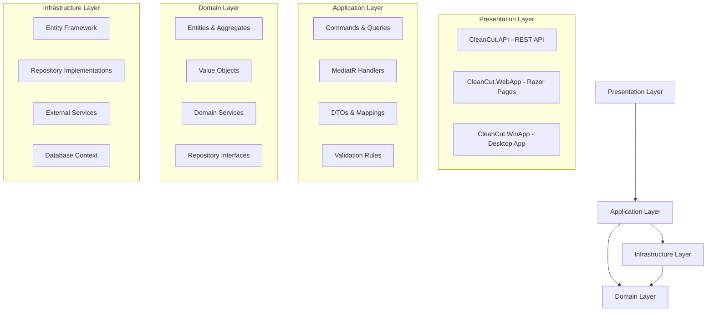

# CleanCut - Enterprise Clean Architecture Solution

[](https://dotnet.microsoft.com/)
[](https://github.com/markyoxall/Cleancut)
[](https://github.com/markyoxall/Cleancut)
[](https://github.com/markyoxall/Cleancut)

> A comprehensive **Clean Architecture** solution demonstrating **Domain-Driven Design (DDD)** and **CQRS** patterns using **.NET 10**. Built as a showcase of enterprise-level software architecture and modern development practices.

## 🚀 Live Demo
- **API Documentation**: [Swagger UI](https://localhost:7142) *(when running locally)*
- **Sample API Endpoints**: RESTful endpoints for User and Product management
- **Interactive Testing**: Full CRUD operations through Swagger interface

## 📸 Screenshots

*API Documentation Interface*


*Clean Architecture Layers*


## 🎯 What This Project Demonstrates

### **Enterprise Architecture Skills**
- ✅ **Clean Architecture** implementation with proper dependency inversion
- ✅ **Domain-Driven Design** with rich domain models and business logic
- ✅ **CQRS pattern** using MediatR for command/query separation
- ✅ **Repository pattern** with Unit of Work for data access
- ✅ **Dependency Injection** throughout all layers

### **Modern .NET Development**
- ✅ **.NET 10** (latest preview) with C# 14 features
- ✅ **Entity Framework Core** with Code First migrations
- ✅ **ASP.NET Core Web API** with OpenAPI/Swagger
- ✅ **MediatR** for CQRS implementation
- ✅ **FluentValidation** for input validation
- ✅ **AutoMapper** for object mapping

### **Quality & Testing**
- ✅ **Comprehensive test suite** (Unit, Integration, Architecture tests)
- ✅ **Architecture constraints** enforced through tests
- ✅ **SOLID principles** applied throughout
- ✅ **Clean code practices** with proper naming and structure

### **Professional Development Practices**
- ✅ **Trunk-based development** with clean commit history
- ✅ **Comprehensive documentation** for each layer
- ✅ **Database seeding** for development environment
- ✅ **CORS configuration** for API testing
- ✅ **Environment-specific configurations**

## 🏗️ Architecture Overview

This solution follows **Clean Architecture** principles with clear separation of concerns:



## 📁 Project Structure

```
CleanCut/
├── src/
│   ├── Core/                           # Business Logic (Framework Independent)
│   │   ├── CleanCut.Domain/           # Entities, Value Objects, Business Rules
│   │   └── CleanCut.Application/      # Use Cases, Commands, Queries, DTOs
│   │
│   ├── Infrastructure/                 # External Concerns
│   │   ├── CleanCut.Infrastructure.Data/      # EF Core, Repositories
│   │   ├── CleanCut.Infrastructure.Identity/  # Authentication & Authorization
│   │   └── CleanCut.Infrastructure.Shared/    # Cross-cutting Services
│   │
│   └── Presentation/                   # User Interfaces
│       ├── CleanCut.API/              # REST API with Swagger
│       ├── CleanCut.WebApp/           # Razor Pages Application
│       └── CleanCut.WinApp/           # Windows Desktop Application
│
├── tests/                             # Comprehensive Test Suite
│   ├── UnitTests/                     # Layer-specific unit tests
│   ├── IntegrationTests/              # End-to-end workflow tests
│   └── ArchitectureTests/             # Architecture constraint validation
│
└── docs/                              # Project Documentation
```

## 🚀 Quick Start

### Prerequisites
- **.NET 10 SDK** (Preview)
- **SQL Server** (LocalDB or full instance)
- **Visual Studio 2025** or **VS Code**

### Running the Application

1. **Clone the repository**
   ```bash
   git clone https://github.com/markyoxall/Cleancut.git
   cd Cleancut
   ```

2. **Restore packages and build**
   ```bash
   dotnet restore
   dotnet build
   ```

3. **Update database connection** (if needed)
   ```json
   // src/Presentation/CleanCut.API/appsettings.json
   {
     "ConnectionStrings": {
       "DefaultConnection": "Server=(localdb)\\mssqllocaldb;Database=CleanCutDb;Trusted_Connection=true;"
     }
   }
   ```

4. **Run the API**
   ```bash
   dotnet run --project src/Presentation/CleanCut.API
   ```

5. **Access Swagger UI**
   - Navigate to: `https://localhost:7142`
   - Test all endpoints interactively

## 🧪 Testing

Run the comprehensive test suite:

```bash
# All tests
dotnet test

# Unit tests only
dotnet test tests/UnitTests/

# Integration tests
dotnet test tests/IntegrationTests/

# Architecture tests (validates Clean Architecture rules)
dotnet test tests/ArchitectureTests/
```

## 📋 Key Features Implemented

### **Domain Layer**
- **Rich Domain Models**: `User` and `Product` entities with business logic
- **Value Objects**: Email validation, audit properties
- **Repository Interfaces**: Clean abstractions for data access
- **Business Rule Validation**: Domain-level constraint enforcement

### **Application Layer**
- **CQRS Implementation**: Separate commands and queries
- **MediatR Pipeline**: Request/response pattern with cross-cutting concerns
- **DTOs**: Clean data transfer objects for API boundaries
- **Validation**: FluentValidation rules for input validation
- **AutoMapper**: Automatic object mapping configurations

### **Infrastructure Layer**
- **Entity Framework Core**: Code-first database approach
- **Repository Pattern**: Concrete implementations of domain interfaces
- **Unit of Work**: Transaction management
- **Database Seeding**: Sample data for development/testing

### **Presentation Layer**
- **REST API**: Full CRUD operations with proper HTTP semantics
- **OpenAPI/Swagger**: Interactive API documentation
- **CORS Configuration**: Proper cross-origin request handling
- **Error Handling**: Consistent error responses

## 🎯 Technical Highlights

### **Clean Architecture Benefits Demonstrated**
- **Framework Independence**: Core business logic has no external dependencies
- **Testability**: Easy to unit test business logic in isolation
- **Flexibility**: Can swap UI, database, or external services without affecting core
- **Maintainability**: Clear separation of concerns and dependencies

### **Enterprise Patterns Applied**
- **Domain-Driven Design**: Business logic lives in domain entities
- **CQRS**: Command/Query responsibility segregation for scalability
- **Repository Pattern**: Clean data access abstractions
- **Dependency Injection**: Loose coupling throughout the application
- **Specification Pattern**: Reusable business rule definitions

## 🛠️ Technologies Used

| Category | Technologies |
|----------|-------------|
| **Framework** | .NET 10, ASP.NET Core |
| **Language** | C# 14 |
| **Architecture** | Clean Architecture, DDD, CQRS |
| **Data Access** | Entity Framework Core, SQL Server |
| **API** | REST, OpenAPI/Swagger |
| **Validation** | FluentValidation |
| **Mapping** | AutoMapper |
| **Mediator** | MediatR |
| **Testing** | xUnit, Architecture Tests |
| **Documentation** | XML Comments, Swagger |

## 🚀 Future Enhancements

Planned improvements to showcase additional skills:

- [ ] **Authentication & Authorization** (JWT, Identity)
- [ ] **Caching Strategy** (Redis, In-Memory)
- [ ] **Logging & Monitoring** (Serilog, Application Insights)
- [ ] **API Versioning** (URL/Header-based versioning)
- [ ] **Rate Limiting** (API throttling)
- [ ] **Health Checks** (Application health monitoring)
- [ ] **Docker Support** (Containerization)
- [ ] **CI/CD Pipeline** (GitHub Actions)

## 📚 Learning Resources

This project demonstrates concepts from:
- **Clean Architecture** by Robert C. Martin
- **Domain-Driven Design** by Eric Evans
- **Implementing Domain-Driven Design** by Vaughn Vernon
- **Enterprise Application Patterns** by Martin Fowler

## 📞 Contact

**Mark Yoxall**
- **GitHub**: [@markyoxall](https://github.com/markyoxall)
- **LinkedIn**: [Your LinkedIn Profile]
- **Email**: [your.email@example.com]

---

### 💼 For Employers

This project demonstrates my ability to:
- Design and implement enterprise-level software architecture
- Apply advanced .NET development patterns and practices
- Build scalable, maintainable, and testable applications
- Follow modern software development methodologies
- Write clean, well-documented code with comprehensive testing

**Ready to discuss how these skills can benefit your team!**

---

⭐ **If you find this project helpful, please consider giving it a star!**