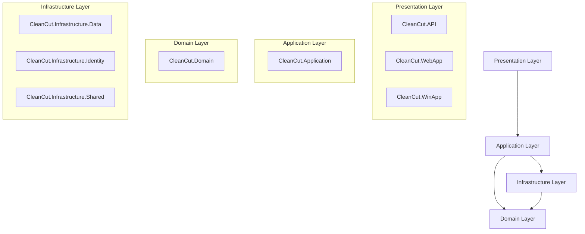

# CleanCut - Clean Architecture Solution

A comprehensive .NET 10 solution demonstrating **Clean Architecture** principles with **Domain-Driven Design (DDD)** patterns. This solution provides a robust foundation for building scalable, maintainable applications with multiple client interfaces (Web API, Web App, Windows App) sharing a common business core.

## 🏗️ Architecture Overview

This solution follows the **Clean Architecture** pattern, organizing code into layers with clear dependencies flowing inward toward the domain. The architecture ensures separation of concerns, testability, and independence from external frameworks.



## 📁 Solution Structure

```
CleanCut/
├── src/
│   ├── Core/                           # Core business logic
│   │   ├── CleanCut.Domain/           # Domain entities, value objects, business rules
│   │   └── CleanCut.Application/      # Use cases, commands, queries
│   │
│   ├── Infrastructure/                 # External concerns
│   │   ├── CleanCut.Infrastructure.Data/      # Data access, repositories
│   │   ├── CleanCut.Infrastructure.Identity/  # Authentication, authorization
│   │   └── CleanCut.Infrastructure.Shared/    # Cross-cutting services
│   │
│   └── Presentation/                   # User interfaces
│       ├── CleanCut.API/              # REST API endpoints
│       ├── CleanCut.WebApp/           # Web application (MVC)
│       └── CleanCut.WinApp/           # Windows desktop application
│
├── tests/                             # Test projects
│   ├── UnitTests/
│   ├── IntegrationTests/
│   └── ArchitectureTests/
│
├── docs/                              # Documentation
│   ├── architecture/
│   ├── api/
│   └── deployment/
│
└── tools/                             # Development tools and scripts
    ├── scripts/
    └── utilities/
```

## ✨ Key Features

### Clean Architecture Benefits
- 🎯 **Independence**: Framework and database independent core
- 🧪 **Testability**: Easy to unit test business logic
- 🔄 **Flexibility**: Can swap out UI, database, or external services
- 🛠️ **Maintainability**: Clear separation of concerns
- 📈 **Scalability**: Well-organized for team development

### Domain-Driven Design
- 🏢 **Rich Domain Model**: Business logic in domain entities
- 💬 **Ubiquitous Language**: Code speaks business language
- 📦 **Aggregate Patterns**: Consistent business rule enforcement
- 📢 **Domain Events**: Decoupled business process communication
- 🗂️ **Repository Pattern**: Clean data access abstractions

### Multiple Client Support
- 🌐 **REST API**: For web clients, mobile apps, and integrations
- 🖥️ **Web Application**: Browser-based interface with MVC
- 💻 **Windows Application**: Rich desktop client with Windows Forms

### Modern Patterns & Technologies
- 🚀 **CQRS**: Command/Query Responsibility Segregation
- 📡 **MediatR**: Request/response and notification patterns
- 🔐 **JWT Authentication**: Secure token-based authentication
- 💾 **Entity Framework Core**: Modern ORM with Code First
- ✅ **FluentValidation**: Declarative input validation
- 🔄 **AutoMapper**: Object-to-object mapping

## 🚀 Getting Started

### Prerequisites
- .NET 10 SDK (Preview)
- SQL Server (LocalDB or full instance)
- Visual Studio 2025 or Visual Studio Code
- Git

### Quick Start

1. **Clone the repository**
   ```bash
   git clone https://github.com/yourorg/cleancut.git
   cd cleancut
   ```

2. **Restore packages**
   ```bash
   dotnet restore
   ```

3. **Update database connection string**
   ```json
   // In appsettings.json files
   {
     "ConnectionStrings": {
       "DefaultConnection": "Server=(localdb)\\mssqllocaldb;Database=CleanCutDb;Trusted_Connection=true;"
     }
   }
   ```

4. **Run database migrations**
   ```bash
   dotnet ef database update --project src/Infrastructure/CleanCut.Infrastructure.Data
   ```

5. **Build the solution**
   ```bash
   dotnet build
   ```

6. **Run the applications**
   ```bash
   # Start the API
   dotnet run --project src/Presentation/CleanCut.API
   
   # Start the Web App
   dotnet run --project src/Presentation/CleanCut.WebApp
   
   # Start the Windows App
   dotnet run --project src/Presentation/CleanCut.WinApp
   ```

### Project Dependencies

Each layer has carefully controlled dependencies:

```
Domain Layer
??? (No dependencies - pure C#)

Application Layer
??? Domain Layer

Infrastructure Layers
??? Domain Layer (for repository interfaces)
??? Application Layer (for service interfaces)

Presentation Layers
??? Application Layer (for commands/queries)
??? Infrastructure Layers (for DI registration)
```

## 📚 Layer Documentation

Each layer includes comprehensive README files explaining its purpose, patterns, and best practices:

- **[Domain Layer](src/Core/CleanCut.Domain/README.md)** - Core business logic and rules
- **[Application Layer](src/Core/CleanCut.Application/README.md)** - Use cases and application workflows
- **[Data Infrastructure](src/Infrastructure/CleanCut.Infrastructure.Data/README.md)** - Data access and persistence
- **[Identity Infrastructure](src/Infrastructure/CleanCut.Infrastructure.Identity/README.md)** - Authentication and authorization
- **[Shared Infrastructure](src/Infrastructure/CleanCut.Infrastructure.Shared/README.md)** - Cross-cutting services
- **[API Presentation](src/Presentation/CleanCut.API/README.md)** - REST API endpoints
- **[Web Presentation](src/Presentation/CleanCut.WebApp/README.md)** - Web application interface
- **[Windows Presentation](src/Presentation/CleanCut.WinApp/README.md)** - Desktop application interface

## 🧪 Testing Strategy

The solution includes comprehensive testing across all layers:

### Unit Tests
- **Domain Tests**: Business logic validation
- **Application Tests**: Use case orchestration
- **Infrastructure Tests**: Repository and service implementations

### Integration Tests
- **API Tests**: End-to-end API workflows
- **Database Tests**: Data access integration

### Architecture Tests
- **Dependency Rules**: Enforce clean architecture constraints
- **Naming Conventions**: Maintain consistent code organization

```bash
# Run all tests
dotnet test

# Run specific test project
dotnet test tests/UnitTests/CleanCut.Domain.Tests/

# Generate test coverage
dotnet test --collect:"XPlat Code Coverage"
```

## 🔄 Development Workflow

### Adding a New Feature

1. **Start with Domain** - Define entities, value objects, and business rules
2. **Add Application Use Cases** - Create commands/queries and handlers
3. **Implement Infrastructure** - Add repository implementations and external services
4. **Create Presentation** - Add controllers, forms, or API endpoints
5. **Write Tests** - Unit tests for business logic, integration tests for workflows

### Example: Adding a Product Feature

```bash
# 1. Domain entities
src/Core/CleanCut.Domain/Entities/Product.cs
src/Core/CleanCut.Domain/Repositories/IProductRepository.cs

# 2. Application use cases
src/Core/CleanCut.Application/Commands/CreateProduct/
src/Core/CleanCut.Application/Queries/GetProduct/

# 3. Infrastructure implementation
src/Infrastructure/CleanCut.Infrastructure.Data/Repositories/ProductRepository.cs
src/Infrastructure/CleanCut.Infrastructure.Data/Configurations/ProductConfiguration.cs

# 4. Presentation layer
src/Presentation/CleanCut.API/Controllers/ProductsController.cs
src/Presentation/CleanCut.WebApp/Controllers/ProductController.cs
src/Presentation/CleanCut.WinApp/Forms/ProductForm.cs
```

## ⚙️ Configuration

### Application Settings

Key configuration sections:

```json
{
  "ConnectionStrings": {
    "DefaultConnection": "Server=(localdb)\\mssqllocaldb;Database=CleanCutDb;Trusted_Connection=true;"
  },
  "JwtSettings": {
    "Secret": "YourVeryLongAndSecureSecretKeyHere",
    "Issuer": "CleanCut",
    "Audience": "CleanCutUsers",
    "ExpirationInMinutes": 60
  },
  "EmailSettings": {
    "Provider": "SendGrid",
    "DefaultFromAddress": "noreply@cleancut.com"
  },
  "FileStorageSettings": {
    "Provider": "Local",
    "DefaultContainer": "uploads",
    "MaxFileSize": 10485760
  }
}
```

### Environment-Specific Settings

- `appsettings.json` - Base configuration
- `appsettings.Development.json` - Development overrides
- `appsettings.Production.json` - Production overrides

## 🚀 Deployment

### API Deployment
```bash
# Publish API
dotnet publish src/Presentation/CleanCut.API -c Release -o ./publish/api

# Run with specific environment
dotnet CleanCut.API.dll --environment Production
```

### Web App Deployment
```bash
# Publish Web App
dotnet publish src/Presentation/CleanCut.WebApp -c Release -o ./publish/webapp
```

### Windows App Distribution
```bash
# Publish Windows App
dotnet publish src/Presentation/CleanCut.WinApp -c Release -r win-x64 --self-contained
```

## 📊 Monitoring and Logging

The solution includes comprehensive logging and monitoring:

- **Structured Logging** with Serilog
- **Application Insights** integration
- **Health Checks** for API endpoints
- **Performance Monitoring** for database queries

## 🤝 Contributing

### Code Style
- Follow C# coding conventions
- Use meaningful names that reflect domain language
- Write self-documenting code with appropriate comments
- Maintain separation of concerns

### Pull Request Process
1. Create a feature branch from `main`
2. Implement changes with appropriate tests
3. Ensure all tests pass
4. Update documentation if needed
5. Submit pull request with clear description

### Architecture Principles
- **Dependency Rule**: Dependencies only point inward
- **Single Responsibility**: Each class has one reason to change
- **Open/Closed**: Open for extension, closed for modification
- **Interface Segregation**: Many client-specific interfaces
- **Dependency Inversion**: Depend on abstractions, not concretions

## 🗺️ Roadmap

Future enhancements planned:

- [ ] **Microservices**: Break into domain-specific services
- [ ] **Event Sourcing**: Add event sourcing capabilities
- [ ] **GraphQL**: Alternative API query language
- [ ] **Blazor Client**: Modern web UI framework
- [ ] **Mobile Apps**: Xamarin/MAUI clients
- [ ] **Docker**: Containerization support
- [ ] **Azure**: Cloud deployment templates

## 📄 License

This project is licensed under the MIT License - see the [LICENSE](LICENSE) file for details.

## 🙏 Acknowledgments

- **Clean Architecture** by Robert C. Martin
- **Domain-Driven Design** by Eric Evans
- **ASP.NET Core** team for excellent documentation
- **Entity Framework** team for modern ORM capabilities
- Open source community for inspiration and tools

---

**Happy Coding!** 🎉

For questions or support, please open an issue or contact the development team.