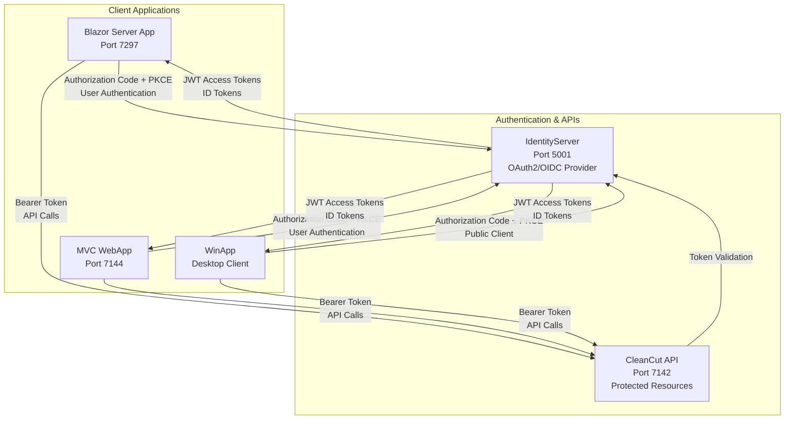
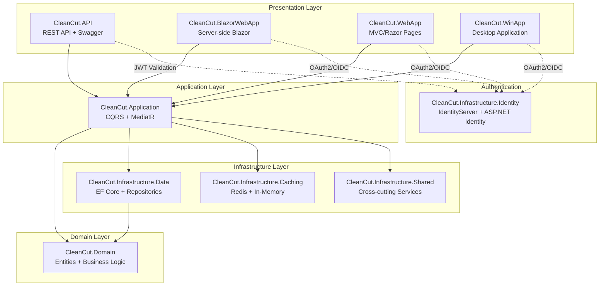

# CleanCut - Enterprise Clean Architecture Solution with OAuth2/OIDC Authentication

[](https://dotnet.microsoft.com/)
[](https://github.com/markyoxall/Cleancut)
[](https://github.com/markyoxall/Cleancut)
[](https://github.com/markyoxall/Cleancut)
[](https://github.com/markyoxall/Cleancut)

> A comprehensive **Clean Architecture** solution demonstrating **Domain-Driven Design (DDD)**, **CQRS**, and **OAuth2/OpenID Connect** authentication patterns using **.NET 9**. Built as a showcase of enterprise-level software architecture, modern development practices, and secure authentication flows.

## 🚀 Live Demo
- **API Documentation**: [Swagger UI](https://localhost:7142/swagger) *(when running locally)*
- **IdentityServer**: [Authentication Server](https://localhost:5001) *(OAuth2/OIDC Provider)*
- **Blazor App**: [Interactive UI](https://localhost:7297) *(Server-side Blazor with authentication)*
- **MVC WebApp**: [Traditional Web App](https://localhost:7144) *(Razor Pages with user authentication)*

## 📸 Architecture Overview

*OAuth2/OIDC Authentication Flow*

```mermaid
graph TB
    subgraph "Client Applications"
        BA[Blazor Server App<br/>Port 7297]
        WA[MVC WebApp<br/>Port 7144] 
        WD[WinApp<br/>Desktop Client]
    end
    
    subgraph "Authentication & APIs"
        IS[IdentityServer<br/>Port 5001<br/>OAuth2/OIDC Provider]
        API[CleanCut API<br/>Port 7142<br/>Protected Resources]
    end
    
    BA -->|Authorization Code + PKCE<br/>User Authentication| IS
    WA -->|Authorization Code + PKCE<br/>User Authentication| IS
    WD -->|Authorization Code + PKCE<br/>Public Client| IS
    
    IS -->|JWT Access Tokens<br/>ID Tokens| BA
IS -->|JWT Access Tokens<br/>ID Tokens| WA
  IS -->|JWT Access Tokens<br/>ID Tokens| WD
    
    BA -->|Bearer Token<br/>API Calls| API
    WA -->|Bearer Token<br/>API Calls| API
    WD -->|Bearer Token<br/>API Calls| API
    
    API -->|Token Validation| IS
```

## 🎯 What This Project Demonstrates

### **Enterprise Authentication & Security**
- ✅ **OAuth2/OpenID Connect** complete implementation with IdentityServer
- ✅ **JWT Bearer Authentication** for API protection
- ✅ **Authorization Code + PKCE** flows for secure client authentication
- ✅ **Role-based Authorization** with granular access control
- ✅ **Public and Confidential Clients** demonstrating different security models
- ✅ **Cross-Origin Resource Sharing (CORS)** with proper security restrictions

### **Multiple Client Application Types**
- ✅ **Blazor Server Application** with user authentication and API integration
- ✅ **ASP.NET Core MVC/Razor Pages** traditional web application
- ✅ **Windows Desktop Application** (WinForms) as public client
- ✅ **RESTful Web API** as protected resource server

### **Enterprise Architecture Skills**
- ✅ **Clean Architecture** implementation with proper dependency inversion
- ✅ **Domain-Driven Design** with rich domain models and business logic
- ✅ **CQRS pattern** using MediatR for command/query separation
- ✅ **Repository pattern** with Unit of Work for data access
- ✅ **Dependency Injection** throughout all layers

### **Modern .NET Development**
- ✅ **.NET 9** with latest features and C# 13
- ✅ **Entity Framework Core** with Code First migrations
- ✅ **ASP.NET Core Web API** with OpenAPI/Swagger
- ✅ **Blazor Server** with interactive components
- ✅ **MediatR** for CQRS implementation
- ✅ **FluentValidation** for input validation
- ✅ **AutoMapper** for object mapping

### **Quality & Testing**
- ✅ **Comprehensive test suite** (Unit, Integration, Architecture tests)
- ✅ **Architecture constraints** enforced through tests
- ✅ **SOLID principles** applied throughout
- ✅ **Clean code practices** with proper naming and structure

## 🏗️ Complete Solution Architecture


```mermaid
graph TD
    subgraph "Presentation Layer"
        API[CleanCut.API<br/>REST API + Swagger]
        BLAZOR[CleanCut.BlazorWebApp<br/>Server-side Blazor]
        MVC[CleanCut.WebApp<br/>MVC/Razor Pages]
        WIN[CleanCut.WinApp<br/>Desktop Application]
    end
    
    subgraph "Authentication"
IDENTITY[CleanCut.Infrastructure.Identity<br/>IdentityServer + ASP.NET Identity]
end
    
    subgraph "Application Layer"
APP[CleanCut.Application<br/>CQRS + MediatR]
    end
    
    subgraph "Domain Layer"
        DOMAIN[CleanCut.Domain<br/>Entities + Business Logic]
    end
    
    subgraph "Infrastructure Layer"
        DATA[CleanCut.Infrastructure.Data<br/>EF Core + Repositories]
        CACHE[CleanCut.Infrastructure.Caching<br/>Redis + In-Memory]
 SHARED[CleanCut.Infrastructure.Shared<br/>Cross-cutting Services]
    end
    
    API --> APP
    BLAZOR --> APP
    MVC --> APP
    WIN --> APP
    
    BLAZOR -.->|OAuth2/OIDC| IDENTITY
    MVC -.->|OAuth2/OIDC| IDENTITY
    WIN -.->|OAuth2/OIDC| IDENTITY
 API -.->|JWT Validation| IDENTITY
    
    APP --> DOMAIN
    APP --> DATA
    APP --> CACHE
    APP --> SHARED
    
    DATA --> DOMAIN
```

## 📁 Project Structure

```
CleanCut/
├── src/
│   ├── Core/ # Business Logic (Framework Independent)
│   │   ├── CleanCut.Domain/ # Entities, Value Objects, Business Rules
│   │   └── CleanCut.Application/      # Use Cases, Commands, Queries, DTOs
│   │
│ ├── Infrastructure/          # External Concerns
│   │   ├── CleanCut.Infrastructure.Data/        # EF Core, Repositories
│   │   ├── CleanCut.Infrastructure.Identity/    # IdentityServer + OAuth2/OIDC
│   │   ├── CleanCut.Infrastructure.Caching/     # Redis + In-Memory Caching
│   │   └── CleanCut.Infrastructure.Shared/      # Cross-cutting Services
│   │
│   └── Presentation/          # User Interfaces & APIs
│       ├── CleanCut.API/    # REST API with JWT Bearer Auth
│       ├── CleanCut.BlazorWebApp/     # Blazor Server with OIDC Auth
│       ├── CleanCut.WebApp/   # MVC/Razor Pages with OIDC Auth
│       └── CleanCut.WinApp/      # Windows Desktop App (Public Client)
│
├── tests/       # Comprehensive Test Suite
│   ├── UnitTests/          # Layer-specific unit tests
│   ├── IntegrationTests/              # End-to-end workflow tests
│   └── ArchitectureTests/             # Architecture constraint validation
│
└── docs/        # Project Documentation
```

## 🚀 Quick Start

### Prerequisites
- **.NET 9 SDK**
- **SQL Server** (LocalDB or full instance)
- **Visual Studio 2022** (17.8+) or **VS Code**
- **Redis** (optional, for caching)

### Running the Complete Solution

1. **Clone the repository**
   ```bash
   git clone https://github.com/markyoxall/Cleancut.git
   cd Cleancut
   ```

2. **Restore packages and build**
   ```bash
   dotnet restore
   dotnet build
   ```

3. **Update database connections** (if needed)
   ```json
   // src/Presentation/CleanCut.API/appsettings.json
   // src/Infrastructure/CleanCut.Infrastructure.Identity/appsettings.json
   {
     "ConnectionStrings": {
       "DefaultConnection": "Server=(localdb)\\mssqllocaldb;Database=CleanCut_Data;Trusted_Connection=true;"
     }
   }
   ```

4. **Start the services** (in separate terminals)
   ```bash
   # Terminal 1: Start IdentityServer (Authentication)
   dotnet run --project src/Infrastructure/CleanCut.Infrastructure.Identity
   
   # Terminal 2: Start API (Protected Resources)
   dotnet run --project src/Presentation/CleanCut.API
   
   # Terminal 3: Start Blazor App (Client Application)
   dotnet run --project src/Presentation/CleanCut.BlazorWebApp
   
   # Terminal 4: Start MVC WebApp (Client Application)
   dotnet run --project src/Presentation/CleanCut.WebApp
   ```

5. **Access the applications**
   - **IdentityServer**: `https://localhost:5001`
   - **API + Swagger**: `https://localhost:7142/swagger`
   - **Blazor App**: `https://localhost:7297`
   - **MVC WebApp**: `https://localhost:7144`

### Authentication Flow Testing

1. **Navigate to Blazor App** (`https://localhost:7297`)
2. **Login** using seeded test accounts:
   - **Admin**: `admin@cleancut.com` / `TempPassword123!`
   - **User**: `user@cleancut.com` / `TempPassword123!`
3. **Test API integration** through the authenticated UI
4. **Check JWT tokens** in browser developer tools

## 🧪 Testing

Run the comprehensive test suite:

```bash
# All tests
dotnet test

# Unit tests only
dotnet test tests/UnitTests/

# Integration tests (requires running services)
dotnet test tests/IntegrationTests/

# Architecture tests (validates Clean Architecture rules)
dotnet test tests/ArchitectureTests/
```

## 📋 Authentication & Authorization Features

### **OAuth2/OpenID Connect Implementation**
- **Authorization Server**: IdentityServer with ASP.NET Identity
- **Resource Server**: CleanCut.API with JWT Bearer validation
- **Client Applications**: Multiple client types with different flows

### **Supported OAuth2 Flows**
| Client Type | Grant Type | PKCE | Client Secret | Use Case |
|-------------|------------|------|---------------|----------|
| **Blazor Server** | Authorization Code | ✅ Yes | ✅ Yes | User authentication in server app |
| **MVC WebApp** | Authorization Code | ✅ Yes | ✅ Yes | Traditional web application |
| **WinApp** | Authorization Code | ✅ Yes | ❌ No | Desktop application (Public Client) |
| **m2m.client** | Client Credentials | ❌ No | ✅ Yes | Service-to-service communication |

### **Security Features**
- **JWT Bearer Tokens** with proper audience validation
- **Role-based Authorization** (Admin, User roles)
- **PKCE (Proof Key for Code Exchange)** for all Authorization Code flows
- **CORS** properly configured for cross-origin requests
- **HTTPS enforcement** in production
- **Token expiration and refresh** handling
- **Secure cookie configuration** for authentication

## 🛠️ Technologies Used

| Category | Technologies |
|----------|-------------|
| **Framework** | .NET 9, ASP.NET Core |
| **Language** | C# 13 |
| **Architecture** | Clean Architecture, DDD, CQRS |
| **Authentication** | IdentityServer, OAuth2, OpenID Connect, JWT |
| **Data Access** | Entity Framework Core, SQL Server |
| **Caching** | Redis, In-Memory Caching |
| **API** | REST, OpenAPI/Swagger, Bearer Token Auth |
| **UI Frameworks** | Blazor Server, ASP.NET Core MVC, WinForms |
| **Validation** | FluentValidation |
| **Mapping** | AutoMapper |
| **Mediator** | MediatR |
| **Testing** | xUnit, Architecture Tests |
| **Documentation** | XML Comments, Swagger, Markdown |

## 🔐 Security Best Practices Implemented

### **OAuth2/OIDC Security**
- ✅ **PKCE for all Authorization Code flows** (including confidential clients)
- ✅ **Proper audience validation** in JWT tokens
- ✅ **Short-lived access tokens** with refresh token rotation
- ✅ **Secure redirect URI validation**
- ✅ **Public clients without client secrets** (WinApp)

### **API Security**
- ✅ **Global authentication requirement** with fallback policy
- ✅ **Role-based authorization policies**
- ✅ **CORS restrictions** to known origins only
- ✅ **Rate limiting** for API protection
- ✅ **Comprehensive security headers**

### **Application Security**
- ✅ **HTTPS enforcement** across all applications
- ✅ **Secure cookie configuration**
- ✅ **Input validation** with FluentValidation
- ✅ **SQL injection prevention** through EF Core
- ✅ **XSS protection** in Blazor/MVC applications

## 🚀 Running Individual Components

### **IdentityServer Only**
```bash
dotnet run --project src/Infrastructure/CleanCut.Infrastructure.Identity
# Access: https://localhost:5001
# Features: User registration, login, OAuth2 token endpoints
```

### **API Only** (requires IdentityServer running)
```bash
dotnet run --project src/Presentation/CleanCut.API
# Access: https://localhost:7142/swagger
# Features: Protected REST API, JWT authentication required
```

### **Blazor App Only** (requires IdentityServer + API)
```bash
dotnet run --project src/Presentation/CleanCut.BlazorWebApp
# Access: https://localhost:7297
# Features: Interactive UI with user authentication
```

## 📚 Learning Resources

This project demonstrates concepts from:
- **OAuth2 RFC 6749** - The OAuth 2.0 Authorization Framework
- **OpenID Connect Core 1.0** - Simple Identity layer on top of OAuth2
- **RFC 7636** - Proof Key for Code Exchange (PKCE)
- **Clean Architecture** by Robert C. Martin
- **Domain-Driven Design** by Eric Evans
- **IdentityServer Documentation** - Modern Authentication for .NET

## 🔧 Configuration Notes

### **Development Environment**
- All services run on `localhost` with HTTPS
- Database auto-created with seed data
- Relaxed CORS policies for development
- Developer JWT signing credentials

### **Production Considerations**
- Certificate-based JWT signing required
- Secure configuration management (Azure Key Vault)
- Proper CORS origin restrictions
- HSTS headers and security policies
- Monitoring and logging integration

## 📞 Contact

**Mark Yoxall**
- **GitHub**: [@markyoxall](https://github.com/markyoxall)
- **LinkedIn**: [Your LinkedIn Profile]
- **Email**: [your.email@example.com]

---

### 💼 For Employers

This project demonstrates my ability to:
- Design and implement **secure, enterprise-level authentication systems**
- Build **OAuth2/OpenID Connect solutions** following industry standards
- Apply **Clean Architecture** with multiple client application types
- Implement **modern .NET development patterns** and security practices
- Create **scalable, maintainable, and secure applications**
- Follow **authentication security best practices** (PKCE, JWT, CORS)
- Write **comprehensive documentation** and **well-tested code**

**Ready to discuss how these skills can secure and scale your applications!**

---

⭐ **If you find this project helpful, please consider giving it a star!**