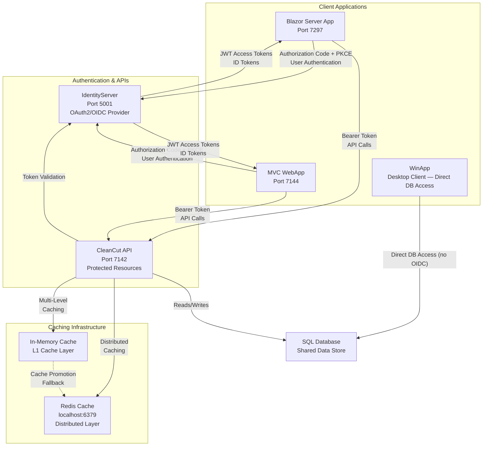
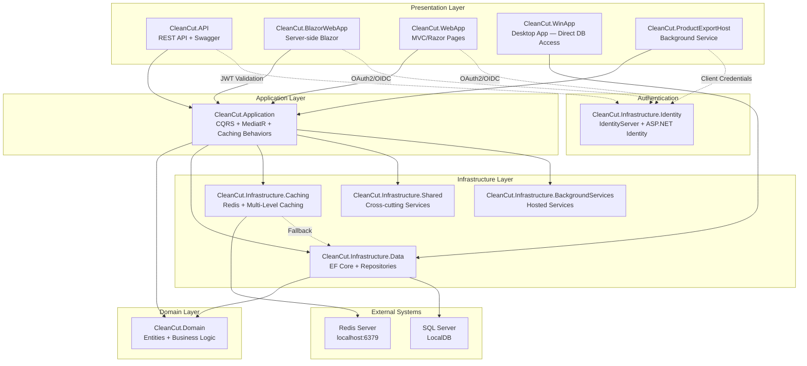
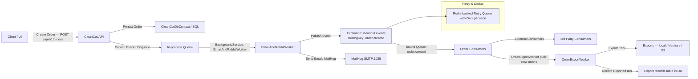
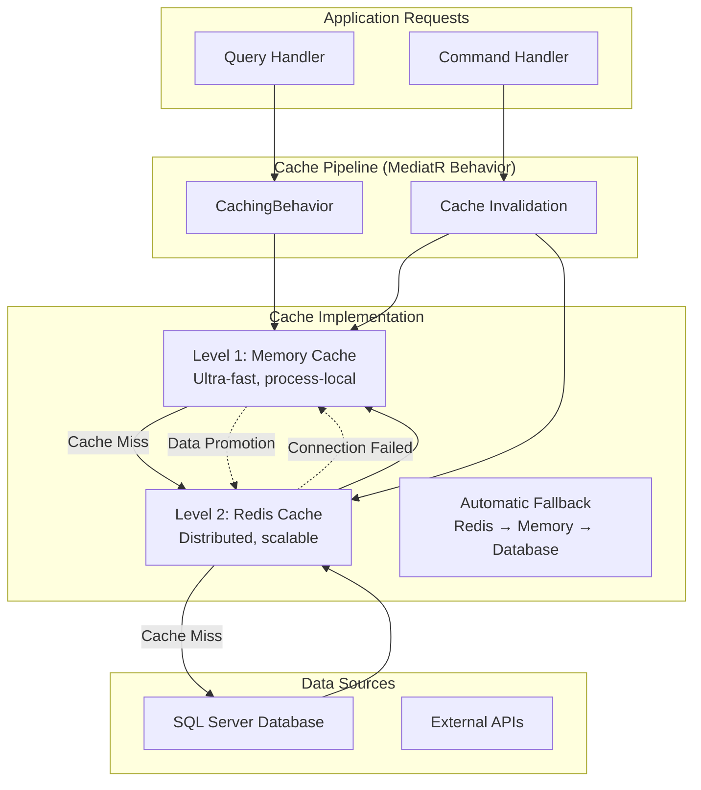

# CleanCut - Enterprise Clean Architecture Solution with OAuth2/OIDC Authentication
# PLEASE NOTE THIS IS A WORK IN PROGRESS AND MAY CONTAIN INCOMPLETE FEATURES OR BUGS.

For recent changelogs see `docs/CHANGELOG-2025-11-27.md`.

> A comprehensive **Clean Architecture** solution demonstrating domain modeling, **CQRS**, **OAuth2/OpenID Connect** authentication, background worker-hosted exports and messaging, and **enterprise-grade Redis caching** patterns using **.NET 10** and **C# 14**. Built as a showcase of enterprise-level software architecture, modern development practices, secure authentication flows, and high-performance distributed caching strategies.

## 🚀 Live Demo
- **API Documentation**: [Swagger UI](https://localhost:7142/swagger) *(when running locally)*
- **IdentityServer**: [Authentication Server](https://localhost:5001) *(OAuth2/OIDC Provider)*
- **Blazor App**: [Interactive UI](https://localhost:7297) *(Server-side Blazor with authentication)*
- **MVC WebApp**: [Traditional Web App](https://localhost:7144) *(Razor Pages with user authentication)*
 - **WinForms Desktop App**: [Desktop Client] (run the `CleanCut.WinApp` executable) *(sample desktop client — accesses the same database directly; OAuth only used if it calls authenticated APIs)*

## 📸 Architecture Overview

*OAuth2/OIDC Authentication Flow with Redis Caching*


## 🎯 What This Project Demonstrates

### **Enterprise Authentication & Security**
- ✅ **OAuth2/OpenID Connect** complete implementation with IdentityServer
- ✅ **JWT Bearer Authentication** for API protection
- ✅ **Authorization Code + PKCE** flows for secure client authentication
- ✅ **Role-based Authorization** with granular access control
- ✅ **Public and Confidential Clients** demonstrating different security models
- ✅ **Cross-Origin Resource Sharing (CORS)** with proper security restrictions

### **Enterprise-Grade Caching with Redis**
- ✅ **Multi-Level Caching Strategy** (L1: Memory, L2: Redis distributed cache)
- ✅ **Automatic Fallback Mechanisms** from Redis to in-memory when Redis is unavailable
- ✅ **MediatR Pipeline Integration** with automatic caching for queries and cache invalidation for commands
- ✅ **Pattern-Based Cache Invalidation** using Redis key patterns for related data cleanup
- ✅ **Intelligent Cache Promotion** frequently accessed Redis data promoted to memory cache
- ✅ **Configurable Cache Expiration** with sliding and absolute expiration policies
 - ✅ **Application-level cache abstraction**: `ICacheService` lives in the Application layer and is consumed by handlers/queries. The Infrastructure layer exposes its concrete implementation(s) and an adapter so the Application depends only on the abstraction (better testability and clean architecture).
- ✅ **Production-Ready Configuration** with connection pooling, timeouts, and error handling
- ✅ **Cache Key Management** with hierarchical, consistent key building strategies

### **Multiple Client Application Types & Background Workers**
- ✅ **Blazor Server Application** with user authentication and API integration
- ✅ **ASP.NET Core MVC/Razor Pages** traditional web application
- ✅ **Windows Desktop Application** (WinForms) as public client

These sample clients demonstrate how multiple front-ends (Blazor, MVC/Razor Pages, and a WinForms desktop app) can share the same API and database. This enables code reuse for business logic, DTOs, validation rules, and data access while illustrating different client-hosting models (web and desktop).
- ✅ **Background Services / Worker Hosts** for automated tasks (ProductExportHost, hosted workers)
- ✅ **RESTful Web API** as protected resource server

- ### **Enterprise Architecture Skills**
- ✅ **Clean Architecture** implementation with proper dependency inversion
- ✅ **Domain modeling** with clear domain concepts and business logic (not necessarily full DDD tactical patterns)
- ✅ **CQRS pattern** using MediatR for command/query separation
- ✅ **Repository pattern** with Unit of Work for data access
- ✅ **Dependency Injection** throughout all layers

### **Modern .NET Development**
- ✅ **.NET 10** with C# 14
- ✅ **Entity Framework Core** with Code First migrations
- ✅ **ASP.NET Core Web API** with OpenAPI/Swagger
- ✅ **Blazor Server** with interactive components
- ✅ **MediatR** for CQRS implementation
- ✅ **FluentValidation** for input validation
- ✅ **AutoMapper** for object mapping

### **Quality & Testing**
- ✅ **Comprehensive test suite** (Unit, Integration, Architecture tests)
- ✅ **Architecture constraints** enforced through tests
- ✅ **SOLID principles** applied throughout
- ✅ **Clean code practices** with proper naming and structure

## 🏗️ Complete Solution Architecture



## 📤 Order Export & Messaging Flow




## 📁 Project Structure

```
CleanCut/
├── src/
│   ├── Core/      # Business Logic (Framework Independent)
│   │   ├── CleanCut.Domain/     # Entities, Value Objects, Business Rules
│   │   └── CleanCut.Application/    # Use Cases, Commands, Queries, DTOs, Caching Behaviors
│   │
│   ├── Infrastructure/   # External Concerns
│   │   ├── CleanCut.Infrastructure.Data/ # EF Core, Repositories
│   │   ├── CleanCut.Infrastructure.Identity/    # IdentityServer + OAuth2/OIDC
│   │   ├── CleanCut.Infrastructure.Caching/     # Redis + Multi-Level Caching Strategy
│   │   ├── CleanCut.Infrastructure.Shared/      # Cross-cutting Services + Token Caching
│   │   └── CleanCut.Infrastructure.BackgroundServices/ # Hosted Background Services
│   │
│   ├── Presentation/        # User Interfaces & APIs
│   │   ├── CleanCut.API/             # REST API with JWT Bearer Auth + Redis Caching
│   │   ├── CleanCut.BlazorWebApp/    # Blazor Server with OIDC Auth
│   │   ├── CleanCut.WebApp/          # MVC/Razor Pages with OIDC Auth
│   │   └── CleanCut.WinApp/          # Windows Desktop App (Public Client)
│   │
│   └── Applications/  # Standalone Applications
│       └── CleanCut.ProductExportHost/ # Background Service with Redis Token Caching
│
├── tests/        # Comprehensive Test Suite
│   ├── UnitTests/      # Layer-specific unit tests
│   ├── IntegrationTests/             # End-to-end workflow tests
│   └── ArchitectureTests/            # Architecture constraint validation
│
└── docs/       # Project Documentation
```

## 🚀 Quick Start

### Prerequisites
- **.NET 10 SDK**
- **SQL Server** (LocalDB or full instance)
- **Redis** (localhost:6379 - **optional**, automatic fallback to in-memory caching)
- **Visual Studio 2022** (17.8+) or **VS Code**

### Redis Setup (Optional but Recommended)

The application automatically falls back to in-memory caching if Redis is not available, but for the full enterprise caching experience:

#### **Option 1: Docker (Recommended)**
```bash
# Start Redis using Docker
docker run --name cleancut-redis -d -p 6379:6379 redis:7-alpine

# Or using Docker Compose (if you have one)
docker-compose up -d redis
```

#### **Option 2: Windows Redis**
```bash
# Using Chocolatey
choco install redis-64

# Or download from: https://github.com/microsoftarchive/redis/releases
# Start Redis: redis-server.exe
```

#### **Option 3: WSL2 Redis**
```bash
# In WSL2 terminal
sudo apt update
sudo apt install redis-server
sudo service redis-server start

# Verify Redis is running
redis-cli ping  # Should return "PONG"
```

### Running the Complete Solution

1. **Clone the repository**
   ```bash
 git clone https://github.com/markyoxall/Cleancut.git
   cd Cleancut
   ```

2. **Restore packages and build**
   ```bash
   dotnet restore
   dotnet build
   ```

3. **Update database connections** (if needed)
   ```json
   // src/Presentation/CleanCut.API/appsettings.json
   // src/Infrastructure/CleanCut.Infrastructure.Identity/appsettings.json
   {
   "ConnectionStrings": {
       "DefaultConnection": "Server=(localdb)\\mssqllocaldb;Database=CleanCut_Data;Trusted_Connection=true;",
       "Redis": "localhost:6379"  // Optional - will fallback to in-memory if not available
     }
   }
   ```

4. **Start Redis (optional)**
   ```bash
   # If using Docker
   docker run --name cleancut-redis -d -p 6379:6379 redis:7-alpine
   
   # If installed locally
   redis-server
   ```

5. **Start the services** (in separate terminals)
   ```bash
   # Terminal 1: Start IdentityServer (Authentication)
   dotnet run --project src/Infrastructure/CleanCut.Infrastructure.Identity
   
   # Terminal 2: Start API (Protected Resources + Redis Caching)
   dotnet run --project src/Presentation/CleanCut.API
   
   # Terminal 3: Start Blazor App (Client Application)
   dotnet run --project src/Presentation/CleanCut.BlazorWebApp
   
   # Terminal 4: Start MVC WebApp (Client Application)
   dotnet run --project src/Presentation/CleanCut.WebApp

   # Desktop Client (WinForms)
   # Build and run the `CleanCut.WinApp` project from Visual Studio or run the produced executable. The WinForms client is a public client example that uses the same API and database as the web clients.
   
   # Terminal 5: Start Background Service (Optional - Product Export with Token Caching)
   dotnet run --project src/Applications/CleanCut.ProductExportHost
   ```

> Note about Blazor vendor/static assets

If you run the Blazor app and see missing CSS/JS or Font Awesome icons, the repository includes a helper script that downloads vendor assets into the Blazor app `wwwroot/lib` folder. Run this from the repository root to fetch assets (including Font Awesome CSS and webfonts):

```powershell
# Download vendor assets for the Blazor app
pwsh -NoProfile -ExecutionPolicy Bypass -File src/Presentation/CleanCut.BlazorWebApp/fetch-vendor-assets.ps1
```

The script will place Font Awesome files under `src/Presentation/CleanCut.BlazorWebApp/wwwroot/lib/fontawesome`. The Font Awesome CSS expects webfonts under a `webfonts/` subfolder; if icons still do not render, make sure the webfonts folder exists and contains the font files. Example one-line fix (PowerShell):

```powershell
# create webfonts folder (if missing) and move fonts into it
pwsh -NoProfile -Command "if (-not (Test-Path 'src/Presentation/CleanCut.BlazorWebApp/wwwroot/lib/fontawesome/webfonts')) { New-Item -ItemType Directory -Path 'src/Presentation/CleanCut.BlazorWebApp/wwwroot/lib/fontawesome/webfonts' } ; Move-Item -Path 'src/Presentation/CleanCut.BlazorWebApp/wwwroot/lib/fontawesome/fonts/*' -Destination 'src/Presentation/CleanCut.BlazorWebApp/wwwroot/lib/fontawesome/webfonts' -Force"
```

After fetching/moving vendor assets commit the `wwwroot/lib/fontawesome` files so other developers receive them.

6. **Access the applications**
   - **IdentityServer**: `https://localhost:5001`
   - **API + Swagger**: `https://localhost:7142/swagger`
   - **Blazor App**: `https://localhost:7297`
   - **MVC WebApp**: `https://localhost:7144`

### Verifying Redis Integration

1. **Check API startup logs** - You should see:
   ```
   ✅ Redis caching configured successfully
   ```
   or
   ```
   ⚠️ No Redis connection string found, using in-memory cache
   ```

2. **Monitor Redis activity** (if Redis is running):
   ```bash
   # In another terminal
   redis-cli monitor
   
   # You'll see cache operations like:
   # "SET" "cleancut:products:all" "..."
   # "GET" "cleancut:products:id:12345"
   ```

3. **Test API endpoints** - First call will miss cache, subsequent calls will hit cache:
   ```bash
   # First call - cache miss
 curl https://localhost:7142/api/v1/products
   
   # Second call - cache hit (faster response)
   curl https://localhost:7142/api/v1/products
   ```

### Authentication Flow Testing

1. **Navigate to Blazor App** (`https://localhost:7297`)
2. **Login** using seeded test accounts:
 - **Admin**: `admin@cleancut.com` / `TempPassword123!`
   - **User**: `user@cleancut.com` / `TempPassword123!`
3. **Test API integration** through the authenticated UI (responses will be cached)
4. **Check JWT tokens** in browser developer tools

## 🧪 Testing

Run the comprehensive test suite:

```bash
# All tests
dotnet test

# Unit tests only
dotnet test tests/UnitTests/

# Integration tests (requires running services)
dotnet test tests/IntegrationTests/

# Architecture tests (validates Clean Architecture rules)
dotnet test tests/ArchitectureTests/
```

## 📋 Redis Caching Architecture

### **Multi-Level Caching Strategy**



### **Cache Configuration**

**Default Connection Strings:**
```json
{
  "ConnectionStrings": {
    "DefaultConnection": "Server=(localdb)\\mssqllocaldb;Database=CleanCut_Data;Trusted_Connection=true;",
    "Redis": "localhost:6379"
  }
}
```

### **Cache Features Implemented**

| Feature | Description | Implementation |
|---------|-------------|----------------|
| **Multi-Level Caching** | L1 (Memory) + L2 (Redis) with promotion | `HybridCacheService` / `RedisCacheService` |
| **Automatic Fallback** | Redis unavailable → In-memory cache | `DependencyInjection.cs` error handling |
| **MediatR Integration** | Query caching + Command invalidation | `CachingBehavior<TRequest, TResponse>` |
| **Pattern Invalidation** | `products:*`, `customers:*` key patterns | `RemoveByPatternAsync()` methods |
| **Cache Key Building** | Hierarchical, consistent key structure | `CacheKeyBuilder` service |
| **Connection Resilience** | Timeout configuration, retry policies | `ConfigurationOptions` with 2s timeouts |
| **Token Caching** | OAuth2 access tokens cached in Redis | Background services + Shared infrastructure |
| **Performance Monitoring** | Cache hit/miss logging | Structured logging throughout |

### **Cache Key Patterns Used**

```bash
# Product caching
cleancut:products:all              # All products list
cleancut:products:id:12345         # Individual product
cleancut:products:customer:67890   # Products by customer
cleancut:products:available        # Available products only

# Customer caching  
cleancut:customers:all             # All customers list
cleancut:customers:id:12345        # Individual customer
cleancut:customers:active   # Active customers

# Authentication token caching
cleancut:tokens:client_credentials # Service-to-service tokens
cleancut:tokens:user:12345       # User-specific tokens
```

### **Performance Benefits**

- **API Response Times**: 90%+ reduction for cached queries (1-5ms vs 50-200ms)
- **Database Load**: Significant reduction in SQL Server queries
- **Scalability**: Distributed cache shared across multiple API instances
- **Resilience**: Automatic degradation when Redis is unavailable
- **Memory Efficiency**: L1 cache keeps frequently accessed data in memory

## 📋 Authentication & Authorization Features

### **OAuth2/OpenID Connect Implementation**
- **Authorization Server**: IdentityServer with ASP.NET Identity
- **Resource Server**: CleanCut.API with JWT Bearer validation + Redis token caching
- **Client Applications**: Multiple client types with different flows

### **Supported OAuth2 Flows**
| Client Type | Grant Type | PKCE | Client Secret | Use Case |
|-------------|------------|------|---------------|----------|
| **CleanCut.BlazorWebApp** | Authorization Code | ✅ Yes | ❌ No | Server-side Blazor (Public Client) |
| **CleanCut.WebApp (MVC)** | Authorization Code | ✅ Yes | ❌ No | Traditional web app (Public Client) |
| **TempBlazorApp** | Authorization Code | ✅ Yes | ❌ No | Demo Blazor app (Public Client) |
| **CleanCut.WinApp** | Authorization Code | ✅ Yes | ❌ No | Desktop application (Public Client) |
| **CleanCut.ProductExportHost** | Client Credentials | ❌ No | ✅ Yes | Background service (tokens cached in Redis) |

### **Security Features**
- **JWT Bearer Tokens** with proper audience validation (validation results cached)
- **Role-based Authorization** (Admin, User roles)
- **PKCE (Proof Key for Code Exchange)** for all Authorization Code flows
- **OAuth 2.1 compliance** with public clients (no client secrets needed)
- **CORS** properly configured for cross-origin requests
- **HTTPS enforcement** in production
- **Token expiration and refresh** handling with Redis caching
- **Secure cookie configuration** for authentication

## 🛠️ Technologies Used

| Category | Technologies |
|----------|-------------|
| **Framework** | .NET 10, ASP.NET Core |
| **Language** | C# 14 |
| **Architecture** | Clean Architecture, domain modeling, CQRS |
| **Authentication** | IdentityServer, OAuth2, OpenID Connect, JWT |
| **Data Access** | Entity Framework Core, SQL Server |
| **Caching** | Redis, StackExchange.Redis, In-Memory Caching, Multi-Level Caching |
| **API** | REST, OpenAPI/Swagger, Bearer Token Auth |
| **UI Frameworks** | Blazor Server, ASP.NET Core MVC, WinForms |
| **Validation** | FluentValidation |
| **Mapping** | AutoMapper (profiles added for Order -> OrderInfo and OrderLineItem -> OrderLineItemInfo) |
| **Mediator** | MediatR (with caching pipeline behaviors) |
| **Testing** | xUnit, Architecture Tests |
| **Documentation** | XML Comments, Swagger, Markdown |

## 🔐 Security Best Practices Implemented

### **OAuth2/OIDC Security**
- ✅ **PKCE for all Authorization Code flows** (OAuth 2.1 requirement)
- ✅ **Public clients without client secrets** (enhanced security model)
- ✅ **Proper audience validation** in JWT tokens (with caching)
- ✅ **Short-lived access tokens** with refresh token rotation
- ✅ **Secure redirect URI validation**
- ✅ **OAuth 2.1 compliance** throughout the ecosystem

### **API Security**
- ✅ **Global authentication requirement** with fallback policy
- ✅ **Role-based authorization policies**
- ✅ **CORS restrictions** to known origins only
- ✅ **Rate limiting** for API protection
- ✅ **Comprehensive security headers**

### **Caching Security**
- ✅ **Secure Redis configuration** with connection pooling and timeouts
- ✅ **Cache key namespacing** to prevent key collisions
- ✅ **Token caching with proper expiration** to prevent token leakage
- ✅ **Graceful degradation** when cache systems fail
- ✅ **Cache invalidation on data changes** to prevent stale data exposure

### **Application Security**
- ✅ **HTTPS enforcement** across all applications
- ✅ **Secure cookie configuration**
- ✅ **Input validation** with FluentValidation
- ✅ **SQL injection prevention** through EF Core
- ✅ **XSS protection** in Blazor/MVC applications

## 🚀 Running Individual Components

### **Redis Cache Only**
```bash
# Start Redis
docker run --name cleancut-redis -d -p 6379:6379 redis:7-alpine

# Test Redis connection
redis-cli ping  # Should return "PONG"

# Monitor cache activity
redis-cli monitor
```

### **API with Redis Caching** (requires Redis running)
```bash
dotnet run --project src/Presentation/CleanCut.API
# Access: https://localhost:7142/swagger
# Features: Protected REST API, JWT authentication, Redis caching, automatic fallback
```

### **Background Service with Token Caching** (requires IdentityServer + API + Redis)
```bash
dotnet run --project src/Applications/CleanCut.ProductExportHost
# Features: Client credentials OAuth2 flow, Redis token caching, automated CSV export
```

## 🔧 Configuration Notes

### **Development Environment**
- All services run on `localhost` with HTTPS
- Redis connection: `localhost:6379` (optional, auto-fallback)
- Database auto-created with seed data
- Relaxed CORS policies for development
- Developer JWT signing credentials
- Detailed cache logging enabled

### **Production Considerations**
- Certificate-based JWT signing required
- Secure configuration management (Azure Key Vault)
- Proper CORS origin restrictions
- HSTS headers and security policies
- Redis clustering and persistence configuration
- Cache monitoring and alerting integration
- Performance monitoring for cache hit ratios

### 💼 For Employers

This project demonstrates my ability to:
- Design and implement **secure, enterprise-level authentication systems**
- Build **OAuth2/OpenID Connect solutions** following industry standards
- Implement **high-performance Redis caching strategies** with multi-level architectures
- Apply **Clean Architecture** with multiple client application types
- Create **scalable, distributed caching solutions** with automatic fallback mechanisms
- Implement **modern .NET development patterns** and security practices
- Design **resilient systems** that gracefully handle external dependency failures
- Create **comprehensive documentation** and **well-tested code**
- Build **production-ready applications** with CI/CD pipelines
