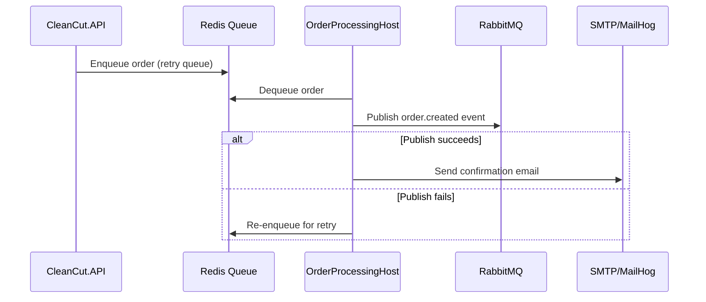

# CleanCut Order Processing Host

A .NET 10 background worker service that handles **asynchronous order processing** including RabbitMQ event publishing and customer email notifications.

## 🎯 Purpose

This worker service is responsible for **reliable, asynchronous order processing** that happens after an order is created. It ensures that order-created events are published to RabbitMQ and confirmation emails are sent to customers, even if the initial attempt fails.

## 📋 Responsibilities

### 1. **Order Event Publishing**
- Publishes `order.created` events to RabbitMQ exchange
- Ensures events reach all downstream consumers (inventory, reporting, etc.)
- Handles retry logic for failed publishes

### 2. **Email Notifications**
- Sends order confirmation emails to customers
- Includes itemized order details and totals
- Uses SMTP (MailHog in development, real SMTP in production)

### 3. **Retry Queue Processing**
- Dequeues orders from Redis-backed retry queue
- Processes failed operations from web/API layer
- Ensures eventual consistency

### 4. **Reliable Delivery**
- Publishes to RabbitMQ first (idempotent)
- Only sends email after successful publish
- Prevents duplicate emails on retry

## 🏗️ Architecture

```
┌─────────────────────────────────────────┐
│   CleanCut.OrderProcessingHost          │
│   (Background Worker Service)           │
└──────────────┬──────────────────────────┘
               │
               ├─> EmailAndRabbitWorker (BackgroundService)
               │   └─> Dequeues from Redis retry queue
               │   └─> Publishes to RabbitMQ
               │   └─> Sends confirmation emails
               │
               ├─> Redis (Retry Queue Storage)
               ├─> RabbitMQ (Event Publishing)
               └─> SMTP/MailHog (Email Delivery)
```

### Dependencies
- **CleanCut.Infrastructure.BackgroundServices** - Contains `EmailAndRabbitWorker`
- **CleanCut.Infrastructure.Shared** - RabbitMQ publisher, email sender
- **CleanCut.Infrastructure.Data** - Database context (for potential DB lookups)
- **CleanCut.Application** - Application layer services

## ⚙️ Configuration

### Required Settings (`appsettings.Development.json`)

```json
{
  "ConnectionStrings": {
    "Redis": "localhost:6379"
  },
  "RabbitMQ": {
    "Hostname": "localhost",
    "Port": 5672,
    "VirtualHost": "/",
    "Username": "guest",
    "Password": "guest",
    "Exchange": "cleancut.events",
    "OrderCreatedRoutingKey": "order.created",
    "OrderCreatedQueue": "cleancut.order.created",
    "RetryQueueKey": "cleancut:retry:orders"
  },
  "Smtp": {
    "Host": "localhost",
    "Port": 1025,
    "UseSsl": false,
    "FromAddress": "no-reply@cleancut.local",
    "FromName": "CleanCut"
  }
}
```

## 🚀 Running with Aspire

This service is orchestrated by **.NET Aspire** along with the required infrastructure containers.

### Startup Order (Aspire manages this automatically):
1. **Redis** container starts
2. **RabbitMQ** container starts (with management plugin)
3. **MailHog** container starts (dev SMTP server)
4. **OrderProcessingHost** starts (this service)
5. **API/BlazorWebApp** start

### Run via Aspire:
```bash
# From workspace root
dotnet run --project CleanCut.AspireAppHost
```

The Aspire Dashboard will show all resources including `orderprocessing`.

### Standalone Run (without Aspire):
```bash
# Ensure Redis, RabbitMQ, MailHog are running first
cd src/Applications/CleanCut.OrderProcessingHost
dotnet run
```

## 📊 Monitoring

### Check if it's working:

1. **Logs** - Check console output for:
   ```
   CleanCut Order Processing Host starting up
   EmailAndRabbitWorker started
   Published order {OrderId} to RabbitMQ
   ```

2. **RabbitMQ Management UI** - `http://localhost:15672`
   - Queue: `cleancut.order.created` should show messages

3. **MailHog UI** - `http://localhost:8025`
   - Confirmation emails should appear here

4. **Redis** - Check retry queue:
   ```bash
   redis-cli
   > LLEN cleancut:retry:orders
   ```

## 🔄 Order Processing Flow



## 🧪 Testing

### Manual Test:
1. Run Aspire AppHost (F5)
2. Place an order via BlazorWebApp or API
3. Check logs for "Published order..."
4. Verify message in RabbitMQ UI
5. Verify email in MailHog UI

### Unit Tests:
See `CleanCut.Infrastructure.Tests` for `EmailAndRabbitWorker` tests.

## 🔧 Troubleshooting

### Order not processing?
- **Check logs**: "Failed to connect to RabbitMQ" or "Failed to connect to Redis"
- **Verify config**: Ensure `appsettings.Development.json` has correct connection strings
- **Check Aspire**: Ensure Redis/RabbitMQ containers are running

### Email not sending?
- **Check MailHog**: Is it running on port 1025?
- **Check SMTP config**: Ensure `Smtp:Host` is `localhost` and `Port` is `1025`

### Messages stuck in retry queue?
- **Check Redis**: `redis-cli LLEN cleancut:retry:orders`
- **Check RabbitMQ**: Is it accepting connections?
- **Restart worker**: Stop/start OrderProcessingHost

## 📚 Related Documentation

- **EmailAndRabbitWorker**: `src/Infrastructure/CleanCut.Infrastructure.BackgroundServices/Workers/EmailAndRabbitWorker.cs`
- **RabbitMQ Publisher**: `src/Infrastructure/CleanCut.Infrastructure.Shared/Messaging/RabbitMqPublisher.cs`
- **Retry Queue**: `src/Infrastructure/CleanCut.Infrastructure.Shared/Messaging/RabbitMqRetryQueue.cs`
- **Aspire Setup**: `CleanCut.AspireAppHost/Program.cs`

## 🏆 Clean Architecture Compliance

✅ **Separation of Concerns**  
✅ **Dependency Inversion** (interfaces in Application, implementations in Infrastructure)  
✅ **Single Responsibility** (only handles order processing)  
✅ **Testable** (all dependencies injectable)  

---

**Note**: This service was previously named `ProductExportHost` but was renamed to accurately reflect its actual purpose.
