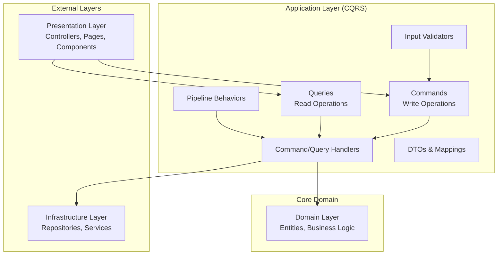

# CleanCut.Application - CQRS Application Layer

## Overview

The **CleanCut.Application** layer implements the **Command Query Responsibility Segregation (CQRS)** pattern and serves as the orchestration layer for all business use cases. It coordinates between the Domain Layer and external systems, handling application workflows, validation, and cross-cutting concerns while maintaining complete separation from infrastructure details.

## Role in Clean Architecture



## Key Features

### **?? CQRS Implementation**
- ? **Command Handlers** for write operations (Create, Update, Delete)
- ? **Query Handlers** for read operations (Get, List, Search)
- ? **MediatR Integration** for decoupled request/response patterns
- ? **Separate Models** for commands and queries
- ? **Optimized Read/Write Patterns** for performance

### **??? Cross-Cutting Concerns**
- ? **Validation Pipeline** with FluentValidation
- ? **Logging Behavior** for all operations
- ? **Transaction Management** for data consistency
- ? **Caching Behavior** for query optimization
- ? **Error Handling** with consistent response patterns

### **?? Application Services**
- ? **Service Interfaces** for infrastructure abstractions
- ? **DTO Mapping** with AutoMapper
- ? **Input Validation** separated from business rules
- ? **Use Case Orchestration** without business logic

## Project Structure

```
CleanCut.Application/
??? Commands/  # Write operations
?   ??? Products/
?   ?   ??? CreateProduct/
?   ?   ?   ??? CreateProductCommand.cs
?   ?   ?   ??? CreateProductCommandHandler.cs
?   ?   ?   ??? CreateProductCommandValidator.cs
?   ?   ??? UpdateProduct/
?   ?   ??? DeleteProduct/
?   ??? Customers/
?   ?   ??? CreateCustomer/
?   ?   ??? UpdateCustomer/
?   ?   ??? DeleteCustomer/
?   ??? Countries/
?
??? Queries/ # Read operations
?   ??? Products/
?   ?   ??? GetAllProducts/
?   ?   ?   ??? GetAllProductsQuery.cs
?   ?   ?   ??? GetAllProductsQueryHandler.cs
?   ? ??? GetProduct/
?   ?   ??? GetProductsByCustomer/
?   ??? Customers/
?   ?   ??? GetAllCustomers/
?   ?   ??? GetCustomer/
?   ?   ??? SearchCustomers/
?   ??? Countries/
?
??? DTOs/    # Data Transfer Objects
?   ??? ProductInfo.cs
?   ??? CustomerInfo.cs
?   ??? CountryInfo.cs
?   ??? Common/
?       ??? PaginatedResult.cs
?       ??? AuditInfo.cs
?
??? Interfaces/      # Service abstractions
?   ??? IEmailService.cs
?   ??? ICurrentUserService.cs
?   ??? ICacheService.cs
?
??? Behaviors/       # MediatR pipeline behaviors
?   ??? ValidationBehavior.cs
?   ??? LoggingBehavior.cs
?   ??? TransactionBehavior.cs
?   ??? CachingBehavior.cs
?
??? Mappings/        # AutoMapper profiles
?   ??? ProductMappingProfile.cs
?   ??? CustomerMappingProfile.cs
?   ??? CountryMappingProfile.cs
?
??? Validators/      # FluentValidation validators
?   ??? Products/
?   ??? Customers/
? ??? Countries/
?
??? Exceptions/      # Application-specific exceptions
?   ??? ValidationException.cs
???? NotFoundException.cs
?   ??? ApplicationException.cs
?
??? Extensions/      # Service registration extensions
    ??? ServiceCollectionExtensions.cs
```

## CQRS Implementation Examples

### **Product Commands**

#### **Create Product Command**
```csharp
public class CreateProductCommand : IRequest<ProductInfo>
{
    public string Name { get; set; } = string.Empty;
    public string Description { get; set; } = string.Empty;
    public decimal Price { get; set; }
    public Guid CustomerId { get; set; }
    public bool IsAvailable { get; set; } = true;
}

public class CreateProductCommandHandler : IRequestHandler<CreateProductCommand, ProductInfo>
{
    private readonly IProductRepository _productRepository;
    private readonly ICustomerRepository _customerRepository;
    private readonly IUnitOfWork _unitOfWork;
    private readonly IMapper _mapper;
    private readonly ILogger<CreateProductCommandHandler> _logger;

    public async Task<ProductInfo> Handle(CreateProductCommand request, CancellationToken cancellationToken)
    {
    _logger.LogInformation("Creating product {ProductName} for customer {CustomerId}", 
      request.Name, request.CustomerId);

        // Validate customer exists
        var customer = await _customerRepository.GetByIdAsync(request.CustomerId);
        if (customer == null)
            throw new NotFoundException($"Customer with ID {request.CustomerId} not found");

    // Create domain entity (business logic)
        var product = Product.Create(
            request.Name,
     request.Description,
   request.Price,
  request.CustomerId);

        if (!request.IsAvailable)
     product.UpdateAvailability(false);

        // Persist changes
        await _productRepository.AddAsync(product);
        await _unitOfWork.SaveChangesAsync(cancellationToken);

        _logger.LogInformation("Product {ProductId} created successfully", product.Id);

        // Return mapped DTO
        return _mapper.Map<ProductInfo>(product);
    }
}

public class CreateProductCommandValidator : AbstractValidator<CreateProductCommand>
{
    public CreateProductCommandValidator()
    {
        RuleFor(x => x.Name)
         .NotEmpty().WithMessage("Product name is required")
            .MaximumLength(100).WithMessage("Product name cannot exceed 100 characters");

   RuleFor(x => x.Description)
            .MaximumLength(500).WithMessage("Description cannot exceed 500 characters");

 RuleFor(x => x.Price)
    .GreaterThan(0).WithMessage("Price must be greater than zero")
 .LessThan(100000).WithMessage("Price cannot exceed $100,000");

        RuleFor(x => x.CustomerId)
      .NotEmpty().WithMessage("Customer ID is required");
    }
}
```

#### **Update Product Command**
```csharp
public class UpdateProductCommand : IRequest<ProductInfo>
{
    public Guid Id { get; set; }
    public string Name { get; set; } = string.Empty;
    public string Description { get; set; } = string.Empty;
    public decimal Price { get; set; }
    public bool IsAvailable { get; set; }
}

public class UpdateProductCommandHandler : IRequestHandler<UpdateProductCommand, ProductInfo>
{
    private readonly IProductRepository _productRepository;
    private readonly IUnitOfWork _unitOfWork;
    private readonly IMapper _mapper;

    public async Task<ProductInfo> Handle(UpdateProductCommand request, CancellationToken cancellationToken)
    {
 var product = await _productRepository.GetByIdAsync(request.Id);
        if (product == null)
            throw new NotFoundException($"Product with ID {request.Id} not found");

        // Update through domain methods (business rules enforced)
        product.UpdateDetails(request.Name, request.Description);
        product.UpdatePrice(request.Price);
        product.UpdateAvailability(request.IsAvailable);

  await _unitOfWork.SaveChangesAsync(cancellationToken);

        return _mapper.Map<ProductInfo>(product);
    }
}
```

### **Product Queries**

#### **Get All Products Query**
```csharp
public class GetAllProductsQuery : IRequest<IReadOnlyList<ProductInfo>>
{
    public string? CustomerFilter { get; set; }
    public bool? AvailableOnly { get; set; }
    public int? PageNumber { get; set; }
    public int? PageSize { get; set; }
}

public class GetAllProductsQueryHandler : IRequestHandler<GetAllProductsQuery, IReadOnlyList<ProductInfo>>
{
    private readonly IProductRepository _productRepository;
    private readonly IMapper _mapper;
    private readonly ICacheService _cacheService;

    public async Task<IReadOnlyList<ProductInfo>> Handle(GetAllProductsQuery request, CancellationToken cancellationToken)
    {
     // Try cache first for frequently accessed data
        var cacheKey = $"products_all_{request.CustomerFilter}_{request.AvailableOnly}";
        var cachedResult = await _cacheService.GetAsync<IReadOnlyList<ProductInfo>>(cacheKey);
     
        if (cachedResult != null)
            return cachedResult;

        // Fetch from repository
        var products = await _productRepository.GetAllAsync();

   // Apply filters (could be moved to repository for performance)
  if (!string.IsNullOrEmpty(request.CustomerFilter))
      {
         products = products.Where(p => 
        p.Customer.FirstName.Contains(request.CustomerFilter, StringComparison.OrdinalIgnoreCase) ||
                p.Customer.LastName.Contains(request.CustomerFilter, StringComparison.OrdinalIgnoreCase))
                .ToList();
    }

        if (request.AvailableOnly == true)
        {
            products = products.Where(p => p.IsAvailable).ToList();
        }

        var result = _mapper.Map<IReadOnlyList<ProductInfo>>(products);

        // Cache the result
        await _cacheService.SetAsync(cacheKey, result, TimeSpan.FromMinutes(15));

        return result;
    }
}
```

#### **Get Product by ID Query**
```csharp
public class GetProductQuery : IRequest<ProductInfo?>
{
    public Guid Id { get; set; }

    public GetProductQuery(Guid id)
    {
    Id = id;
    }
}

public class GetProductQueryHandler : IRequestHandler<GetProductQuery, ProductInfo?>
{
    private readonly IProductRepository _productRepository;
    private readonly IMapper _mapper;

    public async Task<ProductInfo?> Handle(GetProductQuery request, CancellationToken cancellationToken)
    {
      var product = await _productRepository.GetByIdAsync(request.Id);
     return product != null ? _mapper.Map<ProductInfo>(product) : null;
    }
}
```

## Data Transfer Objects (DTOs)

### **Product DTOs**
```csharp
public class ProductInfo
{
    public Guid Id { get; set; }
    public string Name { get; set; } = string.Empty;
    public string Description { get; set; } = string.Empty;
    public decimal Price { get; set; }
    public bool IsAvailable { get; set; }
    public Guid CustomerId { get; set; }
    public CustomerInfo? Customer { get; set; }
    public DateTime CreatedAt { get; set; }
    public DateTime? ModifiedAt { get; set; }
}

public class CustomerInfo
{
    public Guid Id { get; set; }
    public string FirstName { get; set; } = string.Empty;
    public string LastName { get; set; } = string.Empty;
    public string Email { get; set; } = string.Empty;
    public bool IsActive { get; set; }
    public DateTime CreatedAt { get; set; }
 public DateTime? ModifiedAt { get; set; }
}

public class CountryInfo
{
  public Guid Id { get; set; }
    public string Name { get; set; } = string.Empty;
    public string Code { get; set; } = string.Empty;
    public DateTime CreatedAt { get; set; }
}
```

### **Common DTOs**
```csharp
public class PaginatedResult<T>
{
    public IReadOnlyList<T> Data { get; set; } = new List<T>();
    public int TotalCount { get; set; }
    public int PageNumber { get; set; }
    public int PageSize { get; set; }
    public int TotalPages => (int)Math.Ceiling(TotalCount / (double)PageSize);
  public bool HasNextPage => PageNumber < TotalPages;
    public bool HasPreviousPage => PageNumber > 1;
}
```

## Pipeline Behaviors

### **Validation Behavior**
```csharp
public class ValidationBehavior<TRequest, TResponse> : IPipelineBehavior<TRequest, TResponse>
where TRequest : class, IRequest<TResponse>
{
    private readonly IEnumerable<IValidator<TRequest>> _validators;

    public async Task<TResponse> Handle(TRequest request, RequestHandlerDelegate<TResponse> next, CancellationToken cancellationToken)
    {
        if (_validators.Any())
        {
 var context = new ValidationContext<TRequest>(request);
            var validationResults = await Task.WhenAll(
        _validators.Select(v => v.ValidateAsync(context, cancellationToken)));

            var failures = validationResults
        .Where(r => r.Errors.Any())
       .SelectMany(r => r.Errors)
       .ToList();

            if (failures.Any())
       throw new ValidationException(failures);
    }

        return await next();
    }
}
```

### **Logging Behavior**
```csharp
public class LoggingBehavior<TRequest, TResponse> : IPipelineBehavior<TRequest, TResponse>
    where TRequest : class, IRequest<TResponse>
{
    private readonly ILogger<LoggingBehavior<TRequest, TResponse>> _logger;

    public async Task<TResponse> Handle(TRequest request, RequestHandlerDelegate<TResponse> next, CancellationToken cancellationToken)
    {
        var requestName = typeof(TRequest).Name;
    
        _logger.LogInformation("Handling {RequestName}: {@Request}", requestName, request);

  var stopwatch = Stopwatch.StartNew();

        try
   {
         var response = await next();
            stopwatch.Stop();

 _logger.LogInformation("Completed {RequestName} in {ElapsedMilliseconds}ms", 
requestName, stopwatch.ElapsedMilliseconds);

 return response;
        }
    catch (Exception ex)
  {
          stopwatch.Stop();
        _logger.LogError(ex, "Error handling {RequestName} after {ElapsedMilliseconds}ms", 
         requestName, stopwatch.ElapsedMilliseconds);
throw;
  }
    }
}
```

### **Transaction Behavior**
```csharp
public class TransactionBehavior<TRequest, TResponse> : IPipelineBehavior<TRequest, TResponse>
    where TRequest : class, IRequest<TResponse>
{
  private readonly IUnitOfWork _unitOfWork;

    public async Task<TResponse> Handle(TRequest request, RequestHandlerDelegate<TResponse> next, CancellationToken cancellationToken)
    {
        // Only apply transactions to commands (write operations)
  if (!typeof(TRequest).Name.EndsWith("Command"))
      {
   return await next();
        }

        using var transaction = await _unitOfWork.BeginTransactionAsync();

        try
        {
            var response = await next();
    await transaction.CommitAsync(cancellationToken);
return response;
        }
      catch
        {
   await transaction.RollbackAsync(cancellationToken);
     throw;
        }
  }
}
```

## AutoMapper Configuration

### **Product Mapping Profile**
```csharp
public class ProductMappingProfile : Profile
{
    public ProductMappingProfile()
    {
    CreateMap<Product, ProductInfo>()
       .ForMember(dest => dest.Price, opt => opt.MapFrom(src => src.Price.Amount));

 CreateMap<Customer, CustomerInfo>()
          .ForMember(dest => dest.Email, opt => opt.MapFrom(src => src.Email.Value));

        CreateMap<CreateProductCommand, Product>()
    .ConstructUsing(src => Product.Create(src.Name, src.Description, src.Price, src.CustomerId));
    }
}
```

## Service Registration

### **Dependency Injection Setup**
```csharp
public static class ServiceCollectionExtensions
{
    public static IServiceCollection AddApplication(this IServiceCollection services)
{
        // MediatR registration
    services.AddMediatR(cfg => {
     cfg.RegisterServicesFromAssembly(Assembly.GetExecutingAssembly());
        });

        // FluentValidation
        services.AddValidatorsFromAssembly(Assembly.GetExecutingAssembly());

        // Pipeline behaviors (order matters)
        services.AddTransient(typeof(IPipelineBehavior<,>), typeof(LoggingBehavior<,>));
  services.AddTransient(typeof(IPipelineBehavior<,>), typeof(ValidationBehavior<,>));
        services.AddTransient(typeof(IPipelineBehavior<,>), typeof(TransactionBehavior<,>));
      services.AddTransient(typeof(IPipelineBehavior<,>), typeof(CachingBehavior<,>));

     // AutoMapper
        services.AddAutoMapper(Assembly.GetExecutingAssembly());

     return services;
    }
}
```

## Exception Handling

### **Application Exceptions**
```csharp
public class ValidationException : ApplicationException
{
    public IDictionary<string, string[]> Errors { get; }

    public ValidationException(IEnumerable<ValidationFailure> failures)
  : base("One or more validation failures have occurred.")
  {
    Errors = failures
        .GroupBy(e => e.PropertyName, e => e.ErrorMessage)
    .ToDictionary(failureGroup => failureGroup.Key, failureGroup => failureGroup.ToArray());
    }
}

public class NotFoundException : ApplicationException
{
    public NotFoundException(string name, object key)
        : base($"Entity \"{name}\" ({key}) was not found.")
    {
    }

    public NotFoundException(string message)
        : base(message)
    {
    }
}
```

## Testing Strategy

### **Command Handler Testing**
```csharp
[Test]
public async Task CreateProductCommandHandler_WithValidCommand_ShouldCreateProduct()
{
    // Arrange
    var mockProductRepo = new Mock<IProductRepository>();
    var mockCustomerRepo = new Mock<ICustomerRepository>();
    var mockUnitOfWork = new Mock<IUnitOfWork>();
    var mockMapper = new Mock<IMapper>();

 var customer = Customer.Create("John", "Doe", "john@example.com");
    mockCustomerRepo.Setup(x => x.GetByIdAsync(It.IsAny<Guid>()))
        .ReturnsAsync(customer);

    var handler = new CreateProductCommandHandler(
        mockProductRepo.Object,
     mockCustomerRepo.Object,
mockUnitOfWork.Object,
        mockMapper.Object,
        Mock.Of<ILogger<CreateProductCommandHandler>>());

    var command = new CreateProductCommand
    {
        Name = "Test Product",
      Description = "Test Description",
      Price = 29.99m,
        CustomerId = customer.Id
    };

  // Act
    var result = await handler.Handle(command, CancellationToken.None);

    // Assert
mockProductRepo.Verify(x => x.AddAsync(It.IsAny<Product>()), Times.Once);
 mockUnitOfWork.Verify(x => x.SaveChangesAsync(It.IsAny<CancellationToken>()), Times.Once);
}
```

### **Validation Testing**
```csharp
[Test]
public void CreateProductCommandValidator_WithEmptyName_ShouldHaveValidationError()
{
    // Arrange
    var validator = new CreateProductCommandValidator();
    var command = new CreateProductCommand { Name = "" };

    // Act
    var result = validator.Validate(command);

    // Assert
    Assert.That(result.IsValid, Is.False);
    Assert.That(result.Errors.Any(x => x.PropertyName == nameof(command.Name)), Is.True);
}
```

## Performance Considerations

### **Query Optimization**
- **Caching**: Frequently accessed queries cached
- **Projection**: Return only needed data in DTOs
- **Async Operations**: All database operations async
- **Repository Patterns**: Optimized queries in repositories

### **Command Optimization**
- **Transactions**: Automatic transaction management
- **Domain Events**: Handled after successful persistence
- **Bulk Operations**: Batch multiple changes when possible
- **Validation**: Fast-fail with input validation

---

**This Application layer provides a robust CQRS implementation that orchestrates business use cases while maintaining clean separation of concerns, comprehensive validation, and enterprise-grade cross-cutting behaviors.**