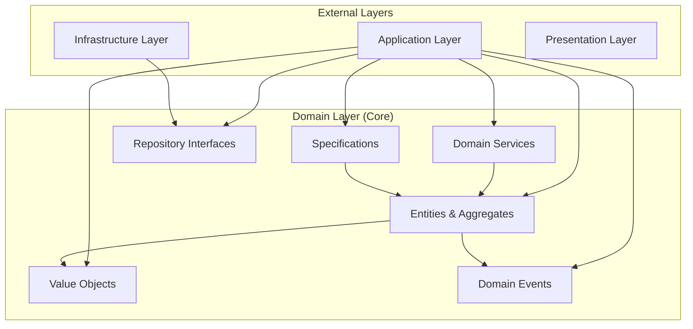

# CleanCut.Domain - Core Business Domain

## Overview

The **CleanCut.Domain** layer represents the **heart of the business logic** in the CleanCut application. It contains the fundamental business concepts, rules, and behaviors that define what the application does, completely independent of external concerns like databases, authentication systems, or user interfaces. This layer implements Domain-Driven Design (DDD) principles with rich domain models and comprehensive business rule enforcement.

## Role in Clean Architecture



## Key Features

### **?? Rich Domain Model**
- ? **Behavior-Rich Entities** with business logic encapsulation
- ? **Value Objects** for type safety and immutability
- ? **Aggregate Boundaries** for consistency enforcement
- ? **Domain Events** for cross-aggregate communication
- ? **Business Rule Validation** at the domain level

### **?? Domain-Driven Design Implementation**
- ? **Ubiquitous Language** reflected in code structure
- ? **Aggregate Root Pattern** for transactional boundaries
- ? **Repository Pattern** interfaces for data access
- ? **Specification Pattern** for business rules
- ? **Domain Services** for cross-entity operations

### **??? Framework Independence**
- ? **No External Dependencies** - pure .NET implementation
- ? **Database Agnostic** - no ORM or persistence concerns
- ? **Technology Independent** - works with any presentation layer
- ? **Testable** - easy to unit test business logic

## Project Structure

```
CleanCut.Domain/
??? Entities/         # Core business entities
? ??? Customer.cs
?   ??? Product.cs
?   ??? Country.cs
?
??? ValueObjects/     # Immutable value objects
?   ??? Email.cs
?   ??? Address.cs
?   ??? Money.cs
? ??? AuditInfo.cs
?
??? Events/     # Domain events
?   ??? CustomerCreatedEvent.cs
?   ??? ProductUpdatedEvent.cs
?   ??? CustomerEmailChangedEvent.cs
?
??? Repositories/     # Repository contracts
?   ??? ICustomerRepository.cs
?   ??? IProductRepository.cs
?   ??? ICountryRepository.cs
?
??? Services/    # Domain services
?   ??? ICustomerDomainService.cs
?   ??? IProductValidationService.cs
?
??? Specifications/  # Business rule specifications
? ??? CustomerSpecifications.cs
?   ??? ProductSpecifications.cs
?
??? Exceptions/       # Domain-specific exceptions
?   ??? CustomerNotFoundException.cs
?   ??? InvalidEmailException.cs
?   ??? BusinessRuleViolationException.cs
?
??? Common/       # Shared domain components
?   ??? BaseEntity.cs
?   ??? AggregateRoot.cs
?   ??? ValueObject.cs
?   ??? IDomainEvent.cs
?
??? Enums/       # Domain enumerations
    ??? CustomerStatus.cs
    ??? ProductCategory.cs
```

## Core Domain Entities

### **Customer Aggregate**
```csharp
public class Customer : AggregateRoot
{
    public Guid Id { get; private set; }
    public string FirstName { get; private set; }
    public string LastName { get; private set; }
    public Email Email { get; private set; }
    public CustomerStatus Status { get; private set; }
    public AuditInfo AuditInfo { get; private set; }
    
    private readonly List<Product> _products = new();
    public IReadOnlyList<Product> Products => _products.AsReadOnly();

    // Factory method for creation
    public static Customer Create(string firstName, string lastName, string email)
    {
     var customer = new Customer
        {
            Id = Guid.NewGuid(),
    FirstName = ValidateName(firstName, nameof(firstName)),
            LastName = ValidateName(lastName, nameof(lastName)),
            Email = new Email(email),
  Status = CustomerStatus.Active,
            AuditInfo = AuditInfo.Create()
        };
 
// Raise domain event
      customer.AddDomainEvent(new CustomerCreatedEvent(customer.Id, customer.Email.Value));
        
  return customer;
    }

    // Business behavior methods
    public void UpdateEmail(string newEmail)
    {
        if (Status == CustomerStatus.Inactive)
       throw new BusinessRuleViolationException("Cannot update email for inactive customer");
   
        var oldEmail = Email.Value;
  Email = new Email(newEmail);
        AuditInfo = AuditInfo.Update(AuditInfo);
  
        AddDomainEvent(new CustomerEmailChangedEvent(Id, oldEmail, newEmail));
    }

    public void Deactivate()
    {
        if (Status == CustomerStatus.Inactive)
            return; // Idempotent operation
            
        Status = CustomerStatus.Inactive;
        AuditInfo = AuditInfo.Update(AuditInfo);
        
    AddDomainEvent(new CustomerDeactivatedEvent(Id));
    }

    public void AddProduct(Product product)
  {
        if (product == null)
        throw new ArgumentNullException(nameof(product));
     
        if (Status == CustomerStatus.Inactive)
  throw new BusinessRuleViolationException("Cannot add products for inactive customer");
    
   if (_products.Any(p => p.Name == product.Name))
            throw new BusinessRuleViolationException($"Customer already has a product named '{product.Name}'");
            
        _products.Add(product);
        AddDomainEvent(new ProductAddedToCustomerEvent(Id, product.Id));
    }

    // Private validation methods
    private static string ValidateName(string name, string parameterName)
    {
        if (string.IsNullOrWhiteSpace(name))
 throw new ArgumentException($"{parameterName} cannot be empty");
            
  if (name.Length > 50)
       throw new ArgumentException($"{parameterName} cannot exceed 50 characters");
     
        return name.Trim();
    }
}
```

### **Product Aggregate**
```csharp
public class Product : AggregateRoot
{
    public Guid Id { get; private set; }
    public string Name { get; private set; }
    public string Description { get; private set; }
    public Money Price { get; private set; }
    public bool IsAvailable { get; private set; }
    public Guid CustomerId { get; private set; }
    public AuditInfo AuditInfo { get; private set; }

    public static Product Create(string name, string description, decimal price, Guid customerId)
    {
  var product = new Product
        {
            Id = Guid.NewGuid(),
            Name = ValidateName(name),
    Description = description?.Trim(),
            Price = new Money(price, "USD"),
   IsAvailable = true,
            CustomerId = customerId,
      AuditInfo = AuditInfo.Create()
        };
 
        product.AddDomainEvent(new ProductCreatedEvent(product.Id, product.Name, customerId));
        
        return product;
    }

    public void UpdatePrice(decimal newPrice)
    {
        if (newPrice <= 0)
      throw new BusinessRuleViolationException("Product price must be greater than zero");
   
        var oldPrice = Price.Amount;
        Price = new Money(newPrice, Price.Currency);
        AuditInfo = AuditInfo.Update(AuditInfo);
        
 AddDomainEvent(new ProductPriceChangedEvent(Id, oldPrice, newPrice));
    }

    public void UpdateAvailability(bool isAvailable)
    {
        if (IsAvailable == isAvailable)
   return; // No change needed
            
        IsAvailable = isAvailable;
      AuditInfo = AuditInfo.Update(AuditInfo);
        
        AddDomainEvent(new ProductAvailabilityChangedEvent(Id, isAvailable));
    }

    public void UpdateDetails(string name, string description)
    {
        var oldName = Name;
        Name = ValidateName(name);
        Description = description?.Trim();
        AuditInfo = AuditInfo.Update(AuditInfo);
        
        if (oldName != Name)
        {
    AddDomainEvent(new ProductNameChangedEvent(Id, oldName, Name));
        }
    }

    private static string ValidateName(string name)
    {
        if (string.IsNullOrWhiteSpace(name))
            throw new ArgumentException("Product name cannot be empty");
            
 if (name.Length > 100)
 throw new ArgumentException("Product name cannot exceed 100 characters");
  
        return name.Trim();
    }
}
```

## Value Objects

### **Email Value Object**
```csharp
public class Email : ValueObject
{
    public string Value { get; private set; }

  public Email(string value)
    {
     if (string.IsNullOrWhiteSpace(value))
      throw new InvalidEmailException("Email cannot be empty");
     
        if (!IsValidEmail(value))
            throw new InvalidEmailException($"'{value}' is not a valid email address");
      
        Value = value.ToLowerInvariant().Trim();
    }

    protected override IEnumerable<object> GetEqualityComponents()
    {
    yield return Value;
    }

    private static bool IsValidEmail(string email)
{
      try
        {
    var addr = new System.Net.Mail.MailAddress(email);
         return addr.Address == email;
   }
        catch
        {
    return false;
        }
    }

    public static implicit operator string(Email email) => email.Value;
    public override string ToString() => Value;
}
```

### **Money Value Object**
```csharp
public class Money : ValueObject
{
    public decimal Amount { get; private set; }
    public string Currency { get; private set; }

    public Money(decimal amount, string currency = "USD")
    {
        if (amount < 0)
            throw new ArgumentException("Money amount cannot be negative");
  
        if (string.IsNullOrWhiteSpace(currency))
            throw new ArgumentException("Currency cannot be empty");
            
 Amount = amount;
        Currency = currency.ToUpperInvariant();
    }

public Money Add(Money other)
    {
  if (Currency != other.Currency)
  throw new InvalidOperationException($"Cannot add {other.Currency} to {Currency}");
            
   return new Money(Amount + other.Amount, Currency);
    }

    public Money Multiply(decimal factor)
    {
        if (factor < 0)
            throw new ArgumentException("Factor cannot be negative");
        
        return new Money(Amount * factor, Currency);
    }

    public bool IsGreaterThan(Money other)
    {
        if (Currency != other.Currency)
    throw new InvalidOperationException($"Cannot compare {other.Currency} to {Currency}");
 
  return Amount > other.Amount;
    }

    protected override IEnumerable<object> GetEqualityComponents()
    {
        yield return Amount;
        yield return Currency;
    }

    public override string ToString() => $"{Amount:C} {Currency}";
}
```

### **AuditInfo Value Object**
```csharp
public class AuditInfo : ValueObject
{
    public DateTime CreatedAt { get; private set; }
    public string CreatedBy { get; private set; }
    public DateTime? ModifiedAt { get; private set; }
    public string ModifiedBy { get; private set; }

    private AuditInfo(DateTime createdAt, string createdBy, DateTime? modifiedAt = null, string modifiedBy = null)
    {
        CreatedAt = createdAt;
CreatedBy = createdBy ?? "System";
        ModifiedAt = modifiedAt;
  ModifiedBy = modifiedBy;
    }

    public static AuditInfo Create(string createdBy = null)
    {
        return new AuditInfo(DateTime.UtcNow, createdBy ?? "System");
    }

    public static AuditInfo Update(AuditInfo existing, string modifiedBy = null)
    {
     return new AuditInfo(
     existing.CreatedAt, 
      existing.CreatedBy, 
            DateTime.UtcNow, 
            modifiedBy ?? "System");
    }

    protected override IEnumerable<object> GetEqualityComponents()
    {
     yield return CreatedAt;
        yield return CreatedBy;
        yield return ModifiedAt;
        yield return ModifiedBy;
    }
}
```

## Domain Events

### **Customer Domain Events**
```csharp
public record CustomerCreatedEvent(Guid CustomerId, string Email) : IDomainEvent;

public record CustomerEmailChangedEvent(Guid CustomerId, string OldEmail, string NewEmail) : IDomainEvent;

public record CustomerDeactivatedEvent(Guid CustomerId) : IDomainEvent;
```

### **Product Domain Events**
```csharp
public record ProductCreatedEvent(Guid ProductId, string Name, Guid CustomerId) : IDomainEvent;

public record ProductPriceChangedEvent(Guid ProductId, decimal OldPrice, decimal NewPrice) : IDomainEvent;

public record ProductAvailabilityChangedEvent(Guid ProductId, bool IsAvailable) : IDomainEvent;

public record ProductNameChangedEvent(Guid ProductId, string OldName, string NewName) : IDomainEvent;
```

## Repository Interfaces

### **Customer Repository Contract**
```csharp
public interface ICustomerRepository
{
  Task<Customer?> GetByIdAsync(Guid id);
    Task<Customer?> GetByEmailAsync(string email);
    Task<IReadOnlyList<Customer>> GetAllAsync();
    Task<IReadOnlyList<Customer>> GetActiveCustomersAsync();
    Task<bool> ExistsByEmailAsync(string email);
    
    void Add(Customer customer);
    void Update(Customer customer);
    void Remove(Customer customer);
}
```

### **Product Repository Contract**
```csharp
public interface IProductRepository
{
    Task<Product?> GetByIdAsync(Guid id);
    Task<IReadOnlyList<Product>> GetAllAsync();
    Task<IReadOnlyList<Product>> GetByCustomerIdAsync(Guid customerId);
    Task<IReadOnlyList<Product>> GetAvailableProductsAsync();
    Task<bool> ExistsByNameAsync(string name, Guid? excludeId = null);
  
    void Add(Product product);
    void Update(Product product);
    void Remove(Product product);
}
```

## Specifications

### **Customer Business Rules**
```csharp
public static class CustomerSpecifications
{
    public static readonly Specification<Customer> IsActive = 
     new Specification<Customer>(c => c.Status == CustomerStatus.Active);
        
    public static readonly Specification<Customer> HasProducts = 
  new Specification<Customer>(c => c.Products.Any());
    
    public static Specification<Customer> HasEmailDomain(string domain)
    {
     return new Specification<Customer>(c => c.Email.Value.EndsWith($"@{domain}"));
    }
}
```

### **Product Business Rules**
```csharp
public static class ProductSpecifications
{
    public static readonly Specification<Product> IsAvailable = 
        new Specification<Product>(p => p.IsAvailable);
        
    public static readonly Specification<Product> IsExpensive = 
   new Specification<Product>(p => p.Price.Amount > 100);
        
    public static Specification<Product> PriceRange(decimal min, decimal max)
    {
      return new Specification<Product>(p => p.Price.Amount >= min && p.Price.Amount <= max);
}
}
```

## Base Classes

### **Aggregate Root**
```csharp
public abstract class AggregateRoot : BaseEntity
{
    private readonly List<IDomainEvent> _domainEvents = new();
    public IReadOnlyList<IDomainEvent> DomainEvents => _domainEvents.AsReadOnly();

    protected void AddDomainEvent(IDomainEvent domainEvent)
    {
        _domainEvents.Add(domainEvent);
  }

  public void ClearDomainEvents()
  {
      _domainEvents.Clear();
    }
}
```

### **Base Entity**
```csharp
public abstract class BaseEntity
{
    public override bool Equals(object obj)
    {
    if (obj is not BaseEntity other)
            return false;

        if (ReferenceEquals(this, other))
  return true;

        if (GetType() != other.GetType())
       return false;

        return GetId().Equals(other.GetId());
    }

    public override int GetHashCode()
    {
        return GetId().GetHashCode();
    }

    protected abstract object GetId();
}
```

## Domain Exceptions

### **Business Rule Violations**
```csharp
public class BusinessRuleViolationException : DomainException
{
    public BusinessRuleViolationException(string message) : base(message) { }
 
  public BusinessRuleViolationException(string message, Exception innerException) 
        : base(message, innerException) { }
}

public class InvalidEmailException : DomainException
{
    public InvalidEmailException(string message) : base(message) { }
}

public class CustomerNotFoundException : DomainException
{
 public CustomerNotFoundException(Guid customerId) 
        : base($"Customer with ID '{customerId}' was not found") { }
}

public abstract class DomainException : Exception
{
    protected DomainException(string message) : base(message) { }
    protected DomainException(string message, Exception innerException) : base(message, innerException) { }
}
```

## Testing the Domain

### **Entity Behavior Testing**
```csharp
[Test]
public void Customer_Create_ShouldSetPropertiesCorrectly()
{
    // Arrange
    var firstName = "John";
    var lastName = "Doe";
    var email = "john.doe@example.com";

    // Act
    var customer = Customer.Create(firstName, lastName, email);

    // Assert
    Assert.That(customer.FirstName, Is.EqualTo(firstName));
    Assert.That(customer.LastName, Is.EqualTo(lastName));
    Assert.That(customer.Email.Value, Is.EqualTo(email));
    Assert.That(customer.Status, Is.EqualTo(CustomerStatus.Active));
    Assert.That(customer.DomainEvents.Count, Is.EqualTo(1));
    Assert.That(customer.DomainEvents.First(), Is.TypeOf<CustomerCreatedEvent>());
}

[Test]
public void Customer_UpdateEmail_WithInactiveStatus_ShouldThrowException()
{
    // Arrange
    var customer = Customer.Create("John", "Doe", "john@example.com");
    customer.Deactivate();
    customer.ClearDomainEvents();

    // Act & Assert
    Assert.Throws<BusinessRuleViolationException>(() => 
        customer.UpdateEmail("newemail@example.com"));
}
```

### **Value Object Testing**
```csharp
[Test]
public void Email_WithValidEmail_ShouldCreateSuccessfully()
{
    // Arrange & Act
    var email = new Email("test@example.com");

    // Assert
    Assert.That(email.Value, Is.EqualTo("test@example.com"));
}

[Test]
public void Email_WithInvalidEmail_ShouldThrowException()
{
    // Act & Assert
    Assert.Throws<InvalidEmailException>(() => new Email("invalid-email"));
}
```

## Benefits of This Domain Design

### **?? Business-Centric**
- **Ubiquitous Language**: Code reflects business terminology
- **Rich Behavior**: Entities contain business logic, not just data
- **Business Rules**: Enforced at the domain level
- **Domain Events**: Capture business-significant occurrences

### **??? Protection & Integrity**
- **Encapsulation**: Private setters protect invariants
- **Validation**: Business rules enforced in constructors and methods
- **Type Safety**: Value objects prevent primitive obsession
- **Immutability**: Value objects cannot be changed after creation

### **?? Testability**
- **Pure Logic**: No external dependencies to mock
- **Isolated Testing**: Each entity/value object tests independently
- **Behavior Focus**: Tests verify business behavior, not implementation
- **Fast Execution**: No database or network dependencies

---

**This domain layer represents the pure business logic of the CleanCut application, implementing Domain-Driven Design principles with rich domain models, comprehensive business rule enforcement, and complete framework independence.**