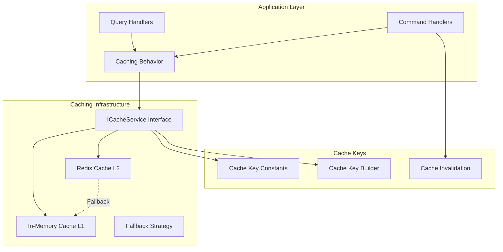

# CleanCut.Infrastructure.Caching - Multi-Level Caching Infrastructure

## Overview

The **CleanCut.Infrastructure.Caching** project provides a comprehensive caching infrastructure that implements a **multi-level caching strategy** with both **in-memory** and **distributed (Redis)** caching capabilities. This infrastructure supports the application's performance requirements by providing fast data access, cache invalidation strategies, and intelligent fallback mechanisms.

## Architecture & Caching Strategy



## Key Features

### **??? Multi-Level Caching**
- ? **Level 1 (L1)**: In-Memory caching for ultra-fast access
- ? **Level 2 (L2)**: Redis distributed caching for scalability
- ? **Intelligent Fallback**: Automatic fallback from Redis to Memory
- ? **Cache Promotion**: Frequently accessed data promoted to L1
- ? **Configurable TTL**: Different expiration times per cache level

### **?? Cache Management**
- ? **Automatic Invalidation**: Cache invalidation on data changes
- ? **Pattern-Based Invalidation**: Invalidate related cache entries
- ? **Cache Key Management**: Consistent, hierarchical key structure
- ? **Cache Warming**: Pre-populate cache with frequently accessed data
- ? **Cache Statistics**: Monitoring and performance metrics

### Application-level abstraction

- ✅ `ICacheService` interface is available as an application-level abstraction for cache operations. The Infrastructure caching project provides concrete implementations (`MemoryCacheService`, `RedisCacheService`) and an adapter (`CacheServiceAdapter`) so the Application layer consumes the abstraction without depending on Infrastructure types directly.

This design preserves Clean Architecture boundaries: Application depends on an interface, Infrastructure provides the implementation.

### **? Performance Optimization**
- ? **Async Operations**: Non-blocking cache operations
- ? **Serialization Efficiency**: Optimized JSON serialization
- ? **Memory Management**: Proper memory cleanup and disposal
- ? **Connection Pooling**: Efficient Redis connection management
- ? **Retry Policies**: Resilient cache operations with retry logic

## Project Structure

```
CleanCut.Infrastructure.Caching/
??? Abstractions/     # Cache service interfaces
?   ??? ICacheService.cs
?   ??? IDistributedCacheService.cs
?   ??? ICacheKeyBuilder.cs
?
??? Services/ # Cache service implementations
?   ??? MemoryCacheService.cs
?   ??? RedisCacheService.cs
?   ??? HybridCacheService.cs
?   ??? CacheKeyBuilder.cs
?
??? Constants/      # Cache key constants
?   ??? CacheKeys.cs
?   ??? CacheTimeouts.cs
?   ??? CachePatterns.cs
?
??? Configuration/    # Cache configuration
?   ??? CacheSettings.cs
?   ??? RedisCacheSettings.cs
?   ??? MemoryCacheSettings.cs
?
??? Extensions/       # Extension methods
?   ??? CacheExtensions.cs
???? ServiceCollectionExtensions.cs
?
??? Behaviors/    # MediatR integration
?   ??? CachingBehavior.cs
?
??? DependencyInjection.cs  # Service registration
```

## Core Cache Service

### ICacheService (what's implemented)

The project exposes an `ICacheService` abstraction (see `src/Core/CleanCut.Application/Common/Interfaces/ICacheService.cs`) that defines the basic operations used across handlers and behaviors. The current interface provides the following operations and the Infrastructure implementations provide corresponding behavior:

- `Task<T?> GetAsync<T>(string key, CancellationToken ct) where T : class`
- `Task SetAsync<T>(string key, T value, TimeSpan? expiration = null, CancellationToken ct) where T : class`
- `Task RemoveAsync(string key, CancellationToken ct)`
- `Task RemoveByPatternAsync(string pattern, CancellationToken ct)` (Redis-backed implementations only)
- `Task<bool> ExistsAsync(string key, CancellationToken ct)`

Note: earlier drafts referenced a `HybridCacheService` and richer bulk helpers. The current codebase implements `MemoryCacheService` and `RedisCacheService` (both conform to the `ICacheService` abstraction) and a small adapter so Application code can depend on the interface. Bulk helpers such as `GetOrSetAsync` are not present in every concrete type in this repository — implementations primarily offer the basic operations above. If you need higher-level helpers, consider adding them to the `ICacheService` abstraction and implementing them in the Infrastructure layer.

### **Hybrid Cache Service Implementation**
```csharp
public class HybridCacheService : ICacheService
{
    private readonly IMemoryCache _memoryCache;
    private readonly IDistributedCache _distributedCache;
    private readonly CacheSettings _settings;
    private readonly ILogger<HybridCacheService> _logger;
    private readonly JsonSerializerOptions _jsonOptions;

    public HybridCacheService(
        IMemoryCache memoryCache,
        IDistributedCache distributedCache,
  IOptions<CacheSettings> settings,
        ILogger<HybridCacheService> logger)
    {
   _memoryCache = memoryCache;
  _distributedCache = distributedCache;
        _settings = settings.Value;
 _logger = logger;
        
 _jsonOptions = new JsonSerializerOptions
        {
   PropertyNamingPolicy = JsonNamingPolicy.CamelCase,
       WriteIndented = false,
  DefaultIgnoreCondition = JsonIgnoreCondition.WhenWritingNull
        };
    }

    public async Task<T?> GetAsync<T>(string key, CancellationToken cancellationToken = default) where T : class
    {
        try
        {
            // Level 1: Try memory cache first (fastest)
    if (_memoryCache.TryGetValue(key, out T? memoryCachedValue))
            {
        _logger.LogDebug("Cache hit (L1 Memory): {Key}", key);
     return memoryCachedValue;
     }

  // Level 2: Try distributed cache
    if (_settings.UseDistributedCache)
  {
             var cachedValue = await _distributedCache.GetStringAsync(key, cancellationToken);
    if (cachedValue != null)
          {
             var deserializedValue = JsonSerializer.Deserialize<T>(cachedValue, _jsonOptions);
       
 // Promote to memory cache for faster future access
       var memoryExpiration = TimeSpan.FromMinutes(_settings.MemoryCacheExpirationMinutes);
      _memoryCache.Set(key, deserializedValue, memoryExpiration);
       
       _logger.LogDebug("Cache hit (L2 Distributed): {Key} - promoted to L1", key);
         return deserializedValue;
       }
     }

    _logger.LogDebug("Cache miss: {Key}", key);
         return null;
        }
        catch (Exception ex)
     {
            _logger.LogWarning(ex, "Cache get operation failed for key: {Key}. Returning null.", key);
            return null; // Graceful degradation
        }
    }

    public async Task SetAsync<T>(string key, T value, TimeSpan? expiration = null, CancellationToken cancellationToken = default) where T : class
    {
        if (value == null) return;

        try
    {
 var expirationTime = expiration ?? TimeSpan.FromMinutes(_settings.DefaultExpirationMinutes);
     
     // Set in memory cache (L1)
      var memoryExpiration = TimeSpan.FromMinutes(Math.Min(_settings.MemoryCacheExpirationMinutes, expirationTime.TotalMinutes));
      _memoryCache.Set(key, value, memoryExpiration);
     
            // Set in distributed cache (L2)
      if (_settings.UseDistributedCache)
        {
                var serializedValue = JsonSerializer.Serialize(value, _jsonOptions);
        var options = new DistributedCacheEntryOptions
                {
            AbsoluteExpirationRelativeToNow = expirationTime,
       SlidingExpiration = _settings.SlidingExpirationEnabled ? 
          TimeSpan.FromMinutes(_settings.SlidingExpirationMinutes) : null
             };
        
         await _distributedCache.SetStringAsync(key, serializedValue, options, cancellationToken);
            }
            
     _logger.LogDebug("Cache set: {Key} with expiration {Expiration}", key, expirationTime);
 }
catch (Exception ex)
        {
 _logger.LogWarning(ex, "Cache set operation failed for key: {Key}", key);
        }
    }

    public async Task<T> GetOrSetAsync<T>(string key, Func<Task<T>> factory, TimeSpan? expiration = null, CancellationToken cancellationToken = default) where T : class
  {
        var cachedValue = await GetAsync<T>(key, cancellationToken);

        if (cachedValue != null)
       return cachedValue;

    var value = await factory();
    
        if (value != null)
        {
            await SetAsync(key, value, expiration, cancellationToken);
        }
        
   return value;
    }

    public async Task RemoveAsync(string key, CancellationToken cancellationToken = default)
    {
        try
        {
            _memoryCache.Remove(key);
   
    if (_settings.UseDistributedCache)
         {
                await _distributedCache.RemoveAsync(key, cancellationToken);
            }

            _logger.LogDebug("Cache removed: {Key}", key);
        }
        catch (Exception ex)
        {
      _logger.LogWarning(ex, "Cache remove operation failed for key: {Key}", key);
        }
    }

    public async Task RemoveByPatternAsync(string pattern, CancellationToken cancellationToken = default)
    {
        try
      {
     // For memory cache, we'd need to track keys or use a different approach
        // For Redis, we can use SCAN with pattern matching
          if (_settings.UseDistributedCache && _distributedCache is IDatabase redisDatabase)
   {
    // Redis pattern-based removal implementation
       await RemoveRedisKeysByPatternAsync(redisDatabase, pattern, cancellationToken);
       }
   
          _logger.LogDebug("Cache pattern removed: {Pattern}", pattern);
        }
    catch (Exception ex)
        {
   _logger.LogWarning(ex, "Cache pattern remove operation failed for pattern: {Pattern}", pattern);
        }
    }

    private async Task RemoveRedisKeysByPatternAsync(IDatabase database, string pattern, CancellationToken cancellationToken)
    {
        // Implementation would depend on Redis client being used
        // This is a simplified example
var server = database.Multiplexer.GetServer(database.Multiplexer.GetEndPoints().First());
    var keys = server.Keys(pattern: pattern);
        
   foreach (var key in keys)
        {
    await database.KeyDeleteAsync(key);
 }
    }
}
```

## Cache Key Management

### **Cache Key Constants**
```csharp
public static class CacheKeys
{
    // Entity prefixes
    public const string PRODUCTS_PREFIX = "products";
    public const string CUSTOMERS_PREFIX = "customers";
    public const string COUNTRIES_PREFIX = "countries";
  
    // Specific patterns
    public const string ALL_PRODUCTS = "products:all";
    public const string PRODUCT_BY_ID = "products:id:{0}";
    public const string PRODUCTS_BY_CUSTOMER = "products:customer:{0}";
    public const string AVAILABLE_PRODUCTS = "products:available";
    
    public const string ALL_CUSTOMERS = "customers:all";
    public const string CUSTOMER_BY_ID = "customers:id:{0}";
    public const string CUSTOMER_BY_EMAIL = "customers:email:{0}";
    public const string ACTIVE_CUSTOMERS = "customers:active";
    
    public const string ALL_COUNTRIES = "countries:all";
    public const string COUNTRY_BY_ID = "countries:id:{0}";
    public const string COUNTRY_BY_CODE = "countries:code:{0}";
    
    // User-specific patterns
    public const string USER_PRODUCTS = "users:{0}:products";
    public const string USER_PERMISSIONS = "users:{0}:permissions";
}

public static class CacheTimeouts
{
    // Standard timeouts
    public static readonly TimeSpan Short = TimeSpan.FromMinutes(5);
    public static readonly TimeSpan Medium = TimeSpan.FromMinutes(30);
    public static readonly TimeSpan Long = TimeSpan.FromHours(2);
    public static readonly TimeSpan VeryLong = TimeSpan.FromHours(24);
    
// Entity-specific timeouts
    public static readonly TimeSpan Products = Medium;
    public static readonly TimeSpan Customers = Long;
 public static readonly TimeSpan Countries = VeryLong;  // Reference data
    public static readonly TimeSpan UserData = Short;     // Frequently changing
}
```

### **Cache Key Builder**
```csharp
public class CacheKeyBuilder : ICacheKeyBuilder
{
  private readonly List<string> _segments = new();
    private readonly CacheSettings _settings;

    public CacheKeyBuilder(IOptions<CacheSettings> settings)
    {
        _settings = settings.Value;
    }

    public ICacheKeyBuilder WithPrefix(string prefix)
    {
      _segments.Insert(0, prefix);
        return this;
    }

    public ICacheKeyBuilder WithEntity<T>() where T : class
    {
        _segments.Add(typeof(T).Name.ToLowerInvariant());
        return this;
    }

    public ICacheKeyBuilder WithId(object id)
    {
        _segments.Add($"id:{id}");
        return this;
    }

    public ICacheKeyBuilder WithUserId(string userId)
    {
        _segments.Add($"user:{userId}");
        return this;
    }

    public ICacheKeyBuilder WithFilter(string name, object value)
    {
        _segments.Add($"{name}:{value}");
        return this;
    }

    public ICacheKeyBuilder WithCustomSegment(string segment)
    {
        _segments.Add(segment);
    return this;
  }

public string Build()
    {
  var key = string.Join(":", _segments.Where(s => !string.IsNullOrWhiteSpace(s)));
      
        if (!string.IsNullOrEmpty(_settings.KeyPrefix))
        {
       key = $"{_settings.KeyPrefix}:{key}";
        }
      
   return key.ToLowerInvariant();
    }

    public ICacheKeyBuilder Reset()
    {
    _segments.Clear();
        return this;
    }

    // Convenience methods
    public static string ForEntity<T>(object id) where T : class =>
        new CacheKeyBuilder(Options.Create(new CacheSettings()))
            .WithEntity<T>()
         .WithId(id)
.Build();

    public static string ForEntityList<T>(string? filter = null) where T : class
    {
        var builder = new CacheKeyBuilder(Options.Create(new CacheSettings()))
    .WithEntity<T>()
            .WithCustomSegment("list");
          
        if (!string.IsNullOrWhiteSpace(filter))
  builder.WithFilter("filter", filter);
            
        return builder.Build();
    }

    public static string ForUserEntity<T>(string userId, object id) where T : class =>
    new CacheKeyBuilder(Options.Create(new CacheSettings()))
    .WithUserId(userId)
  .WithEntity<T>()
            .WithId(id)
            .Build();
}
```

## MediatR Integration

### **Caching Behavior**
```csharp
public class CachingBehavior<TRequest, TResponse> : IPipelineBehavior<TRequest, TResponse>
    where TRequest : class, IRequest<TResponse>
{
    private readonly ICacheService _cacheService;
private readonly ILogger<CachingBehavior<TRequest, TResponse>> _logger;
    private readonly CacheSettings _settings;

    public async Task<TResponse> Handle(TRequest request, RequestHandlerDelegate<TResponse> next, CancellationToken cancellationToken)
    {
        // Only cache queries, not commands
        if (!ShouldCache<TRequest>())
        {
            return await next();
        }

        var cacheKey = GenerateCacheKey(request);
    var cachedResponse = await _cacheService.GetAsync<TResponse>(cacheKey, cancellationToken);

        if (cachedResponse != null)
 {
            _logger.LogDebug("Cache hit for {RequestType} with key {CacheKey}", typeof(TRequest).Name, cacheKey);
     return cachedResponse;
        }

        var response = await next();

        if (response != null)
        {
      var expiration = GetCacheExpiration<TRequest>();
   await _cacheService.SetAsync(cacheKey, response, expiration, cancellationToken);
            _logger.LogDebug("Cached response for {RequestType} with key {CacheKey}", typeof(TRequest).Name, cacheKey);
        }

        return response;
  }

    private static bool ShouldCache<T>()
    {
        // Only cache queries, not commands
   var type = typeof(T);
        return type.Name.EndsWith("Query") || 
               type.GetInterfaces().Any(i => i.IsGenericType && i.GetGenericTypeDefinition() == typeof(ICacheableQuery<>));
    }

    private string GenerateCacheKey<T>(T request)
    {
        // Use a combination of type name and request properties
        var typeName = typeof(T).Name.ToLowerInvariant();
    var properties = typeof(T).GetProperties()
            .Where(p => p.CanRead && p.GetValue(request) != null)
        .Select(p => $"{p.Name.ToLowerInvariant()}:{p.GetValue(request)}")
            .ToArray();

        return properties.Any() 
       ? $"{typeName}:{string.Join(":", properties)}"
            : typeName;
    }

    private TimeSpan GetCacheExpiration<T>()
    {
var type = typeof(T);
        
        // Check for custom cache attribute
        var cacheAttribute = type.GetCustomAttribute<CacheAttribute>();
        if (cacheAttribute != null)
        {
            return TimeSpan.FromMinutes(cacheAttribute.ExpirationMinutes);
        }

        // Default expiration based on query type
        return type.Name.ToLowerInvariant() switch
        {
            var name when name.Contains("product") => CacheTimeouts.Products,
        var name when name.Contains("customer") => CacheTimeouts.Customers,
            var name when name.Contains("country") => CacheTimeouts.Countries,
        _ => CacheTimeouts.Medium
   };
    }
}

// Marker interface for cacheable queries
public interface ICacheableQuery<T> : IRequest<T> { }

// Attribute for custom cache configuration
[AttributeUsage(AttributeTargets.Class)]
public class CacheAttribute : Attribute
{
    public int ExpirationMinutes { get; set; } = 30;
    public bool BypassCache { get; set; } = false;
    public string[]? InvalidationTags { get; set; }
}
```

## Configuration

### **Cache Settings**
```csharp
public class CacheSettings
{
    public bool Enabled { get; set; } = true;
    public bool UseDistributedCache { get; set; } = true;
    public string KeyPrefix { get; set; } = "cleancut";
    
    // Expiration settings
    public int DefaultExpirationMinutes { get; set; } = 30;
    public int MemoryCacheExpirationMinutes { get; set; } = 10;
    public int SlidingExpirationMinutes { get; set; } = 15;
    public bool SlidingExpirationEnabled { get; set; } = true;
    
    // Redis settings
    public RedisCacheSettings Redis { get; set; } = new();
    
    // Performance settings
    public int MaxConcurrentOperations { get; set; } = 100;
    public int RetryAttempts { get; set; } = 3;
public int RetryDelayMilliseconds { get; set; } = 100;
}

public class RedisCacheSettings
{
    public string ConnectionString { get; set; } = string.Empty;
    public string InstanceName { get; set; } = "CleanCut";
    public int Database { get; set; } = 0;
    public int ConnectTimeoutMilliseconds { get; set; } = 5000;
    public int SyncTimeoutMilliseconds { get; set; } = 5000;
    public bool AbortOnConnectFail { get; set; } = false;
}
```

### **Service Registration**
```csharp
public static class ServiceCollectionExtensions
{
    public static IServiceCollection AddCachingInfrastructure(
   this IServiceCollection services, 
      IConfiguration configuration)
{
        // Register cache settings
        services.Configure<CacheSettings>(configuration.GetSection("CacheSettings"));
        
        // Register memory cache
services.AddMemoryCache();
        
        // Register distributed cache (Redis)
        var cacheSettings = configuration.GetSection("CacheSettings").Get<CacheSettings>();
        if (cacheSettings?.UseDistributedCache == true)
        {
         services.AddStackExchangeRedisCache(options =>
     {
                options.Configuration = cacheSettings.Redis.ConnectionString;
      options.InstanceName = cacheSettings.Redis.InstanceName;
            });
        }
        
        // Register cache services
        services.AddScoped<ICacheService, HybridCacheService>();
    services.AddScoped<ICacheKeyBuilder, CacheKeyBuilder>();
        
        // Register cache invalidation service
        services.AddScoped<ICacheInvalidationService, CacheInvalidationService>();
        
        return services;
    }
}
```

### **Configuration Example** (`appsettings.json`)
```json
{
  "CacheSettings": {
    "Enabled": true,
    "UseDistributedCache": true,
    "KeyPrefix": "cleancut",
    "DefaultExpirationMinutes": 30,
    "MemoryCacheExpirationMinutes": 10,
    "SlidingExpirationMinutes": 15,
    "SlidingExpirationEnabled": true,
    "Redis": {
    "ConnectionString": "localhost:6379",
      "InstanceName": "CleanCut",
      "Database": 0,
      "ConnectTimeoutMilliseconds": 5000,
      "SyncTimeoutMilliseconds": 5000,
      "AbortOnConnectFail": false
    },
    "MaxConcurrentOperations": 100,
  "RetryAttempts": 3,
    "RetryDelayMilliseconds": 100
  }
}
```

## Cache Invalidation Strategy

### **Automatic Invalidation on Commands**
```csharp
public class CacheInvalidationBehavior<TRequest, TResponse> : IPipelineBehavior<TRequest, TResponse>
    where TRequest : class, IRequest<TResponse>
{
  private readonly ICacheService _cacheService;
    private readonly ILogger<CacheInvalidationBehavior<TRequest, TResponse>> _logger;

    public async Task<TResponse> Handle(TRequest request, RequestHandlerDelegate<TResponse> next, CancellationToken cancellationToken)
    {
        var response = await next();

        // Invalidate cache after successful command execution
        if (IsCommand<TRequest>() && response != null)
        {
          await InvalidateCacheAsync(request, cancellationToken);
        }

        return response;
    }

    private async Task InvalidateCacheAsync<T>(T request, CancellationToken cancellationToken)
    {
        var invalidationPatterns = GetInvalidationPatterns<T>();
        
        foreach (var pattern in invalidationPatterns)
  {
         await _cacheService.RemoveByPatternAsync(pattern, cancellationToken);
            _logger.LogDebug("Invalidated cache pattern: {Pattern} for command: {Command}", pattern, typeof(T).Name);
   }
    }

    private static IEnumerable<string> GetInvalidationPatterns<T>()
    {
var commandType = typeof(T);
        
        return commandType.Name.ToLowerInvariant() switch
   {
 var name when name.Contains("product") => new[] { CacheKeys.PRODUCTS_PREFIX + ":*" },
         var name when name.Contains("customer") => new[] { CacheKeys.CUSTOMERS_PREFIX + ":*" },
 var name when name.Contains("country") => new[] { CacheKeys.COUNTRIES_PREFIX + ":*" },
       _ => Array.Empty<string>()
        };
    }

    private static bool IsCommand<T>() => typeof(T).Name.EndsWith("Command");
}
```

## Usage Examples

### **In Query Handlers**
```csharp
public class GetAllProductsQueryHandler : IRequestHandler<GetAllProductsQuery, IReadOnlyList<ProductInfo>>
{
    private readonly ICacheService _cacheService;
    private readonly IProductRepository _productRepository;

    public async Task<IReadOnlyList<ProductInfo>> Handle(GetAllProductsQuery request, CancellationToken cancellationToken)
    {
        var cacheKey = CacheKeyBuilder.ForEntityList<Product>(request.Filter);
        
        return await _cacheService.GetOrSetAsync(
    cacheKey,
  async () =>
      {
 var products = await _productRepository.GetAllAsync();
   return _mapper.Map<IReadOnlyList<ProductInfo>>(products);
    },
    CacheTimeouts.Products,
     cancellationToken);
    }
}
```

### **Manual Cache Management**
```csharp
public class ProductService
{
  private readonly ICacheService _cacheService;

    public async Task<ProductInfo> GetProductAsync(Guid productId)
    {
        var cacheKey = string.Format(CacheKeys.PRODUCT_BY_ID, productId);
        
   return await _cacheService.GetOrSetAsync(
  cacheKey,
    async () => await LoadProductFromDatabaseAsync(productId),
        CacheTimeouts.Products);
    }

    public async Task InvalidateProductCacheAsync(Guid productId)
    {
     var specificKey = string.Format(CacheKeys.PRODUCT_BY_ID, productId);
        await _cacheService.RemoveAsync(specificKey);
        
        // Also invalidate related caches
        await _cacheService.RemoveByPatternAsync($"{CacheKeys.PRODUCTS_PREFIX}:*");
    }
}
```

---

**This caching infrastructure provides enterprise-grade caching capabilities with intelligent multi-level strategies, automatic invalidation, and comprehensive performance optimizations that significantly improve the CleanCut application's response times and scalability.**
