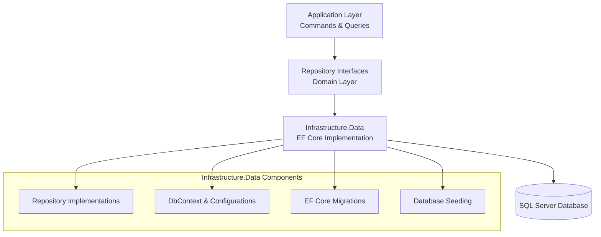

# CleanCut.Infrastructure.Data - Data Access Layer with CQRS

## Overview

The **CleanCut.Infrastructure.Data** layer implements the data persistence and retrieval infrastructure for the CleanCut application. It provides concrete implementations of repository interfaces from the Domain layer and integrates seamlessly with the CQRS pattern implemented in the Application layer.

## Role in Clean Architecture



## Key Features

### **??? Clean Architecture Integration**
- ? **Repository Pattern** implementations from Domain interfaces
- ? **Unit of Work Pattern** via EF Core DbContext
- ? **CQRS Support** with optimized read and write operations
- ? **Domain Events** integration with automatic publishing
- ? **Value Objects** mapping with EF Core converters

### **?? Data Access Patterns**
- ? **Entity Framework Core 9** with SQL Server
- ? **Code-First Development** with fluent API configurations
- ? **Audit Trail Support** with automatic timestamps
- ? **Soft Delete** implementation for data integrity
- ? **Performance Optimization** with query splitting and tracking

### **?? Database Management**
- ? **Migration-Based Schema** version control
- ? **Database Seeding** for development and testing
- ? **Connection Pooling** for performance
- ? **Transaction Management** via Unit of Work
- ? **Query Optimization** with compiled queries

## Project Structure

```
CleanCut.Infrastructure.Data/
??? Context/      # DbContext and configuration
?   ??? CleanCutDbContext.cs
?   ??? ICleanCutDbContext.cs
?
??? Repositories/         # Repository implementations
?   ??? BaseRepository.cs
?   ??? CustomerRepository.cs
? ??? ProductRepository.cs
?   ??? CountryRepository.cs
?
??? Configurations/       # EF Core entity configurations
? ??? CustomerConfiguration.cs
?   ??? ProductConfiguration.cs
?   ??? CountryConfiguration.cs
?
??? Migrations/   # Database schema migrations
?   ??? 20241029015151_InitialCreate.cs
?   ??? [Additional migrations...]
?
??? Seeding/      # Database seeding logic
?   ??? DatabaseSeeder.cs
?   ??? CustomerSeeder.cs
?   ??? ProductSeeder.cs
?
??? Extensions/  # Extension methods and helpers
    ??? ServiceCollectionExtensions.cs
    ??? QueryExtensions.cs
```

## Implementation Examples

### **DbContext with Audit Support**
```csharp
public class CleanCutDbContext : DbContext, IUnitOfWork
{
    public CleanCutDbContext(DbContextOptions<CleanCutDbContext> options) 
        : base(options) { }

    public DbSet<Customer> Customers { get; set; }
  public DbSet<Product> Products { get; set; }
    public DbSet<Country> Countries { get; set; }

protected override void OnModelCreating(ModelBuilder modelBuilder)
    {
  // Apply all entity configurations
   modelBuilder.ApplyConfigurationsFromAssembly(Assembly.GetExecutingAssembly());
        
        // Global query filters for soft delete
        modelBuilder.Entity<Customer>()
            .HasQueryFilter(e => !e.IsDeleted);
        modelBuilder.Entity<Product>()
            .HasQueryFilter(e => !e.IsDeleted);
            
        base.OnModelCreating(modelBuilder);
    }

    public override async Task<int> SaveChangesAsync(CancellationToken cancellationToken = default)
 {
        // Handle audit properties before saving
  HandleAuditProperties();
        
        // Dispatch domain events after successful save
        var domainEvents = GetDomainEvents();
        var result = await base.SaveChangesAsync(cancellationToken);
      
 await DispatchDomainEventsAsync(domainEvents);
        return result;
    }

    private void HandleAuditProperties()
    {
    var entries = ChangeTracker.Entries()
     .Where(e => e.Entity is IAuditableEntity)
       .Where(e => e.State == EntityState.Added || e.State == EntityState.Modified);

        foreach (var entry in entries)
      {
   var entity = (IAuditableEntity)entry.Entity;
      
            if (entry.State == EntityState.Added)
   {
          entity.CreatedAt = DateTime.UtcNow;
        entity.CreatedBy = GetCurrentUserId();
            }
    
     entity.ModifiedAt = DateTime.UtcNow;
   entity.ModifiedBy = GetCurrentUserId();
        }
    }
}
```

### **Repository Implementation**
```csharp
public class ProductRepository : BaseRepository<Product>, IProductRepository
{
    public ProductRepository(CleanCutDbContext context) : base(context) { }

  public async Task<IReadOnlyList<Product>> GetProductsByCustomerAsync(Guid customerId)
{
        return await Context.Products
        .Where(p => p.CustomerId == customerId)
            .Include(p => p.Customer)
  .AsNoTracking()
.ToListAsync();
    }

    public async Task<IReadOnlyList<Product>> GetAvailableProductsAsync()
  {
        return await Context.Products
            .Where(p => p.IsAvailable)
            .OrderBy(p => p.Name)
            .AsNoTracking()
   .ToListAsync();
    }

    public async Task<Product?> GetProductWithCustomerAsync(Guid productId)
    {
        return await Context.Products
            .Include(p => p.Customer)
.FirstOrDefaultAsync(p => p.Id == productId);
    }

    public async Task<bool> IsProductNameUniqueAsync(string name, Guid? excludeId = null)
    {
 var query = Context.Products.Where(p => p.Name == name);
        
        if (excludeId.HasValue)
            query = query.Where(p => p.Id != excludeId.Value);
        
        return !await query.AnyAsync();
    }
}
```

### **Entity Configuration**
```csharp
public class ProductConfiguration : IEntityTypeConfiguration<Product>
{
    public void Configure(EntityTypeBuilder<Product> builder)
    {
        // Table configuration
  builder.ToTable("Products");
        
        // Primary key
        builder.HasKey(p => p.Id);
    builder.Property(p => p.Id)
      .ValueGeneratedNever(); // Using Guid.NewGuid() in entity
        
  // Properties
        builder.Property(p => p.Name)
       .IsRequired()
      .HasMaxLength(100);
            
        builder.Property(p => p.Description)
     .HasMaxLength(500);
            
        builder.Property(p => p.Price)
   .HasColumnType("decimal(18,2)")
          .IsRequired();
            
        builder.Property(p => p.IsAvailable)
   .IsRequired();
            
        // Audit properties
builder.Property(p => p.CreatedAt)
      .IsRequired();
            
        builder.Property(p => p.ModifiedAt)
     .IsRequired();
            
builder.Property(p => p.CreatedBy)
   .HasMaxLength(450); // AspNetUsers.Id length
            
     builder.Property(p => p.ModifiedBy)
.HasMaxLength(450);
     
        // Soft delete
        builder.Property(p => p.IsDeleted)
       .IsRequired()
  .HasDefaultValue(false);
            
        // Relationships
    builder.HasOne(p => p.Customer)
  .WithMany(c => c.Products)
  .HasForeignKey(p => p.CustomerId)
            .OnDelete(DeleteBehavior.Restrict);
   
     // Indexes
        builder.HasIndex(p => p.Name);
   builder.HasIndex(p => p.CustomerId);
        builder.HasIndex(p => p.IsAvailable);
        builder.HasIndex(p => p.CreatedAt);
    }
}
```

### **Database Seeding**
```csharp
public static class DatabaseSeeder
{
    public static async Task SeedAsync(IServiceProvider serviceProvider)
    {
        using var scope = serviceProvider.CreateScope();
        var context = scope.ServiceProvider.GetRequiredService<CleanCutDbContext>();
     var logger = scope.ServiceProvider.GetRequiredService<ILogger<DatabaseSeeder>>();

        try
        {
            await context.Database.EnsureCreatedAsync();
            
            // Seed reference data first
       await SeedCountriesAsync(context, logger);
    
          // Seed master data
       await SeedCustomersAsync(context, logger);
 
            // Seed transactional data
   await SeedProductsAsync(context, logger);

    await context.SaveChangesAsync();
            logger.LogInformation("Database seeding completed successfully");
        }
        catch (Exception ex)
    {
            logger.LogError(ex, "An error occurred while seeding the database");
            throw;
        }
    }

    private static async Task SeedCustomersAsync(CleanCutDbContext context, ILogger logger)
    {
        if (await context.Customers.AnyAsync())
{
      logger.LogInformation("Customers already exist, skipping customer seeding");
         return;
}

        var customers = new[]
        {
          Customer.Create("John", "Doe", "john.doe@example.com"),
        Customer.Create("Jane", "Smith", "jane.smith@example.com"),
            Customer.Create("Bob", "Johnson", "bob.johnson@example.com")
        };

  await context.Customers.AddRangeAsync(customers);
    logger.LogInformation("Seeded {Count} customers", customers.Length);
  }

    private static async Task SeedProductsAsync(CleanCutDbContext context, ILogger logger)
    {
     if (await context.Products.AnyAsync())
 {
      logger.LogInformation("Products already exist, skipping product seeding");
       return;
    }

        var customers = await context.Customers.ToListAsync();
        var random = new Random();
        var products = new List<Product>();

        foreach (var customer in customers)
    {
            for (int i = 1; i <= 3; i++)
            {
      var product = Product.Create(
      $"Product {i} for {customer.FirstName}",
           $"Description for product {i}",
    Math.Round((decimal)(random.NextDouble() * 100 + 10), 2),
   customer.Id);
              
  products.Add(product);
         }
   }

 await context.Products.AddRangeAsync(products);
        logger.LogInformation("Seeded {Count} products", products.Count);
    }
}
```

## Configuration and Setup

### **Service Registration**
```csharp
public static class ServiceCollectionExtensions
{
    public static IServiceCollection AddDataInfrastructure(
        this IServiceCollection services, 
        IConfiguration configuration)
    {
      // Add DbContext
        services.AddDbContext<CleanCutDbContext>(options =>
        {
            var connectionString = configuration.GetConnectionString("DefaultConnection");
 options.UseSqlServer(connectionString, sqlOptions =>
            {
      sqlOptions.MigrationsAssembly(typeof(CleanCutDbContext).Assembly.FullName);
 sqlOptions.EnableRetryOnFailure(
    maxRetryCount: 3,
         maxRetryDelay: TimeSpan.FromSeconds(30),
    errorNumbersToAdd: null);
            });
            
            // Performance configurations
options.EnableSensitiveDataLogging(false);
            options.EnableDetailedErrors(false);
        });

     // Register Unit of Work
     services.AddScoped<IUnitOfWork>(provider => 
        provider.GetRequiredService<CleanCutDbContext>());

        // Register repositories
      services.AddScoped<ICustomerRepository, CustomerRepository>();
        services.AddScoped<IProductRepository, ProductRepository>();
        services.AddScoped<ICountryRepository, CountryRepository>();

        return services;
    }
}
```

### **Connection String Configuration**
```json
// appsettings.json
{
  "ConnectionStrings": {
    "DefaultConnection": "Server=(localdb)\\mssqllocaldb;Database=CleanCut_Data;Trusted_Connection=true;MultipleActiveResultSets=true"
  },
  "DatabaseSettings": {
    "EnableSensitiveDataLogging": false,
    "EnableDetailedErrors": false,
    "CommandTimeout": 30,
    "MaxRetryCount": 3
  }
}
```

## CQRS Integration

### **Command Handler with Repository**
```csharp
public class CreateProductCommandHandler : IRequestHandler<CreateProductCommand, ProductInfo>
{
    private readonly IProductRepository _productRepository;
    private readonly ICustomerRepository _customerRepository;
    private readonly IUnitOfWork _unitOfWork;
    private readonly IMapper _mapper;

    public async Task<ProductInfo> Handle(CreateProductCommand request, CancellationToken cancellationToken)
    {
        // Validate customer exists
   var customer = await _customerRepository.GetByIdAsync(request.CustomerId);
        if (customer == null)
     throw new NotFoundException($"Customer with ID {request.CustomerId} not found");

        // Create domain entity
 var product = Product.Create(
 request.Name,
      request.Description,
    request.Price,
            request.CustomerId);

        // Add to repository
        await _productRepository.AddAsync(product);
      
        // Commit changes
     await _unitOfWork.SaveChangesAsync(cancellationToken);

        // Return mapped result
        return _mapper.Map<ProductInfo>(product);
    }
}
```

### **Query Handler with Direct DbContext Access**
```csharp
public class GetProductsQueryHandler : IRequestHandler<GetProductsQuery, IReadOnlyList<ProductInfo>>
{
    private readonly CleanCutDbContext _context;
    private readonly IMapper _mapper;

    public async Task<IReadOnlyList<ProductInfo>> Handle(GetProductsQuery request, CancellationToken cancellationToken)
    {
        var query = _context.Products
        .Include(p => p.Customer)
            .AsNoTracking();

  if (!string.IsNullOrEmpty(request.CustomerFilter))
        {
       query = query.Where(p => p.Customer.FirstName.Contains(request.CustomerFilter) ||
     p.Customer.LastName.Contains(request.CustomerFilter));
        }

 if (request.AvailableOnly)
        {
            query = query.Where(p => p.IsAvailable);
        }

        var products = await query
         .OrderBy(p => p.Name)
 .ToListAsync(cancellationToken);

  return _mapper.Map<IReadOnlyList<ProductInfo>>(products);
    }
}
```

## Performance Optimizations

### **Query Optimization**
```csharp
// Compiled queries for frequently used operations
private static readonly Func<CleanCutDbContext, Guid, Task<Product?>> GetProductByIdCompiled =
    EF.CompileAsyncQuery((CleanCutDbContext context, Guid id) =>
  context.Products.FirstOrDefault(p => p.Id == id));

// Split queries for includes with collections
var customersWithProducts = await context.Customers
    .AsSplitQuery()
    .Include(c => c.Products)
    .ToListAsync();

// Use AsNoTracking for read-only operations
var productList = await context.Products
    .AsNoTracking()
    .Select(p => new ProductInfo
    {
        Id = p.Id,
        Name = p.Name,
      Price = p.Price
    })
    .ToListAsync();
```

### **Connection Management**
```csharp
// Configure connection pooling
services.AddDbContextPool<CleanCutDbContext>(options =>
{
    options.UseSqlServer(connectionString);
}, poolSize: 128);
```

## Migration Management

### **Development Workflow**
```bash
# Add new migration
dotnet ef migrations add AddProductIndex --project src/Infrastructure/CleanCut.Infrastructure.Data

# Update database
dotnet ef database update --project src/Infrastructure/CleanCut.Infrastructure.Data

# Generate SQL script for production
dotnet ef migrations script --project src/Infrastructure/CleanCut.Infrastructure.Data --output migration.sql
```

### **Production Deployment**
```csharp
// Automatic migration in production (use carefully)
public static async Task InitializeDatabaseAsync(IServiceProvider serviceProvider)
{
    using var scope = serviceProvider.CreateScope();
    var context = scope.ServiceProvider.GetRequiredService<CleanCutDbContext>();
    
 await context.Database.MigrateAsync();
 await DatabaseSeeder.SeedAsync(serviceProvider);
}
```

## Testing Support

### **In-Memory Database for Tests**
```csharp
public static CleanCutDbContext CreateInMemoryContext()
{
    var options = new DbContextOptionsBuilder<CleanCutDbContext>()
        .UseInMemoryDatabase(databaseName: Guid.NewGuid().ToString())
     .Options;

    var context = new CleanCutDbContext(options);
 context.Database.EnsureCreated();
    return context;
}
```

### **Repository Testing**
```csharp
[Test]
public async Task GetProductsByCustomerAsync_ReturnsCorrectProducts()
{
    // Arrange
    using var context = CreateInMemoryContext();
    var repository = new ProductRepository(context);
 
    var customer = Customer.Create("John", "Doe", "john@example.com");
  context.Customers.Add(customer);
    
    var product = Product.Create("Test Product", "Description", 29.99m, customer.Id);
    context.Products.Add(product);
    
    await context.SaveChangesAsync();

    // Act
    var result = await repository.GetProductsByCustomerAsync(customer.Id);

    // Assert
    Assert.That(result.Count, Is.EqualTo(1));
    Assert.That(result[0].Name, Is.EqualTo("Test Product"));
}
```

## Monitoring and Diagnostics

### **EF Core Logging**
```csharp
protected override void OnConfiguring(DbContextOptionsBuilder optionsBuilder)
{
  if (Environment.IsDevelopment())
    {
 optionsBuilder
    .LogTo(Console.WriteLine, LogLevel.Information)
         .EnableSensitiveDataLogging()
       .EnableDetailedErrors();
    }
}
```

### **Query Performance Monitoring**
```csharp
public class QueryPerformanceInterceptor : DbCommandInterceptor
{
    private readonly ILogger<QueryPerformanceInterceptor> _logger;

    public override ValueTask<DbDataReader> ReaderExecutedAsync(
      DbCommand command, CommandExecutedEventData eventData, 
        DbDataReader result, CancellationToken cancellationToken = default)
    {
        if (eventData.Duration.TotalMilliseconds > 1000)
     {
            _logger.LogWarning("Slow query detected: {Duration}ms - {CommandText}", 
        eventData.Duration.TotalMilliseconds, command.CommandText);
    }

        return new ValueTask<DbDataReader>(result);
    }
}
```

---

**This data access layer provides a robust foundation for the CleanCut application, implementing clean architecture principles while delivering high-performance data operations with comprehensive CQRS support.**