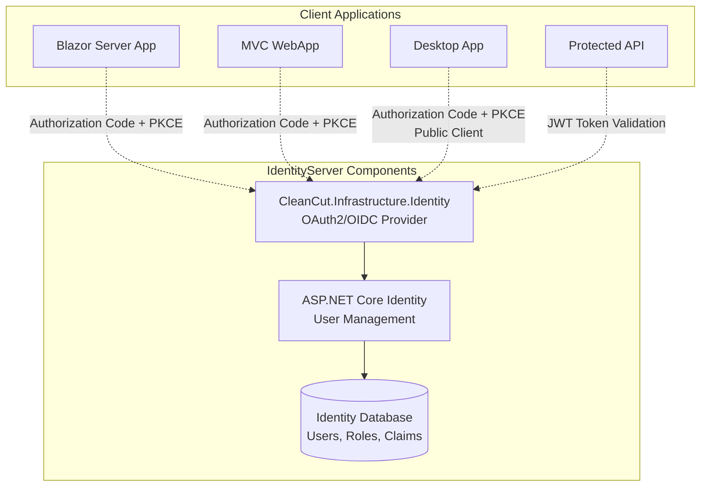
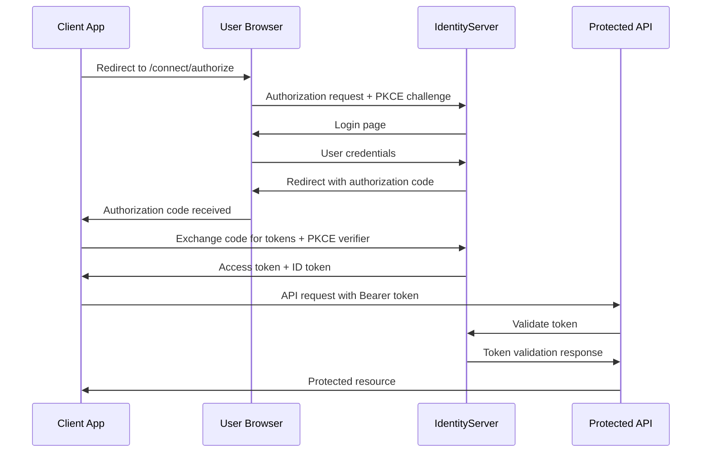
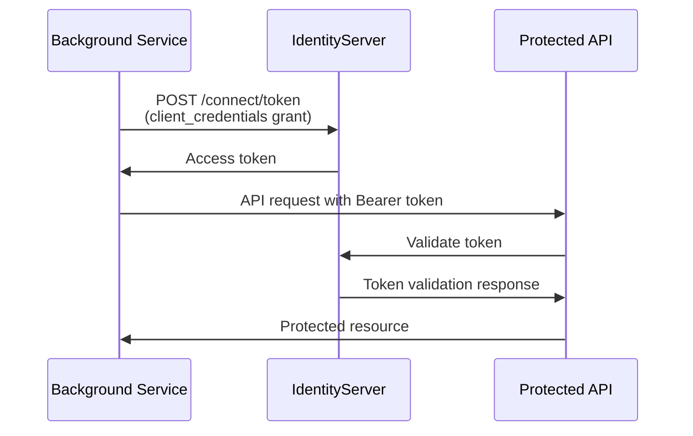
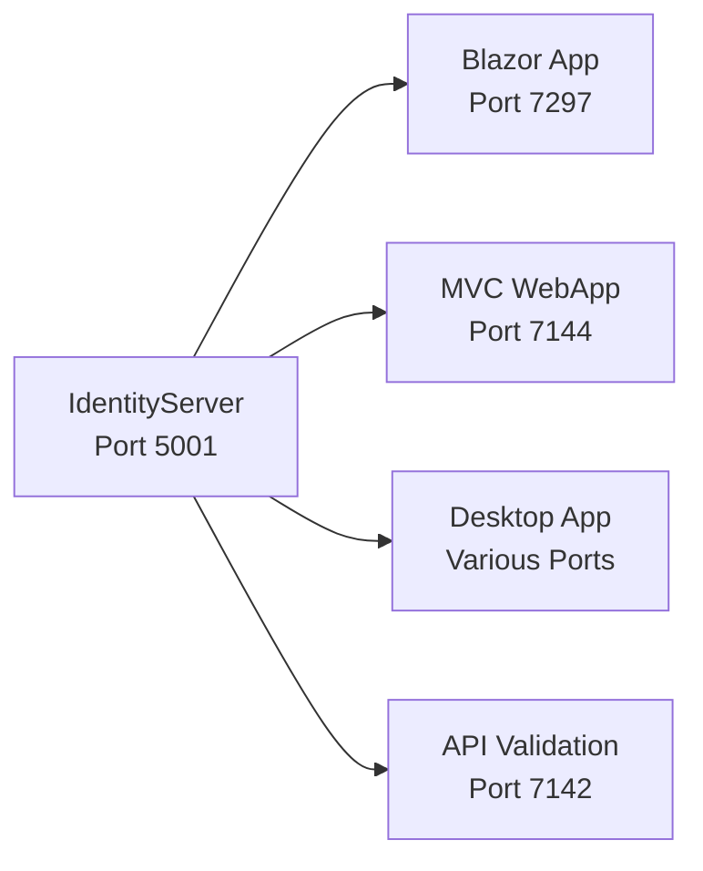

# CleanCut.Infrastructure.Identity - OAuth2/OIDC Authentication Server

## Overview

The **CleanCut.Infrastructure.Identity** project serves as the **OAuth2/OpenID Connect Authorization Server** for the entire CleanCut ecosystem. Built with **Duende IdentityServer** and **ASP.NET Core Identity**, it provides centralized authentication and authorization services for all client applications.

## Role in Authentication Architecture



## Key Features

### **?? OAuth2/OpenID Connect Provider**
- ? **Authorization Server** implementing OAuth2 RFC 6749
- ? **OpenID Connect Core 1.0** for identity layer
- ? **PKCE Support** (RFC 7636) for enhanced security
- ? **Multiple Grant Types** (Authorization Code, Client Credentials)
- ? **JWT Token Issuance** with proper audience claims
- ? **Discovery Document** for client auto-configuration

### **?? User Management**
- ? **ASP.NET Core Identity** integration
- ? **Role-based Authorization** (Admin, User roles)
- ? **User Registration** and account management
- ? **Password Policies** with complexity requirements
- ? **Account Lockout Protection** against brute force attacks
- ? **Email Confirmation** workflow support

### **?? Client Management**
- ? **Multiple Client Types** (Confidential, Public)
- ? **Dynamic Client Configuration** from appsettings
- ? **Secure Client Secrets** with proper storage
- ? **Redirect URI Validation** for security
- ? **CORS Configuration** for web clients

## Project Structure

```
CleanCut.Infrastructure.Identity/
??? Controllers/    # Identity UI controllers (if customized)
??? Data/    # Identity database context and models
?   ??? ApplicationDbContext.cs
?   ??? Migrations/
??? Models/      # Identity models
?   ??? ApplicationUser.cs
??? Pages/           # Razor Pages for Identity UI
?   ??? Account/     # Login, logout, registration
?   ??? Consent/     # Consent pages for authorization
?   ??? Home/        # Home and error pages
??? wwwroot/         # Static assets (CSS, JS, images)
??? Config.cs   # IdentityServer client and resource configuration
??? HostingExtensions.cs  # Service configuration extensions
??? Program.cs       # Application entry point
??? appsettings.json # Configuration settings
```

## Client Configuration

### **Configured OAuth2 Clients**
| Client ID | Type | Grant Type | PKCE | Secret | Purpose |
|-----------|------|------------|------|--------|---------|
| **CleanCutBlazorWebApp** | Confidential | Authorization Code | ? Yes | ? Yes | Blazor Server user auth |
| **CleanCutWebApp** | Confidential | Authorization Code | ? Yes | ? Yes | MVC WebApp user auth |
| **CleanCutWinApp** | Public | Authorization Code | ? Yes | ? No | Desktop app user auth |
| **m2m.client** | Confidential | Client Credentials | ? No | ? Yes | Service-to-service |
| **swagger-ui** | Public | Implicit | ? No | ? No | API testing |

### **Client Configuration Details**
```csharp
// Blazor Server App (Confidential Client)
new Client
{
    ClientId = "CleanCutBlazorWebApp",
    ClientName = "CleanCut Blazor Server WebApp",
    ClientSecrets = { new Secret("BlazorServerSecret2024!".Sha256()) },
    
    AllowedGrantTypes = GrantTypes.Code,
    RequirePkce = true,
    
    RedirectUris = { 
        "https://localhost:7297/signin-oidc",
        "http://localhost:5091/signin-oidc" 
    },
    PostLogoutRedirectUris = { 
        "https://localhost:7297/signout-callback-oidc",
        "http://localhost:5091/signout-callback-oidc" 
 },
    
    AllowedScopes = { "openid", "profile", "CleanCutAPI" },
    AllowOfflineAccess = true,
    RequireConsent = false
}

// Desktop App (Public Client - No Secret)
new Client
{
    ClientId = "CleanCutWinApp",
    ClientName = "CleanCut Windows Desktop App",
    
    RequireClientSecret = false, // Public client
    AllowedGrantTypes = GrantTypes.Code,
    RequirePkce = true, // Required for public clients
    
    RedirectUris = { 
        "http://localhost:8080/", 
        "cleancut://callback" 
    },
    PostLogoutRedirectUris = { "cleancut://logged-out" },
    
    AllowedScopes = { "openid", "profile", "CleanCutAPI" },
    AllowOfflineAccess = true,
    RequireConsent = false
}
```

## API Resources and Scopes

### **Protected Resources**
```csharp
public static IEnumerable<ApiResource> ApiResources =>
 new ApiResource[]
    {
        new ApiResource("CleanCutAPI", "CleanCut API")
        {
        Scopes = { "CleanCutAPI" },
         UserClaims = { "role", "email", "name" }
        }
    };

public static IEnumerable<ApiScope> ApiScopes =>
    new ApiScope[]
    {
      new ApiScope("CleanCutAPI", "CleanCut API Access", new[] { "role", "email", "name" })
    };
```

### **Identity Resources**
```csharp
public static IEnumerable<IdentityResource> IdentityResources =>
    new IdentityResource[]
    {
  new IdentityResources.OpenId(),
 new IdentityResources.Profile()
  };
```

## Authentication Flows

### **Authorization Code + PKCE Flow** (Blazor/MVC/Desktop)


### **Client Credentials Flow** (Service-to-Service)


## User Management

### **Seeded Test Accounts**
```csharp
// Administrator Account
Email: admin@cleancut.com
Password: TempPassword123!
Role: Admin
Claims: Full access to all resources

// Regular User Account
Email: user@cleancut.com
Password: TempPassword123!
Role: User
Claims: Limited access to resources
```

### **ASP.NET Core Identity Configuration**
```csharp
builder.Services.AddIdentity<ApplicationUser, IdentityRole>(options =>
{
    // Enterprise password policy
    options.Password.RequiredLength = 12;
    options.Password.RequireDigit = true;
    options.Password.RequireUppercase = true;
    options.Password.RequireLowercase = true;
    options.Password.RequireNonAlphanumeric = true;
    options.Password.RequiredUniqueChars = 4;

    // Account lockout policy
    options.Lockout.AllowedForNewUsers = true;
    options.Lockout.MaxFailedAccessAttempts = 5;
    options.Lockout.DefaultLockoutTimeSpan = TimeSpan.FromMinutes(15);

    // User requirements
 options.User.RequireUniqueEmail = true;
    options.SignIn.RequireConfirmedEmail = false; // For development
})
.AddEntityFrameworkStores<ApplicationDbContext>()
.AddDefaultTokenProviders();
```

## Security Features

### **?? Token Security**
- ? **JWT Signing** with RSA256 algorithm
- ? **Token Expiration** (1 hour access tokens)
- ? **Refresh Token Rotation** for security
- ? **Audience Validation** for API protection
- ? **Certificate-based Signing** in production

### **??? Client Security**
- ? **PKCE Enforcement** for all Authorization Code flows
- ? **Redirect URI Validation** to prevent open redirects
- ? **Client Secret Hashing** with SHA256
- ? **CORS Restrictions** to allowed origins only
- ? **HTTPS Enforcement** for all endpoints

### **?? User Security**
- ? **Password Complexity** requirements
- ? **Account Lockout** after failed attempts
- ? **Secure Cookie Configuration** for authentication
- ? **Anti-forgery Tokens** on forms
- ? **Security Headers** (HSTS, CSP, etc.)

## Development Setup

### **Prerequisites**
- **.NET 8 SDK**
- **SQL Server** (LocalDB or full instance)
- **HTTPS Certificate** for development

### **Configuration** (`appsettings.json`)
```json
{
  "ConnectionStrings": {
    "DefaultConnection": "Server=(localdb)\\mssqllocaldb;Database=CleanCut_Identity;Trusted_Connection=true;"
  },
  "IdentityServer": {
  "SigningCertificateThumbprint": "", // Production only
    "Clients": {
      "CleanCutBlazorWebApp": {
    "Secret": "BlazorServerSecret2024!",
        "RedirectUris": ["https://localhost:7297/signin-oidc"],
  "PostLogoutRedirectUris": ["https://localhost:7297/signout-callback-oidc"]
   }
    }
  },
  "AllowedOrigins": [
    "https://localhost:7297",
    "https://localhost:7144",
    "https://localhost:7142"
  ]
}
```

### **Starting the IdentityServer**
```bash
# Navigate to project directory
cd src/Infrastructure/CleanCut.Infrastructure.Identity

# Run the application
dotnet run

# IdentityServer will be available at:
# https://localhost:5001
```

### **First Run Setup**
1. **Database Creation**: Automatically created on first run
2. **User Seeding**: Test accounts created automatically
3. **Discovery Document**: Available at `/.well-known/openid_configuration`
4. **Token Endpoint**: Available at `/connect/token`

## Testing and Validation

### **Discovery Document Testing**
```bash
# Test IdentityServer discovery
curl https://localhost:5001/.well-known/openid_configuration

# Expected response includes:
# - issuer
# - authorization_endpoint
# - token_endpoint
# - userinfo_endpoint
# - jwks_uri
```

### **Token Endpoint Testing**
```bash
# Client Credentials Flow
curl -X POST "https://localhost:5001/connect/token" \
  -H "Content-Type: application/x-www-form-urlencoded" \
  -d "grant_type=client_credentials&client_id=m2m.client&client_secret=511536EF-F270-4058-80CA-1C89C192F69A&scope=CleanCutAPI"

# Expected response:
# {
#   "access_token": "eyJhbGciOiJSUzI1NiIs...",
#   "expires_in": 3600,
#   "token_type": "Bearer",
#   "scope": "CleanCutAPI"
# }
```

### **User Authentication Testing**
1. **Navigate to**: `https://localhost:5001/Account/Login`
2. **Login with**: `admin@cleancut.com` / `TempPassword123!`
3. **Verify**: Successful authentication and redirect

## Production Deployment

### **Security Hardening**
```csharp
// Production certificate configuration
if (!builder.Environment.IsDevelopment())
{
    var certThumbprint = builder.Configuration["IdentityServer:SigningCertificateThumbprint"];
    if (!string.IsNullOrEmpty(certThumbprint))
    {
        var cert = LoadCertificateFromStore(certThumbprint);
        identityServerBuilder.AddSigningCredential(cert);
    }
}
```

### **Environment Configuration**
- ?? **Certificate Management**: Use proper X.509 certificates
- ?? **Secret Management**: Store secrets in Azure Key Vault
- ?? **Database Security**: Use managed database services
- ?? **Monitoring**: Implement comprehensive logging
- ?? **Load Balancing**: Configure for high availability

### **CORS Configuration**
```csharp
builder.Services.AddCors(options =>
{
    options.AddPolicy("AllowTokenRequests", policy =>
    {
        var allowedOrigins = builder.Environment.IsDevelopment()
            ? new[] { "https://localhost:7142", "https://localhost:7297" }
        : builder.Configuration.GetSection("AllowedOrigins").Get<string[]>();

  policy.WithOrigins(allowedOrigins)
       .AllowAnyMethod()
   .AllowAnyHeader()
   .AllowCredentials();
    });
});
```

## Monitoring and Logging

### **IdentityServer Events**
```csharp
builder.Services.AddIdentityServer(options =>
{
    options.Events.RaiseErrorEvents = true;
    options.Events.RaiseInformationEvents = true;
    options.Events.RaiseFailureEvents = true;
    options.Events.RaiseSuccessEvents = true;
});
```

### **Authentication Metrics**
- ? **Login Success/Failure Rates**
- ? **Token Issuance Volumes**
- ? **Client Authentication Patterns**
- ? **User Activity Tracking**
- ? **Security Event Monitoring**

## Integration Points

### **Client Application Integration**


### **Token Validation Endpoint**
- **Introspection**: `/connect/introspect`
- **UserInfo**: `/connect/userinfo`
- **JWKS**: `/.well-known/openid_configuration/jwks`
- **End Session**: `/connect/endsession`

## Troubleshooting

### **Common Issues**
1. **Certificate Errors**: Ensure HTTPS certificates are trusted
2. **Redirect URI Mismatch**: Verify client configuration matches application URLs
3. **CORS Errors**: Check allowed origins in configuration
4. **Token Validation Failures**: Verify audience and issuer claims

### **Debug Endpoints**
- **Health Check**: Available in development
- **Configuration**: `/.well-known/openid_configuration`
- **Diagnostics**: `/diagnostics` (authenticated users)

---

**This IdentityServer implementation provides enterprise-grade OAuth2/OIDC authentication services, demonstrating security best practices and supporting multiple client application types in the CleanCut ecosystem.**