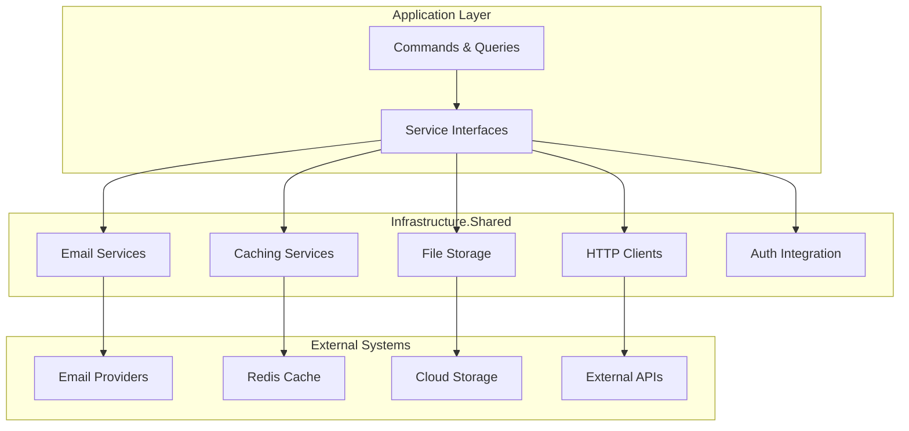

# CleanCut.Infrastructure.Shared - Cross-Cutting Infrastructure Services

## Overview

The **CleanCut.Infrastructure.Shared** layer provides **cross-cutting infrastructure services** that support the entire CleanCut application ecosystem. This layer implements technical concerns that don't belong in the core business logic but are essential for enterprise-level applications, including authentication integration, caching, logging, and external service communications.

## Role in Clean Architecture



## Key Features

### **?? Authentication Integration**
- ? **JWT Token Management** for service-to-service communication
- ? **HTTP Client Authentication** with automatic token injection
- ? **Token Refresh Handling** with retry policies
- ? **Multi-tenant Support** for different authentication contexts

### **?? Communication Services**
- ? **Email Services** with multiple provider support (SMTP, SendGrid)
- ? **Template Engine** for dynamic email content
- ? **SMS Integration** for notifications
- ? **Push Notifications** for real-time alerts

### **?? Caching Infrastructure**
- ? **Multi-level Caching** (Memory + Redis)
- ? **Cache Invalidation** strategies
- ? **Distributed Caching** for scalability
- ? **Cache-aside Pattern** implementation

### **?? File Management**
- ? **Multiple Storage Providers** (Local, Azure Blob, AWS S3)
- ? **File Upload Validation** and security
- ? **Image Processing** capabilities
- ? **CDN Integration** for performance

## Project Structure

```
CleanCut.Infrastructure.Shared/
??? Authentication/   # Auth integration services
?   ??? TokenService.cs
?   ??? AuthenticatedHttpClient.cs
?   ??? JwtTokenHandler.cs
?
??? Services/               # Core infrastructure services
?   ??? Email/
?   ?   ??? IEmailService.cs
?   ?   ??? EmailService.cs
?   ?   ??? SmtpEmailProvider.cs
?   ?   ??? SendGridEmailProvider.cs
?   ??? Storage/
?   ?   ??? IFileStorageService.cs
?   ?   ??? FileStorageService.cs
?   ?   ??? AzureBlobStorageProvider.cs
?   ?   ??? LocalFileStorageProvider.cs
?   ??? Communication/
?   ??? ISmsService.cs
? ??? SmsService.cs
?
??? Caching/   # Caching implementations
?   ??? ICacheService.cs
?   ??? CacheService.cs
?   ??? CacheKeyBuilder.cs
?   ??? CacheInvalidationService.cs
?
??? Http/    # HTTP client services
?   ??? AuthenticatedHttpClientFactory.cs
?   ??? HttpClientExtensions.cs
?   ??? RetryPolicyHandler.cs
?
??? Logging/               # Structured logging
?   ??? IApplicationLogger.cs
?   ??? ApplicationLogger.cs
?   ??? LoggingExtensions.cs
?
??? Configuration/         # Service configurations
?   ??? EmailSettings.cs
?   ??? CacheSettings.cs
?   ??? StorageSettings.cs
?   ??? AuthenticationSettings.cs
?
??? Extensions/  # Dependency injection extensions
    ??? ServiceCollectionExtensions.cs
```

## Authentication Integration

### **Authenticated HTTP Client Service**
```csharp
public class AuthenticatedHttpClientService : IAuthenticatedHttpClientService
{
    private readonly HttpClient _httpClient;
    private readonly ITokenService _tokenService;
    private readonly ILogger<AuthenticatedHttpClientService> _logger;
    private readonly AuthenticationSettings _settings;

    public AuthenticatedHttpClientService(
    HttpClient httpClient,
        ITokenService tokenService,
        IOptions<AuthenticationSettings> settings,
        ILogger<AuthenticatedHttpClientService> logger)
    {
        _httpClient = httpClient;
        _tokenService = tokenService;
        _settings = settings.Value;
_logger = logger;
    }

    public async Task<T> GetAsync<T>(string endpoint, CancellationToken cancellationToken = default)
    {
        await EnsureAuthenticatedAsync();
        
        var response = await _httpClient.GetAsync(endpoint, cancellationToken);
        response.EnsureSuccessStatusCode();
        
        var content = await response.Content.ReadAsStringAsync(cancellationToken);
 return JsonSerializer.Deserialize<T>(content, _jsonOptions);
    }

    public async Task<TResponse> PostAsync<TRequest, TResponse>(
   string endpoint, 
        TRequest data, 
        CancellationToken cancellationToken = default)
    {
        await EnsureAuthenticatedAsync();
        
        var json = JsonSerializer.Serialize(data);
        var content = new StringContent(json, Encoding.UTF8, "application/json");
        
   var response = await _httpClient.PostAsync(endpoint, content, cancellationToken);
        response.EnsureSuccessStatusCode();
     
        var responseContent = await response.Content.ReadAsStringAsync(cancellationToken);
        return JsonSerializer.Deserialize<TResponse>(responseContent, _jsonOptions);
    }

    private async Task EnsureAuthenticatedAsync()
    {
        var token = await _tokenService.GetAccessTokenAsync();
   
      if (string.IsNullOrEmpty(token))
        {
            _logger.LogWarning("No access token available, acquiring new token");
        token = await _tokenService.AcquireTokenAsync();
        }
        
        if (IsTokenExpired(token))
        {
_logger.LogInformation("Access token expired, refreshing token");
            token = await _tokenService.RefreshTokenAsync();
        }
        
 _httpClient.DefaultRequestHeaders.Authorization = 
     new AuthenticationHeaderValue("Bearer", token);
    }

    private static bool IsTokenExpired(string token)
    {
        try
    {
 var handler = new JwtSecurityTokenHandler();
    var jsonToken = handler.ReadJwtToken(token);
            return jsonToken.ValidTo <= DateTime.UtcNow.AddMinutes(-1); // 1-minute buffer
        }
        catch
        {
return true; // Assume expired if we can't parse
        }
    }
}
```

### **Token Service for Client Credentials**
```csharp
public class ClientCredentialsTokenService : ITokenService
{
  private readonly HttpClient _httpClient;
    private readonly ICacheService _cacheService;
private readonly AuthenticationSettings _settings;
    private readonly ILogger<ClientCredentialsTokenService> _logger;
    
    private const string TokenCacheKey = "client_credentials_token";

  public async Task<string> GetAccessTokenAsync()
    {
        var cachedToken = await _cacheService.GetAsync<string>(TokenCacheKey);
        
        if (!string.IsNullOrEmpty(cachedToken) && !IsTokenExpired(cachedToken))
      {
            return cachedToken;
    }
        
        return await AcquireTokenAsync();
    }

    public async Task<string> AcquireTokenAsync()
    {
    try
        {
            var tokenRequest = new FormUrlEncodedContent(new[]
       {
      new KeyValuePair<string, string>("grant_type", "client_credentials"),
          new KeyValuePair<string, "client_id", _settings.ClientId),
             new KeyValuePair<string, string>("client_secret", _settings.ClientSecret),
         new KeyValuePair<string, string>("scope", _settings.Scope)
            });

            var response = await _httpClient.PostAsync(_settings.TokenEndpoint, tokenRequest);
         response.EnsureSuccessStatusCode();

            var content = await response.Content.ReadAsStringAsync();
            var tokenResponse = JsonSerializer.Deserialize<TokenResponse>(content);

       // Cache token with shorter expiration to ensure refresh before actual expiry
  var cacheExpiration = TimeSpan.FromSeconds(tokenResponse.ExpiresIn - 60);
      await _cacheService.SetAsync(TokenCacheKey, tokenResponse.AccessToken, cacheExpiration);

            _logger.LogInformation("Successfully acquired access token");
        return tokenResponse.AccessToken;
        }
        catch (Exception ex)
        {
  _logger.LogError(ex, "Failed to acquire access token");
 throw new AuthenticationException("Failed to acquire access token", ex);
        }
    }

    public async Task<string> RefreshTokenAsync()
    {
        // For client credentials flow, refreshing is the same as acquiring
        await _cacheService.RemoveAsync(TokenCacheKey);
        return await AcquireTokenAsync();
    }
}
```

## Enhanced Caching Service

### **Multi-Level Cache Implementation**
```csharp
public class EnhancedCacheService : ICacheService
{
    private readonly IMemoryCache _memoryCache;
    private readonly IDistributedCache _distributedCache;
    private readonly CacheSettings _settings;
 private readonly ILogger<EnhancedCacheService> _logger;

    public async Task<T> GetAsync<T>(string key, CancellationToken cancellationToken = default) where T : class
    {
     try
        {
  // Level 1: Memory cache (fastest)
            if (_memoryCache.TryGetValue(key, out T memoryCachedValue))
  {
         _logger.LogDebug("Cache hit (L1 Memory): {Key}", key);
                return memoryCachedValue;
            }

    // Level 2: Distributed cache
            var cachedValue = await _distributedCache.GetStringAsync(key, cancellationToken);
    if (cachedValue != null)
      {
      var deserializedValue = JsonSerializer.Deserialize<T>(cachedValue);
      
  // Promote to memory cache for faster future access
       var memoryExpiration = TimeSpan.FromMinutes(_settings.MemoryCacheExpirationMinutes);
          _memoryCache.Set(key, deserializedValue, memoryExpiration);

    _logger.LogDebug("Cache hit (L2 Distributed): {Key}", key);
  return deserializedValue;
   }

            _logger.LogDebug("Cache miss: {Key}", key);
            return null;
   }
        catch (Exception ex)
        {
   _logger.LogWarning(ex, "Cache get operation failed for key: {Key}", key);
 return null; // Graceful degradation
        }
    }

    public async Task SetAsync<T>(
        string key, 
        T value, 
   TimeSpan? expiration = null, 
  CancellationToken cancellationToken = default) where T : class
    {
        try
        {
var expirationTime = expiration ?? TimeSpan.FromMinutes(_settings.DefaultExpirationMinutes);
     
     // Set in memory cache
            _memoryCache.Set(key, value, TimeSpan.FromMinutes(_settings.MemoryCacheExpirationMinutes));
          
       // Set in distributed cache
       var serializedValue = JsonSerializer.Serialize(value);
     var options = new DistributedCacheEntryOptions
            {
      AbsoluteExpirationRelativeToNow = expirationTime,
     SlidingExpiration = TimeSpan.FromMinutes(_settings.SlidingExpirationMinutes)
         };
            
      await _distributedCache.SetStringAsync(key, serializedValue, options, cancellationToken);
   
   _logger.LogDebug("Cache set: {Key} with expiration {Expiration}", key, expirationTime);
        }
        catch (Exception ex)
        {
            _logger.LogWarning(ex, "Cache set operation failed for key: {Key}", key);
        }
  }

    public async Task InvalidateAsync(string key, CancellationToken cancellationToken = default)
    {
        try
        {
            _memoryCache.Remove(key);
   await _distributedCache.RemoveAsync(key, cancellationToken);
     
         _logger.LogDebug("Cache invalidated: {Key}", key);
        }
   catch (Exception ex)
        {
            _logger.LogWarning(ex, "Cache invalidation failed for key: {Key}", key);
        }
    }

    public async Task InvalidateByPatternAsync(string pattern, CancellationToken cancellationToken = default)
    {
        try
        {
          // Implementation depends on cache provider capabilities
            // Redis supports pattern-based operations
if (_distributedCache is IRedisCache redisCache)
 {
      await redisCache.RemoveByPatternAsync(pattern, cancellationToken);
         _logger.LogDebug("Cache pattern invalidated: {Pattern}", pattern);
            }
        }
        catch (Exception ex)
        {
            _logger.LogWarning(ex, "Pattern-based cache invalidation failed for pattern: {Pattern}", pattern);
        }
    }
}
```

### **Cache Key Builder**
```csharp
public class CacheKeyBuilder
{
    private readonly List<string> _segments = new();

    public static CacheKeyBuilder Create() => new();

    public CacheKeyBuilder WithPrefix(string prefix)
    {
        _segments.Insert(0, prefix);
        return this;
    }

    public CacheKeyBuilder WithEntity<T>() where T : class
  {
        _segments.Add(typeof(T).Name.ToLowerInvariant());
 return this;
    }

    public CacheKeyBuilder WithId(object id)
    {
        _segments.Add(id.ToString());
        return this;
}

    public CacheKeyBuilder WithUserId(string userId)
 {
        _segments.Add($"user:{userId}");
        return this;
    }

    public CacheKeyBuilder WithCustomSegment(string segment)
    {
        _segments.Add(segment);
     return this;
    }

    public string Build()
    {
        return string.Join(":", _segments.Where(s => !string.IsNullOrWhiteSpace(s)));
    }

    // Convenience methods for common patterns
    public static string ForEntity<T>(object id) where T : class =>
        Create().WithEntity<T>().WithId(id).Build();

    public static string ForUserEntity<T>(string userId, object id) where T : class =>
        Create().WithEntity<T>().WithUserId(userId).WithId(id).Build();

    public static string ForList<T>(string filter = null) where T : class
    {
        var builder = Create().WithEntity<T>().WithCustomSegment("list");
        if (!string.IsNullOrWhiteSpace(filter))
   builder.WithCustomSegment($"filter:{filter}");
        return builder.Build();
    }
}
```

## Email Service with Authentication Context

### **Enhanced Email Service**
```csharp
public class EmailService : IEmailService
{
    private readonly IEmailProvider _emailProvider;
    private readonly IEmailTemplateService _templateService;
    private readonly EmailSettings _settings;
  private readonly ILogger<EmailService> _logger;
    private readonly ICurrentUserService _currentUserService;

    public async Task<EmailResult> SendWelcomeEmailAsync(string email, string userName, string resetToken)
    {
      var templateData = new
        {
       UserName = userName,
  Email = email,
            ResetPasswordUrl = $"{_settings.BaseUrl}/Account/ResetPassword?token={resetToken}",
         SupportEmail = _settings.SupportEmail,
            CompanyName = _settings.CompanyName
        };

        return await SendTemplateAsync("welcome", templateData, email);
    }

    public async Task<EmailResult> SendPasswordResetEmailAsync(string email, string resetToken)
    {
        var templateData = new
        {
       Email = email,
      ResetPasswordUrl = $"{_settings.BaseUrl}/Account/ResetPassword?token={resetToken}",
     ExpirationHours = 24,
            SupportEmail = _settings.SupportEmail
      };

        return await SendTemplateAsync("password-reset", templateData, email);
    }

    public async Task<EmailResult> SendNotificationEmailAsync(string email, string subject, string message)
    {
        var currentUser = await _currentUserService.GetCurrentUserAsync();

        var templateData = new
   {
   Subject = subject,
          Message = message,
      SentBy = currentUser?.Name ?? "System",
            SentAt = DateTime.UtcNow,
            SupportEmail = _settings.SupportEmail
        };

        return await SendTemplateAsync("notification", templateData, email);
    }

    private async Task<EmailResult> SendTemplateAsync(string templateName, object model, string to)
    {
      try
        {
var template = await _templateService.GetTemplateAsync(templateName);
     var renderedContent = await _templateService.RenderAsync(template, model);

         var request = new EmailRequest
            {
      To = to,
           Subject = renderedContent.Subject,
            Body = renderedContent.Body,
           IsHtml = true
            };

            return await SendAsync(request);
        }
        catch (Exception ex)
        {
  _logger.LogError(ex, "Failed to send template email {Template} to {Recipient}", templateName, to);
       return EmailResult.Failure(ex.Message);
        }
    }
}
```

## Configuration and Setup

### **Service Registration with Authentication**
```csharp
public static class ServiceCollectionExtensions
{
    public static IServiceCollection AddSharedInfrastructure(
     this IServiceCollection services, 
        IConfiguration configuration)
    {
        // Authentication services
        services.Configure<AuthenticationSettings>(configuration.GetSection("Authentication"));
services.AddScoped<ITokenService, ClientCredentialsTokenService>();
   
        // HTTP clients with authentication
        services.AddHttpClient<IAuthenticatedHttpClientService, AuthenticatedHttpClientService>(client =>
  {
            var baseUrl = configuration.GetValue<string>("ApiSettings:BaseUrl");
    client.BaseAddress = new Uri(baseUrl);
    client.Timeout = TimeSpan.FromSeconds(30);
   })
        .AddPolicyHandler(GetRetryPolicy())
        .AddPolicyHandler(GetCircuitBreakerPolicy());

        // Caching services
        services.Configure<CacheSettings>(configuration.GetSection("CacheSettings"));
        services.AddMemoryCache();
     
     var redisConnectionString = configuration.GetConnectionString("Redis");
 if (!string.IsNullOrEmpty(redisConnectionString))
        {
       services.AddStackExchangeRedisCache(options =>
     {
     options.Configuration = redisConnectionString;
   options.InstanceName = "CleanCut";
   });
        }
        
        services.AddScoped<ICacheService, EnhancedCacheService>();

        // Email services
        services.Configure<EmailSettings>(configuration.GetSection("EmailSettings"));
        services.AddScoped<IEmailService, EmailService>();
        services.AddScoped<IEmailTemplateService, EmailTemplateService>();
        
   var emailProvider = configuration.GetValue<string>("EmailSettings:Provider");
        switch (emailProvider?.ToLower())
     {
        case "sendgrid":
            services.AddScoped<IEmailProvider, SendGridEmailProvider>();
   break;
 case "smtp":
      services.AddScoped<IEmailProvider, SmtpEmailProvider>();
        break;
            default:
    services.AddScoped<IEmailProvider, LoggingEmailProvider>(); // Development fallback
        break;
   }

        // File storage
        services.Configure<FileStorageSettings>(configuration.GetSection("FileStorageSettings"));
  services.AddScoped<IFileStorageService, FileStorageService>();
        
      var storageProvider = configuration.GetValue<string>("FileStorageSettings:Provider");
switch (storageProvider?.ToLower())
    {
            case "azureblob":
    services.AddScoped<IFileStorageProvider, AzureBlobStorageProvider>();
            break;
            case "local":
                services.AddScoped<IFileStorageProvider, LocalFileStorageProvider>();
     break;
}

        // Logging
  services.AddScoped<IApplicationLogger, ApplicationLogger>();

 return services;
    }

    private static IAsyncPolicy<HttpResponseMessage> GetRetryPolicy()
    {
        return Policy
         .HandleResult<HttpResponseMessage>(r => !r.IsSuccessStatusCode)
      .Or<HttpRequestException>()
            .WaitAndRetryAsync(
      retryCount: 3,
     sleepDurationProvider: retryAttempt => TimeSpan.FromSeconds(Math.Pow(2, retryAttempt)),
    onRetry: (outcome, timespan, retryCount, context) =>
      {
    var logger = context.GetLogger();
      logger?.LogWarning("Retry {RetryCount} after {Delay}ms", retryCount, timespan.TotalMilliseconds);
           });
    }

    private static IAsyncPolicy<HttpResponseMessage> GetCircuitBreakerPolicy()
    {
        return Policy
          .HandleResult<HttpResponseMessage>(r => !r.IsSuccessStatusCode)
    .CircuitBreakerAsync(
      handledEventsAllowedBeforeBreaking: 3,
            durationOfBreak: TimeSpan.FromSeconds(30));
    }
}
```

### **Configuration Settings**
```json
{
  "Authentication": {
    "Authority": "https://localhost:5001",
    "ClientId": "cleancut-shared-services",
    "ClientSecret": "SharedServicesSecret2024!",
  "Scope": "CleanCutAPI",
    "TokenEndpoint": "https://localhost:5001/connect/token"
  },
  "ApiSettings": {
    "BaseUrl": "https://localhost:7142"
  },
  "CacheSettings": {
    "DefaultExpirationMinutes": 60,
    "MemoryCacheExpirationMinutes": 10,
    "SlidingExpirationMinutes": 30,
    "EnableDistributedCache": true
  },
  "EmailSettings": {
    "Provider": "SendGrid",
    "DefaultFromAddress": "noreply@cleancut.com",
    "DefaultFromName": "CleanCut Application",
    "SupportEmail": "support@cleancut.com",
    "CompanyName": "CleanCut Solutions",
    "BaseUrl": "https://localhost:7297",
    "SendGrid": {
      "ApiKey": "your-sendgrid-api-key"
    }
  }
}
```

## Performance and Monitoring

### **Performance Metrics**
```csharp
public class PerformanceMetricsService : IPerformanceMetricsService
{
    private readonly ILogger<PerformanceMetricsService> _logger;
    private readonly TelemetryClient _telemetryClient;

 public async Task<T> TrackOperationAsync<T>(string operationName, Func<Task<T>> operation)
    {
        var stopwatch = Stopwatch.StartNew();
        var success = false;
        Exception exception = null;

        try
        {
            var result = await operation();
         success = true;
return result;
        }
        catch (Exception ex)
   {
       exception = ex;
      throw;
        }
        finally
    {
          stopwatch.Stop();
            
    _logger.LogInformation("Operation {OperationName} completed in {Duration}ms, Success: {Success}",
         operationName, stopwatch.ElapsedMilliseconds, success);
            
 _telemetryClient?.TrackDependency("Operation", operationName, 
            DateTime.UtcNow.Subtract(stopwatch.Elapsed), stopwatch.Elapsed, success);
          
if (exception != null)
         {
      _telemetryClient?.TrackException(exception);
     }
        }
    }
}
```

## Testing Support

### **Mock Services for Testing**
```csharp
public class MockEmailService : IEmailService
{
    private readonly List<EmailRequest> _sentEmails = new();
    
    public IReadOnlyList<EmailRequest> SentEmails => _sentEmails.AsReadOnly();

    public Task<EmailResult> SendAsync(EmailRequest request)
  {
        _sentEmails.Add(request);
    return Task.FromResult(EmailResult.Success());
    }

    public Task<EmailResult> SendWelcomeEmailAsync(string email, string userName, string resetToken)
    {
        return SendAsync(new EmailRequest
 {
            To = email,
        Subject = "Welcome to CleanCut",
        Body = $"Welcome {userName}!"
        });
    }
}

public class InMemoryCacheService : ICacheService
{
    private readonly ConcurrentDictionary<string, (object Value, DateTime Expiry)> _cache = new();

    public Task<T> GetAsync<T>(string key, CancellationToken cancellationToken = default) where T : class
    {
        if (_cache.TryGetValue(key, out var item) && item.Expiry > DateTime.UtcNow)
        {
       return Task.FromResult((T)item.Value);
    }
        
        return Task.FromResult<T>(null);
 }

    public Task SetAsync<string>(string key, T value, TimeSpan? expiration = null, CancellationToken cancellationToken = default) where T : class
    {
        var expiry = DateTime.UtcNow.Add(expiration ?? TimeSpan.FromMinutes(60));
        _cache.AddOrUpdate(key, (value, expiry), (k, v) => (value, expiry));
     return Task.CompletedTask;
    }
}
```

---

**This shared infrastructure layer provides robust, enterprise-grade cross-cutting services that support the entire CleanCut application ecosystem with proper authentication integration, caching strategies, and external service communications.**