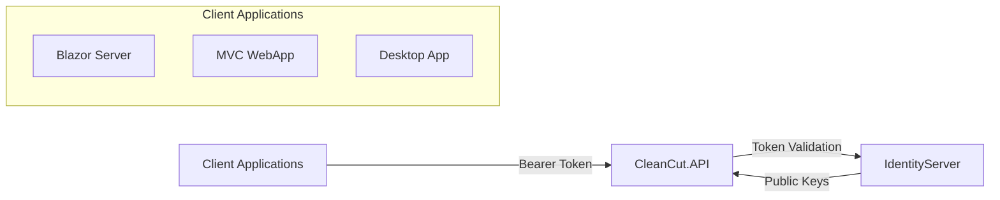

# CleanCut.API - Protected Web API with JWT Bearer Authentication

## Overview

The **CleanCut.API** serves as the **Resource Server** in the OAuth2/OpenID Connect architecture. It provides secure REST endpoints protected by JWT Bearer authentication, requiring valid tokens issued by the CleanCut IdentityServer.

## Role in Authentication Architecture



### Authentication Flow
1. **Client Applications** obtain JWT tokens from IdentityServer
2. **API requests** include `Authorization: Bearer {token}` header
3. **API validates** tokens against IdentityServer's public keys
4. **Authorized requests** proceed to business logic
5. **Unauthorized requests** return 401/403 responses

## Security Features

### **JWT Bearer Authentication**
- **Authority**: `https://localhost:5001` (IdentityServer)
- **Audience**: `CleanCutAPI` (this API resource)
- **Token Validation**: Signature, expiration, audience, issuer
- **Claims Extraction**: User identity, roles, permissions

### **Authorization Policies**
```csharp
FallbackPolicy: RequireAuthenticatedUser()  // All endpoints require auth
AdminOnly: RequireRole("Admin")     // Destructive operations
UserOrAdmin: RequireRole("User", "Admin")  // Regular operations
```

### **Security Middleware**
- ? **Rate Limiting**: 100 req/min (production), 1000 req/min (development)
- ? **CORS**: Restricted origins for client applications
- ? **Security Headers**: CSP, HSTS, XSS Protection, Frame Options
- ? **HTTPS Enforcement**: Redirects and secure cookies
- ? **Input Validation**: FluentValidation with business rules

## API Endpoints

### **Products API (Version 1)**
| Method | Endpoint | Authorization | Description |
|--------|----------|---------------|-------------|
| GET | `/api/v1/products` | User/Admin | List all products |
| GET | `/api/v1/products/{id}` | User/Admin | Get product by ID |
| GET | `/api/v1/products/customer/{customerId}` | User/Admin | Get customer's products |
| POST | `/api/v1/products` | User/Admin | Create new product |
| PUT | `/api/v1/products/{id}` | User/Admin | Update product |
| DELETE | `/api/v1/products/{id}` | **Admin Only** | Delete product |

### **Products API (Version 2)**
| Method | Endpoint | Authorization | Description |
|--------|----------|---------------|-------------|
| GET | `/api/v2/products` | User/Admin | Paginated products list |
| GET | `/api/v2/products/{id}` | User/Admin | Enhanced product details |
| GET | `/api/v2/products/customer/{customerId}` | User/Admin | Paginated customer products |
| GET | `/api/v2/products/statistics` | User/Admin | Product statistics |
| POST | `/api/v2/products` | User/Admin | Create with enhanced response |
| PUT | `/api/v2/products/{id}` | User/Admin | Update with validation |

### **Customers API**
| Method | Endpoint | Authorization | Description |
|--------|----------|---------------|-------------|
| GET | `/api/customers` | User/Admin | List all customers |
| GET | `/api/customers/{id}` | User/Admin | Get customer by ID |
| POST | `/api/customers` | User/Admin | Create new customer |
| PUT | `/api/customers/{id}` | User/Admin | Update customer |

### **Countries API**
| Method | Endpoint | Authorization | Description |
|--------|----------|---------------|-------------|
| GET | `/api/countries` | User/Admin | List all countries |
| GET | `/api/countries/{id}` | User/Admin | Get country by ID |
| POST | `/api/countries` | User/Admin | Create new country |
| PUT | `/api/countries/{id}` | User/Admin | Update country |
| DELETE | `/api/countries/{id}` | User/Admin | Delete country |

## Authentication Testing

### **Getting JWT Tokens**
1. **Use Token Helper**: Navigate to `/token-helper.html`
2. **Select Client**: Choose from configured clients
3. **Get Token**: Click "Get JWT Token"
4. **Use in Swagger**: Copy token and authorize in Swagger UI

### **Test Accounts** (Seeded in Development)
```
Admin Account:
- Username: alice
- Email: admin@cleancut.com
- Password: Dynamically generated (check IdentityServer logs on startup)
- Role: Admin (can access all endpoints)
- Claims: Full name, department (IT), employee_id (EMP001)

User Account:  
- Username: bob
- Email: user@cleancut.com
- Password: Dynamically generated (check IdentityServer logs on startup)
- Role: User (cannot delete products)
- Claims: Full name, department (Sales), employee_id (EMP002), location (New York)
```

**Note**: Passwords are automatically generated for security. To get the actual passwords:
1. Start the IdentityServer project
2. Check the console output or logs for generated passwords
3. Or configure custom passwords in `appsettings.json`:
   ```json
{
     "SeedData": {
       "AdminPassword": "YourCustomPassword123!",
       "UserPassword": "YourCustomPassword123!"
     }
   }
   ```

### **Manual Testing with cURL**
```bash
# Get token from IdentityServer
curl -X POST "https://localhost:5001/connect/token" \
  -H "Content-Type: application/x-www-form-urlencoded" \
  -d "grant_type=client_credentials&client_id=m2m.client&client_secret=511536EF-F270-4058-80CA-1C89C192F69A&scope=CleanCutAPI"

# Use token to call API
curl -H "Authorization: Bearer YOUR_TOKEN_HERE" \
  https://localhost:7142/api/v1/products
```

## Error Responses

### **Authentication Errors**
```json
// 401 Unauthorized - Missing or invalid token
{
  "type": "https://tools.ietf.org/html/rfc7235#section-3.1",
  "title": "Unauthorized",
  "status": 401,
  "detail": "JWT Authentication failed"
}
```

### **Authorization Errors**
```json
// 403 Forbidden - Valid token but insufficient permissions
{
  "type": "https://tools.ietf.org/html/rfc7231#section-6.5.3", 
  "title": "Forbidden",
  "status": 403,
  "detail": "User does not have the required role: Admin"
}
```

## Development Setup

### **Prerequisites**
- IdentityServer running on `https://localhost:5001`
- SQL Server with connection string configured
- Redis (optional, for caching)

### **Configuration** (`appsettings.json`)
```json
{
  "IdentityServer": {
    "Authority": "https://localhost:5001"
  },
  "AllowedOrigins": [
    "https://localhost:7297",  // Blazor App
    "http://localhost:5091"    // Blazor HTTP
  ]
}
```

### **Starting the API**
```bash
# Start IdentityServer first
dotnet run --project src/Infrastructure/CleanCut.Infrastructure.Identity

# Then start the API
dotnet run --project src/Presentation/CleanCut.API

# Access Swagger UI
open https://localhost:7142/swagger
```

## CORS Configuration

### **Production CORS Policy**
```csharp
AllowBlazorApp: 
- Origins: Configured client application URLs only
- Methods: Any (GET, POST, PUT, DELETE)
- Headers: Any (Authorization, Content-Type, etc.)
- Credentials: Allowed (for authentication cookies)
```

### **Development Additional Policy**
```csharp
AllowSwagger:
- Origins: Any (for Swagger UI testing)
- Methods: Any
- Headers: Any
- Note: Only enabled in development environment
```

## OpenAPI/Swagger Documentation

### **Features**
- ? **Interactive Testing**: Test all endpoints with real authentication
- ? **JWT Authorization**: Built-in OAuth2 authorization flow
- ? **Request/Response Examples**: Comprehensive API documentation
- ? **Schema Validation**: Input/output model validation

### **Access Points**
- **Swagger UI**: `https://localhost:7142/swagger`
- **OpenAPI JSON**: `https://localhost:7142/openapi/v1.json`
- **Token Helper**: `https://localhost:7142/token-helper.html`

## Architecture Integration

### **Clean Architecture Compliance**
- ? **Thin Controllers**: Only routing, model binding, response formatting
- ? **Application Layer Delegation**: All business logic in Application layer
- ? **Dependency Injection**: Proper IoC container usage
- ? **Exception Handling**: Global middleware for error responses

### **CQRS Pattern Implementation**
- ? **Command/Query Separation**: MediatR for CQRS implementation
- ? **Handler Pattern**: Dedicated handlers for each operation
- ? **Validation Pipeline**: FluentValidation integrated with MediatR

## Security Monitoring

### **Logging Features**
- ? **Authentication Events**: Token validation success/failure
- ? **Authorization Events**: Role-based access attempts
- ? **Rate Limiting**: Request throttling and rejection logging
- ? **Security Headers**: Policy violation tracking
- ? **Performance Metrics**: Request timing and throughput

### **Development Helpers**
- ? **Token Helper UI**: Easy token generation for testing
- ? **Detailed Error Responses**: Enhanced debugging information
- ? **Request Logging**: Complete request/response cycle tracking

## Production Considerations

### **Security Hardening**
- ?? **HSTS Headers**: Force HTTPS connections
- ?? **Certificate Validation**: Proper TLS/SSL setup
- ?? **Rate Limiting**: Production-level request restrictions
- ?? **Error Handling**: Minimal error disclosure
- ?? **Security Headers**: XSS, clickjacking, content type protection

### **Performance Optimization**
- ? **Caching**: Redis integration for frequently accessed data
- ? **Connection Pooling**: Optimized database connections
- ? **Response Compression**: Reduced payload sizes
- ? **Health Checks**: Application monitoring endpoints

---

**This API serves as the secure foundation for all client applications in the CleanCut ecosystem, demonstrating enterprise-level security practices and clean architecture principles.**