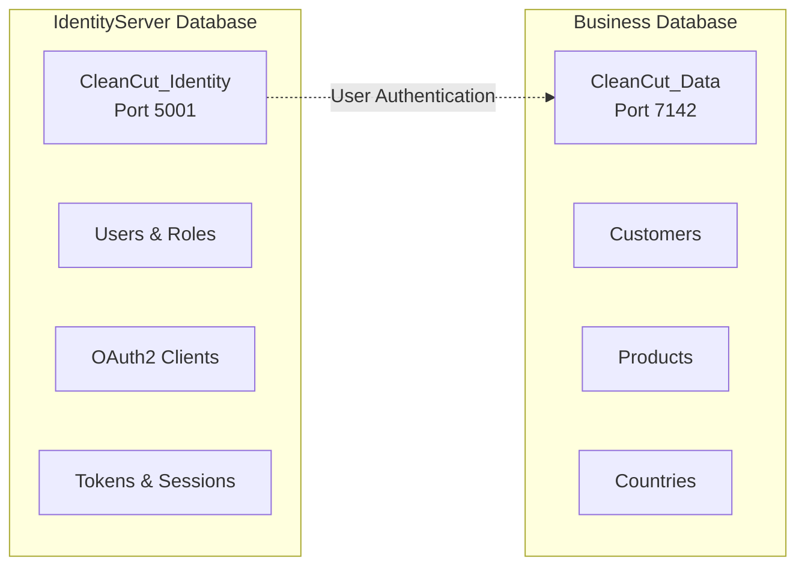

# Database Seeding Guide - Multi-Database Architecture

## Overview

The CleanCut solution uses a **dual-database architecture** with automatic seeding for both **business data** and **identity data**. This document explains how to manage and reset the databases that support the OAuth2/OIDC authentication system and business operations.

## Database Architecture

### **??? Dual-Database Setup**


### **Database Purposes**
| Database | Purpose | Content | Project |
|----------|---------|---------|---------|
| **CleanCut_Identity** | Authentication | Users, Roles, OAuth2 Clients, Sessions | Infrastructure.Identity |
| **CleanCut_Data** | Business Data | Customers, Products, Countries | Infrastructure.Data |

## Comprehensive Test Data

### **?? Identity Database Seeding**
- **Admin User**: `admin@cleancut.com` / `TempPassword123!` (Admin role)
- **Regular User**: `user@cleancut.com` / `TempPassword123!` (User role)
- **OAuth2 Clients**: All configured clients for different applications
- **Roles & Claims**: Proper role-based authorization setup

### **?? Business Database Seeding**
- **3 Sample Customers** with complete profile information
- **9+ Products** distributed across customers (3 per customer)
- **5+ Countries** for reference data
- **Realistic pricing** with variation ($10-$500 range)
- **Mixed availability status** (85% available, 15% unavailable)

### **?? Test-Friendly GUIDs**
For consistent testing across applications:
```csharp
// Test Customer IDs (from seeded data)
Customer 1: 11111111-1111-1111-1111-111111111111 (John Doe)
Customer 2: 22222222-2222-2222-2222-222222222222 (Jane Smith)
Customer 3: 33333333-3333-3333-3333-333333333333 (Bob Johnson)

// Test Product IDs (examples from seeded data)
Product 1: First product for Customer 1
Product 2: Second product for Customer 1
// Actual GUIDs are generated dynamically but are consistent per seed
```

## How to Reset and Reseed Both Databases

### **?? Complete Reset (Recommended for Development)**

#### **Step 1: Stop All Services**
```bash
# Stop all running services
# Ctrl+C in each terminal running:
# - IdentityServer (port 5001)
# - API (port 7142)  
# - Blazor App (port 7297)
# - MVC App (port 7144)
```

#### **Step 2: Delete Both Databases**
```bash
# Navigate to solution root
cd "D:\.NET STUDY\CleanCut"

# Delete Identity Database
dotnet ef database drop --project src/Infrastructure/CleanCut.Infrastructure.Identity --force

# Delete Business Data Database
dotnet ef database drop --project src/Infrastructure/CleanCut.Infrastructure.Data --startup-project src/Presentation/CleanCut.API --force
```

#### **Step 3: Restart Services (Auto-Recreation)**
```bash
# Terminal 1: Start IdentityServer (creates Identity DB)
dotnet run --project src/Infrastructure/CleanCut.Infrastructure.Identity

# Terminal 2: Start API (creates Business DB)
dotnet run --project src/Presentation/CleanCut.API

# Terminal 3: Start Blazor App (optional)
dotnet run --project src/Presentation/CleanCut.BlazorWebApp

# Terminal 4: Start MVC App (optional)
dotnet run --project src/Presentation/CleanCut.WebApp
```

### **?? Selective Database Reset**

#### **Reset Only Identity Database**
```bash
# Stop IdentityServer
dotnet ef database drop --project src/Infrastructure/CleanCut.Infrastructure.Identity --force

# Restart IdentityServer (will recreate and seed)
dotnet run --project src/Infrastructure/CleanCut.Infrastructure.Identity
```

#### **Reset Only Business Database**
```bash
# Stop API
dotnet ef database drop --project src/Infrastructure/CleanCut.Infrastructure.Data --startup-project src/Presentation/CleanCut.API --force

# Restart API (will recreate and seed)
dotnet run --project src/Presentation/CleanCut.API
```

## Verifying the Seeding

### **?? Identity Database Verification**

#### **IdentityServer Discovery**
```bash
# Check IdentityServer is running
curl https://localhost:5001/.well-known/openid_configuration
```

#### **Test Authentication**
1. Navigate to `https://localhost:5001/Account/Login`
2. Login with test accounts:
   - **Admin**: `admin@cleancut.com` / `TempPassword123!`
   - **User**: `user@cleancut.com` / `TempPassword123!`

#### **Token Generation Test**
```bash
# Test Client Credentials flow
curl -X POST "https://localhost:5001/connect/token" \
  -H "Content-Type: application/x-www-form-urlencoded" \
  -d "grant_type=client_credentials&client_id=m2m.client&client_secret=511536EF-F270-4058-80CA-1C89C192F69A&scope=CleanCutAPI"
```

### **?? Business Database Verification**

#### **API Endpoints (Authentication Required)**
```bash
# Get access token first (from above)
export TOKEN="your_access_token_here"

# Verify customers
curl -H "Authorization: Bearer $TOKEN" https://localhost:7142/api/customers

# Verify products  
curl -H "Authorization: Bearer $TOKEN" https://localhost:7142/api/v1/products

# Verify countries
curl -H "Authorization: Bearer $TOKEN" https://localhost:7142/api/countries
```

#### **Database Direct Query**
```sql
-- Connect to CleanCut_Data database
USE CleanCut_Data;

-- Check seeded data counts
SELECT 'Customers' as Table_Name, COUNT(*) as Count FROM Customers
UNION ALL
SELECT 'Products', COUNT(*) FROM Products  
UNION ALL
SELECT 'Countries', COUNT(*) FROM Countries;

-- Verify test customer exists
SELECT * FROM Customers WHERE Id = '11111111-1111-1111-1111-111111111111';

-- Check products distribution
SELECT c.FirstName, c.LastName, COUNT(p.Id) as ProductCount
FROM Customers c
LEFT JOIN Products p ON c.Id = p.CustomerId
GROUP BY c.Id, c.FirstName, c.LastName
ORDER BY c.FirstName;
```

### **?? Application Verification**

#### **Blazor App Authentication Flow**
1. Navigate to `https://localhost:7297`
2. Click "Login" ? Should redirect to IdentityServer
3. Login with test credentials
4. Should redirect back to Blazor app authenticated
5. Navigate to `/service-status` to verify API connectivity
6. Navigate to `/products` to test authenticated API calls

#### **MVC App Authentication Flow**
1. Navigate to `https://localhost:7144`
2. Click "Login" ? Should redirect to IdentityServer
3. Login with test credentials
4. Should redirect back to MVC app authenticated
5. Test protected pages and API integration

## Authentication-Aware API Testing

### **?? Using the API with Authentication**

#### **Via Blazor/MVC Apps (Recommended)**
- Use the web applications for interactive testing
- Authentication is handled automatically
- Role-based features work out of the box

#### **Via Swagger UI**
1. Navigate to `https://localhost:7142/swagger`
2. Click "Authorize"
3. Use OAuth2 authorization code flow
4. Login with test credentials
5. Test endpoints with automatic token inclusion

#### **Manual API Testing**
```bash
# 1. Get access token
TOKEN=$(curl -s -X POST "https://localhost:5001/connect/token" \
  -H "Content-Type: application/x-www-form-urlencoded" \
  -d "grant_type=client_credentials&client_id=m2m.client&client_secret=511536EF-F270-4058-80CA-1C89C192F69A&scope=CleanCutAPI" \
  | jq -r '.access_token')

# 2. Use token in API calls
curl -H "Authorization: Bearer $TOKEN" \
  -H "Content-Type: application/json" \
  https://localhost:7142/api/v1/products

# 3. Test role-restricted endpoints (requires user token, not client credentials)
# For user-specific operations, use the web apps or authorization code flow
```

## Seeding Process Details

### **?? Automatic Seeding Triggers**
| Service | Trigger | Condition | Duration |
|---------|---------|-----------|----------|
| **IdentityServer** | Startup | No existing users | ~2-3 seconds |
| **API** | Startup | No existing customers | ~3-5 seconds |

### **??? Seeding Safety Features**
- ? **Idempotent Operations**: Safe to run multiple times
- ? **Existence Checks**: Only seeds if tables are empty
- ? **Transaction Safety**: All-or-nothing seeding
- ? **Error Handling**: Graceful degradation on failures
- ? **Logging**: Comprehensive seeding activity logs

## Troubleshooting

### **?? Common Issues**

#### **IdentityServer Database Issues**
```bash
# Check connection string
# File: src/Infrastructure/CleanCut.Infrastructure.Identity/appsettings.json
{
  "ConnectionStrings": {
  "DefaultConnection": "Server=(localdb)\\mssqllocaldb;Database=CleanCut_Identity;Trusted_Connection=true;"
  }
}
```

#### **Business Database Issues**
```bash
# Check connection string  
# File: src/Presentation/CleanCut.API/appsettings.json
{
  "ConnectionStrings": {
    "DefaultConnection": "Server=(localdb)\\mssqllocaldb;Database=CleanCut_Data;Trusted_Connection=true;"
  }
}
```

#### **Authentication Flow Issues**
1. **Check IdentityServer logs** for authentication errors
2. **Verify client configuration** in `Config.cs`
3. **Check redirect URIs** match application URLs
4. **Validate CORS settings** for cross-origin requests

### **?? Diagnostic Commands**
```bash
# Check if databases exist
sqlcmd -S "(localdb)\mssqllocaldb" -Q "SELECT name FROM sys.databases WHERE name IN ('CleanCut_Identity', 'CleanCut_Data')"

# Check IdentityServer health
curl -k https://localhost:5001/health

# Check API health  
curl -k https://localhost:7142/health
```

## Production Considerations

### **?? Production Database Setup**
- **Separate Database Servers** for Identity and Business data
- **Connection String Security** via Azure Key Vault or similar
- **Migration Scripts** for controlled deployments
- **Backup Strategies** for both databases
- **Monitoring** for database health and performance

### **?? Production Seeding**
- **No Automatic Seeding** in production environments
- **Manual Data Import** for initial reference data
- **Secure User Creation** through proper admin interfaces
- **Client Configuration** through secure configuration management

---

**This dual-database architecture provides proper separation of concerns between authentication and business data while maintaining comprehensive development and testing capabilities through automated seeding.**