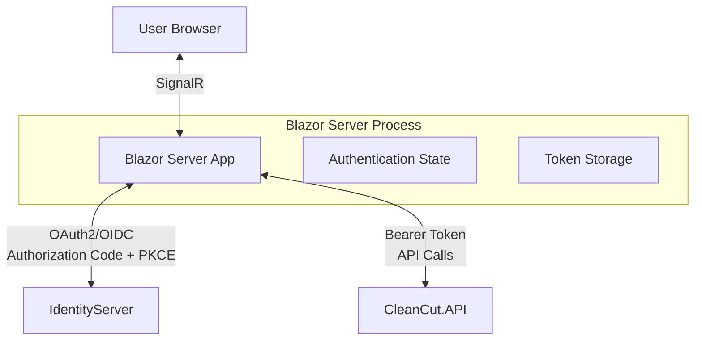

# CleanCut.BlazorWebApp - Server-Side Blazor with OAuth2 Authentication

## Overview

The **CleanCut.BlazorWebApp** is a **Blazor Server** application that serves as a client in the OAuth2/OpenID Connect ecosystem. It demonstrates modern web application development with server-side rendering, real-time interactivity, and secure authentication integration.

## Role in Authentication Architecture



## Authentication Flow

### **OAuth2/OpenID Connect Integration**
1. **User visits** Blazor application
2. **Authentication required** ? Redirect to IdentityServer
3. **User authenticates** with username/password
4. **Authorization Code + PKCE** flow completes
5. **Tokens stored** securely in server-side authentication context
6. **User returns** to Blazor application with authenticated session
7. **API calls** automatically include Bearer tokens

### **Client Configuration**
```csharp
Client Type: Confidential Client
Grant Type: Authorization Code + PKCE
Client ID: CleanCutBlazorWebApp
Client Secret: BlazorServerSecret2024! (development)
Scopes: openid, profile, CleanCutAPI
Redirect URIs: https://localhost:7297/signin-oidc
```

## Key Features

### **?? Authentication & Authorization**
- ? **OpenID Connect Authentication** with automatic redirects
- ? **JWT Bearer Token Integration** for API calls  
- ? **Role-based UI Rendering** (Admin/User content)
- ? **Automatic Token Refresh** handling
- ? **Secure Session Management** with sliding expiration

### **?? Modern Blazor Server Features**
- ? **Interactive Server Components** with real-time updates
- ? **SignalR Integration** for browser-server communication
- ? **Server-side State Management** with scoped services
- ? **Component-based Architecture** with reusable UI elements
- ? **Form Validation** with data annotations

### **?? API Integration**
- ? **Automatic Authentication** via `AuthenticatedHttpMessageHandler`
- ? **Multiple API Versions** (v1 and v2) support
- ? **Typed HTTP Clients** for strongly-typed API calls
- ? **Error Handling** with user-friendly messages
- ? **Loading States** and progress indicators

## Project Structure

```
CleanCut.BlazorWebApp/
??? Components/
?   ??? Account/  # Authentication UI components
?   ?   ??? LoginDisplay.razor
?   ??? Layout/       # Application layout components
?   ?   ??? MainLayout.razor
?   ?   ??? MainLayout.razor.css
?   ??? Pages/        # Page components
?       ??? Home.razor
?       ??? AuthTest.razor    # Authentication testing
?       ??? ServiceStatus.razor
?   ??? ProductCreate.razor
?       ??? ProductManagement.razor
?       ??? CustomerManagement.razor
?       ??? Countries.razor
?
??? Services/    # HTTP clients and API services
? ??? Auth/
?   ?   ??? AuthenticatedHttpMessageHandler.cs
?   ??? ProductApiClientV1.cs
?   ??? ProductApiClientV2.cs
?   ??? CustomerApiService.cs
?   ??? CountryApiService.cs
?
??? State/       # Application state management
?   ??? IUiStateService.cs
?   ??? IProductsState.cs
?   ??? ICustomersState.cs
?   ??? ICountriesState.cs
?
??? Extensions/      # Service registration extensions
?   ??? ServiceCollectionExtensions.cs
?
??? wwwroot/       # Static assets
    ??? app.css
    ??? favicon.ico
```

## Page Components

### **?? Home Dashboard**
- Authentication status display
- User information and claims
- API connectivity testing
- Real-time data updates

### **?? Authentication Test (`/auth-test`)**
- User claims inspection
- Token validation testing  
- API call testing with authentication
- Authentication flow debugging

### **?? Service Status (`/service-status`)**
- IdentityServer connectivity testing
- API availability monitoring
- Authentication flow diagnostics
- Quick action buttons for troubleshooting

### **?? Product Management**
- CRUD operations with API integration
- Real-time form validation
- Role-based action visibility
- Pagination and filtering

### **?? Customer Management**
- Customer data management
- Enhanced UI with loading states
- Error handling and validation
- Responsive design

### **?? Countries Management**
- Simple reference data management
- Inline editing capabilities
- CRUD operations with confirmation

## Authentication Implementation

### **Program.cs Configuration**
```csharp
// Authentication setup
builder.Services.AddAuthentication(options =>
{
    options.DefaultScheme = "Cookies";
    options.DefaultChallengeScheme = "oidc";
})
.AddCookie("Cookies", options =>
{
    options.LoginPath = "/Account/Login";
    options.AccessDeniedPath = "/Account/AccessDenied";
})
.AddOpenIdConnect("oidc", options =>
{
    options.Authority = "https://localhost:5001";
    options.ClientId = "CleanCutBlazorWebApp";
    options.ClientSecret = "BlazorServerSecret2024!";
    options.UsePkce = true;
    options.SaveTokens = true;
    options.GetClaimsFromUserInfoEndpoint = true;
});
```

### **AuthenticatedHttpMessageHandler**
```csharp
// Automatic token injection for API calls
public class AuthenticatedHttpMessageHandler : DelegatingHandler
{
    protected override async Task<HttpResponseMessage> SendAsync(
        HttpRequestMessage request, CancellationToken cancellationToken)
    {
  var accessToken = await httpContext.GetTokenAsync("access_token");
  if (!string.IsNullOrEmpty(accessToken))
        {
            request.Headers.Authorization = 
   new AuthenticationHeaderValue("Bearer", accessToken);
        }
        return await base.SendAsync(request, cancellationToken);
  }
}
```

### **Authorization in Components**
```razor
<AuthorizeView>
    <Authorized>
        <h3>Welcome, @context.User.Identity.Name!</h3>
        <!-- Authenticated content -->
    </Authorized>
    <NotAuthorized>
        <p>Please log in to access this content.</p>
  <a href="/Account/Login">Login</a>
    </NotAuthorized>
</AuthorizeView>

<!-- Role-based content -->
<AuthorizeView Roles="Admin">
    <button @onclick="DeleteProduct">Delete Product</button>
</AuthorizeView>
```

## API Service Integration

### **HTTP Client Configuration**
```csharp
// Automatic authentication for all API calls
builder.Services.AddHttpClient<IProductApiClientV1>(client =>
{
    client.BaseAddress = new Uri("https://localhost:7142");
})
.AddHttpMessageHandler<AuthenticatedHttpMessageHandler>();
```

### **Typed API Clients**
```csharp
public interface IProductApiClientV1
{
    Task<List<ProductInfo>> GetAllProductsAsync();
    Task<ProductInfo> GetProductAsync(Guid id);
    Task<ProductInfo> CreateProductAsync(CreateProductCommand command);
    Task<ProductInfo> UpdateProductAsync(UpdateProductCommand command);
    Task DeleteProductAsync(Guid id);
}
```

### **State Management**
```csharp
public interface IProductsState
{
    List<ProductInfo> Products { get; }
    bool IsLoading { get; }
    string? ErrorMessage { get; }
    
    Task LoadProductsAsync();
    Task CreateProductAsync(CreateProductCommand command);
    Task UpdateProductAsync(UpdateProductCommand command);
Task DeleteProductAsync(Guid id);
}
```

## Development Setup

### **Prerequisites**
1. **IdentityServer** running on `https://localhost:5001`
2. **CleanCut.API** running on `https://localhost:7142`
3. **SQL Server** with connection configured

### **Starting the Application**
```bash
# Terminal 1: Start IdentityServer
dotnet run --project src/Infrastructure/CleanCut.Infrastructure.Identity

# Terminal 2: Start API
dotnet run --project src/Presentation/CleanCut.API

# Terminal 3: Start Blazor App
dotnet run --project src/Presentation/CleanCut.BlazorWebApp

# Access application
open https://localhost:7297
```

### **Test Accounts**
```
Admin User:
- Email: admin@cleancut.com  
- Password: TempPassword123!
- Role: Admin (full access)

Regular User:
- Email: user@cleancut.com
- Password: TempPassword123!
- Role: User (limited access)
```

## Configuration

### **appsettings.json**
```json
{
  "IdentityServer": {
    "Authority": "https://localhost:5001",
    "ClientId": "CleanCutBlazorWebApp",
    "ClientSecret": "BlazorServerSecret2024!"
  },
  "ApiSettings": {
    "BaseUrl": "https://localhost:7142"
  }
}
```

### **Environment-Specific Settings**
- **Development**: Detailed errors, relaxed security
- **Production**: Secure configurations, minimal error disclosure
- **CORS**: Restricted to known client origins

## Security Features

### **?? Authentication Security**
- ? **PKCE Implementation** for Authorization Code flow
- ? **Secure Token Storage** in server-side authentication context  
- ? **Automatic Token Refresh** with sliding expiration
- ? **HTTPS Enforcement** for all communications
- ? **CSRF Protection** with anti-forgery tokens

### **??? Application Security**
- ? **CSP Headers** for XSS protection
- ? **Secure Cookies** with HttpOnly and Secure flags
- ? **Input Validation** on all forms
- ? **Role-based Access Control** throughout UI
- ? **Error Handling** without sensitive data exposure

## Blazor Server Considerations

### **Benefits**
- ? **Server-side Rendering** with fast initial load
- ? **Real-time Updates** via SignalR
- ? **Secure Authentication** tokens never reach browser
- ? **Rich Interactivity** without JavaScript frameworks
- ? **SEO Friendly** with server-side rendering

### **Performance Optimizations**
- ? **Component Streaming** for faster page loads
- ? **Efficient State Management** with scoped services
- ? **Optimized SignalR** connections
- ? **Lazy Loading** for large data sets
- ? **Caching Strategies** for frequently accessed data

## Testing & Debugging

### **Authentication Testing**
1. **Visit `/auth-test`** to inspect authentication state
2. **Check Claims** and token information
3. **Test API Calls** with authentication
4. **Verify Role-based Access** throughout application

### **Service Diagnostics**
1. **Visit `/service-status`** for connectivity testing
2. **Monitor SignalR** connections in browser dev tools
3. **Check Network Calls** for proper Bearer token headers
4. **Review Server Logs** for authentication events

### **Common Issues**
- **Token Expiration**: Check automatic refresh mechanism
- **CORS Errors**: Verify API CORS configuration
- **SignalR Disconnections**: Monitor connection stability
- **Authentication Loops**: Check redirect URI configuration

## Production Deployment

### **Security Hardening**
- ?? **Client Secret Management** via Azure Key Vault
- ?? **HTTPS Certificate** configuration
- ?? **Security Headers** implementation
- ?? **Rate Limiting** for API calls
- ?? **Monitoring & Logging** for security events

### **Performance Optimization**
- ? **SignalR Scaling** with Redis backplane
- ? **Output Caching** for static content
- ? **Component Prerendering** for faster loads
- ? **CDN Integration** for static assets
- ? **Health Checks** for monitoring

---

**This Blazor Server application demonstrates modern web development with secure authentication, showcasing the benefits of server-side rendering combined with OAuth2/OIDC security best practices.**