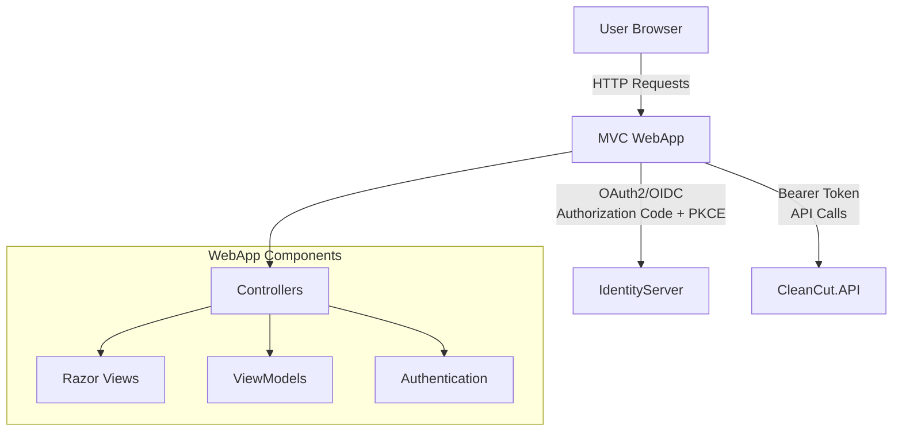

# CleanCut.WebApp - MVC/Razor Pages with OAuth2 Authentication

## Overview

The **CleanCut.WebApp** is an **ASP.NET Core MVC/Razor Pages** application that demonstrates traditional web application development with modern OAuth2/OpenID Connect authentication. It serves as a confidential client in the authentication ecosystem, providing server-side rendered pages with secure user authentication.

## Role in Authentication Architecture



## Authentication Flow

### **OAuth2/OpenID Connect Implementation**
1. **User visits** protected page in MVC application
2. **Authentication required** ? Redirect to IdentityServer
3. **User authenticates** with credentials
4. **Authorization Code + PKCE** flow completes
5. **Tokens stored** securely in authentication cookies
6. **User returns** to MVC application with authenticated session
7. **API calls** include Bearer tokens from stored access token

### **Client Configuration**
```csharp
Client Type: Confidential Client  
Grant Type: Authorization Code + PKCE
Client ID: CleanCutWebApp
Client Secret: WebAppSecret2024! (development)
Scopes: openid, profile, CleanCutAPI
Redirect URIs: https://localhost:7144/signin-oidc
```

## Key Features

### **?? Authentication & Authorization**
- ? **OpenID Connect Authentication** with automatic redirects
- ? **Role-based Authorization** throughout controllers
- ? **JWT Bearer Integration** for API calls
- ? **Secure Session Management** with authentication cookies
- ? **PKCE Implementation** for enhanced security

### **?? Modern MVC Features**
- ? **Razor Pages** with server-side rendering
- ? **Model-View-Controller** pattern implementation  
- ? **Strongly-typed ViewModels** for type safety
- ? **Data Annotations Validation** with client-side validation
- ? **Responsive Bootstrap UI** with custom styling

### **?? API Integration**
- ? **HttpClient Integration** with automatic Bearer token injection
- ? **CRUD Operations** through secured API endpoints
- ? **Error Handling** with user-friendly messages
- ? **Form Validation** with server and client-side validation

## Project Structure

```
CleanCut.WebApp/
??? Controllers/      # MVC Controllers
? ??? HomeController.cs
?   ??? ProductsController.cs
?   ??? CustomersController.cs
?   ??? AccountController.cs
?
??? Views/        # Razor View Templates
?   ??? Shared/
?   ?   ??? _Layout.cshtml
?   ?   ??? _LoginPartial.cshtml
?   ?   ??? Error.cshtml
?   ??? Home/
?   ??? Products/
?   ??? Customers/
?   ??? Account/
?
??? Models/   # ViewModels and DTOs
?   ??? ViewModels/
?   ?   ??? ProductViewModel.cs
?   ?   ??? CustomerViewModel.cs
?   ?   ??? HomeViewModel.cs
?   ??? ErrorViewModel.cs
?
??? Services/        # Application Services
?   ??? IApiService.cs
?   ??? ApiService.cs
?
??? wwwroot/         # Static Assets
?   ??? css/
?   ??? js/
?   ??? images/
?   ??? lib/
?
??? Configuration/   # App Configuration
    ??? AutoMapperProfile.cs
```

## Authentication Implementation

### **Program.cs Configuration**
```csharp
// Authentication setup
builder.Services.AddAuthentication(options =>
{
    options.DefaultScheme = "Cookies";
    options.DefaultChallengeScheme = "oidc";
})
.AddCookie("Cookies", options =>
{
    options.LoginPath = "/Account/Login";
    options.AccessDeniedPath = "/Account/AccessDenied";
    options.LogoutPath = "/Account/Logout";
})
.AddOpenIdConnect("oidc", options =>
{
    options.Authority = "https://localhost:5001";
    options.ClientId = "CleanCutWebApp";
 options.ClientSecret = "WebAppSecret2024!";
    options.ResponseType = "code";
    options.UsePkce = true;
  options.SaveTokens = true;
    options.GetClaimsFromUserInfoEndpoint = true;
 
    options.Scope.Clear();
    options.Scope.Add("openid");
    options.Scope.Add("profile");
    options.Scope.Add("CleanCutAPI");
});
```

### **Controller Authorization**
```csharp
[Authorize] // Requires authentication for entire controller
public class ProductsController : Controller
{
    [Authorize(Roles = "Admin")] // Admin-only action
 public async Task<IActionResult> Delete(Guid id)
    {
        // Implementation
    }
 
    [Authorize(Roles = "User,Admin")] // User or Admin access
    public async Task<IActionResult> Create()
    {
        // Implementation
    }
}
```

### **View Authorization**
```html
@* Conditional rendering based on authentication *@
@if (User.Identity.IsAuthenticated)
{
    <p>Welcome, @User.Identity.Name!</p>
 
    @if (User.IsInRole("Admin"))
    {
        <a asp-action="Delete" class="btn btn-danger">Delete</a>
    }
}
else
{
    <a asp-action="Login" asp-controller="Account">Login</a>
}
```

## API Integration

### **HTTP Client Configuration**
```csharp
// Automatic Bearer token injection
builder.Services.AddHttpClient<IApiService, ApiService>(client =>
{
    client.BaseAddress = new Uri("https://localhost:7142");
})
.AddHttpMessageHandler<AuthenticatedHttpMessageHandler>();
```

### **Authenticated HTTP Handler**
```csharp
public class AuthenticatedHttpMessageHandler : DelegatingHandler
{
    private readonly IHttpContextAccessor _httpContextAccessor;

  protected override async Task<HttpResponseMessage> SendAsync(
  HttpRequestMessage request, CancellationToken cancellationToken)
    {
 var httpContext = _httpContextAccessor.HttpContext;
  var accessToken = await httpContext.GetTokenAsync("access_token");
        
        if (!string.IsNullOrEmpty(accessToken))
        {
       request.Headers.Authorization = 
        new AuthenticationHeaderValue("Bearer", accessToken);
   }
        
        return await base.SendAsync(request, cancellationToken);
    }
}
```

### **API Service Implementation**
```csharp
public interface IApiService
{
    Task<List<ProductViewModel>> GetProductsAsync();
    Task<ProductViewModel> GetProductAsync(Guid id);
    Task<ProductViewModel> CreateProductAsync(CreateProductViewModel model);
    Task<bool> DeleteProductAsync(Guid id);
}

public class ApiService : IApiService
{
    private readonly HttpClient _httpClient;
    private readonly ILogger<ApiService> _logger;

    public ApiService(HttpClient httpClient, ILogger<ApiService> logger)
    {
        _httpClient = httpClient;
        _logger = logger;
    }

    public async Task<List<ProductViewModel>> GetProductsAsync()
    {
        try
        {
     var response = await _httpClient.GetAsync("/api/v1/products");
            response.EnsureSuccessStatusCode();
      
     var json = await response.Content.ReadAsStringAsync();
            return JsonSerializer.Deserialize<List<ProductViewModel>>(json, 
   new JsonSerializerOptions { PropertyNameCaseInsensitive = true });
        }
        catch (HttpRequestException ex)
        {
     _logger.LogError(ex, "Error calling API to get products");
throw;
        }
    }
    
// Additional methods...
}
```

## Controller Examples

### **Home Controller**
```csharp
public class HomeController : Controller
{
    private readonly ILogger<HomeController> _logger;
    private readonly IApiService _apiService;

    public HomeController(ILogger<HomeController> logger, IApiService apiService)
    {
 _logger = logger;
        _apiService = apiService;
    }

    public async Task<IActionResult> Index()
    {
     var model = new HomeViewModel();
        
    if (User.Identity.IsAuthenticated)
      {
     try
         {
    model.RecentProducts = await _apiService.GetProductsAsync();
     model.UserName = User.Identity.Name;
      model.UserRoles = User.Claims
    .Where(c => c.Type == ClaimTypes.Role)
  .Select(c => c.Value)
     .ToList();
 }
     catch (Exception ex)
            {
            _logger.LogError(ex, "Error loading dashboard data");
      model.ErrorMessage = "Unable to load dashboard data";
    }
  }
    
    return View(model);
    }

    [ResponseCache(Duration = 0, Location = ResponseCacheLocation.None, NoStore = true)]
    public IActionResult Error()
    {
     return View(new ErrorViewModel 
        { 
            RequestId = Activity.Current?.Id ?? HttpContext.TraceIdentifier 
        });
    }
}
```

### **Products Controller**
```csharp
[Authorize]
public class ProductsController : Controller
{
    private readonly IApiService _apiService;
 private readonly ILogger<ProductsController> _logger;

    public ProductsController(IApiService apiService, ILogger<ProductsController> logger)
    {
        _apiService = apiService;
    _logger = logger;
    }

    public async Task<IActionResult> Index()
    {
        try
    {
     var products = await _apiService.GetProductsAsync();
    return View(products);
 }
        catch (HttpRequestException ex) when (ex.Message.Contains("401"))
        {
          return Challenge(); // Redirect to login
    }
        catch (Exception ex)
        {
   _logger.LogError(ex, "Error loading products");
TempData["ErrorMessage"] = "Unable to load products";
    return View(new List<ProductViewModel>());
        }
    }

    public async Task<IActionResult> Details(Guid id)
    {
        try
        {
      var product = await _apiService.GetProductAsync(id);
        if (product == null)
  return NotFound();
  
            return View(product);
   }
        catch (Exception ex)
  {
   _logger.LogError(ex, "Error loading product {ProductId}", id);
            return NotFound();
        }
    }

    [HttpGet]
    public IActionResult Create()
    {
     return View(new CreateProductViewModel());
    }

    [HttpPost]
    [ValidateAntiForgeryToken]
    public async Task<IActionResult> Create(CreateProductViewModel model)
    {
        if (!ModelState.IsValid)
         return View(model);

        try
        {
         var product = await _apiService.CreateProductAsync(model);
            TempData["SuccessMessage"] = "Product created successfully";
            return RedirectToAction(nameof(Details), new { id = product.Id });
        }
        catch (Exception ex)
        {
      _logger.LogError(ex, "Error creating product");
      ModelState.AddModelError("", "Error creating product");
     return View(model);
     }
    }

    [HttpPost]
    [Authorize(Roles = "Admin")]
    [ValidateAntiForgeryToken]
    public async Task<IActionResult> Delete(Guid id)
    {
        try
        {
   var success = await _apiService.DeleteProductAsync(id);
     if (success)
     {
         TempData["SuccessMessage"] = "Product deleted successfully";
      }
            else
            {
         TempData["ErrorMessage"] = "Unable to delete product";
          }
   }
   catch (Exception ex)
        {
            _logger.LogError(ex, "Error deleting product {ProductId}", id);
          TempData["ErrorMessage"] = "Error deleting product";
        }

        return RedirectToAction(nameof(Index));
    }
}
```

## ViewModels

### **Product ViewModels**
```csharp
public class ProductViewModel
{
    public Guid Id { get; set; }
    
    [Display(Name = "Product Name")]
    public string Name { get; set; }
    
    [Display(Name = "Description")]
    public string Description { get; set; }

    [Display(Name = "Price")]
    [DisplayFormat(DataFormatString = "{0:C}")]
    public decimal Price { get; set; }
    
    [Display(Name = "Category")]
    public string Category { get; set; }
 
    [Display(Name = "In Stock")]
    public bool IsAvailable { get; set; }
    
    [Display(Name = "Created Date")]
    [DisplayFormat(DataFormatString = "{0:yyyy-MM-dd}")]
    public DateTime CreatedAt { get; set; }
}

public class CreateProductViewModel
{
 [Required(ErrorMessage = "Product name is required")]
    [StringLength(100, ErrorMessage = "Name cannot exceed 100 characters")]
    [Display(Name = "Product Name")]
    public string Name { get; set; }

    [StringLength(500, ErrorMessage = "Description cannot exceed 500 characters")]
    [Display(Name = "Description")]
    public string Description { get; set; }

    [Required(ErrorMessage = "Price is required")]
    [Range(0.01, 99999.99, ErrorMessage = "Price must be between $0.01 and $99,999.99")]
    [Display(Name = "Price")]
    public decimal Price { get; set; }

    [Required(ErrorMessage = "Category is required")]
    [Display(Name = "Category")]
    public string Category { get; set; }

    [Display(Name = "Available for Sale")]
    public bool IsAvailable { get; set; } = true;
}

public class HomeViewModel
{
    public string UserName { get; set; }
    public List<string> UserRoles { get; set; } = new();
    public List<ProductViewModel> RecentProducts { get; set; } = new();
    public string ErrorMessage { get; set; }
    public bool IsAuthenticated => !string.IsNullOrEmpty(UserName);
}
```

## Razor Views

### **Layout with Authentication**
```html
@* Views/Shared/_Layout.cshtml *@
<!DOCTYPE html>
<html lang="en">
<head>
    <meta charset="utf-8" />
    <meta name="viewport" content="width=device-width, initial-scale=1.0" />
    <title>@ViewData["Title"] - CleanCut WebApp</title>

    <link rel="stylesheet" href="~/lib/bootstrap/dist/css/bootstrap.min.css" />
    <link rel="stylesheet" href="~/css/site.css" asp-append-version="true" />
</head>
<body>
    <header>
    <nav class="navbar navbar-expand-sm navbar-toggleable-sm navbar-dark bg-primary border-bottom box-shadow mb-3">
            <div class="container">
        <a class="navbar-brand" asp-area="" asp-controller="Home" asp-action="Index">
 CleanCut WebApp
          </a>
    <button class="navbar-toggler" type="button" data-bs-toggle="collapse" data-bs-target=".navbar-collapse">
  <span class="navbar-toggler-icon"></span>
      </button>
        <div class="navbar-collapse collapse d-sm-inline-flex justify-content-between">
      <ul class="navbar-nav flex-grow-1">
            <li class="nav-item">
           <a class="nav-link" asp-controller="Home" asp-action="Index">Home</a>
    </li>
 @if (User.Identity.IsAuthenticated)
        {
        <li class="nav-item">
                <a class="nav-link" asp-controller="Products" asp-action="Index">Products</a>
            </li>
            <li class="nav-item">
   <a class="nav-link" asp-controller="Customers" asp-action="Index">Customers</a>
        </li>
           }
      </ul>
        <partial name="_LoginPartial" />
              </div>
            </div>
        </nav>
 </header>
    
    <div class="container">
     @* Alert Messages *@
     @if (TempData["SuccessMessage"] != null)
        {
 <div class="alert alert-success alert-dismissible fade show" role="alert">
     @TempData["SuccessMessage"]
             <button type="button" class="btn-close" data-bs-dismiss="alert"></button>
       </div>
  }
        
        @if (TempData["ErrorMessage"] != null)
        {
      <div class="alert alert-danger alert-dismissible fade show" role="alert">
            @TempData["ErrorMessage"]
                <button type="button" class="btn-close" data-bs-dismiss="alert"></button>
            </div>
        }
        
  <main role="main" class="pb-3">
            @RenderBody()
        </main>
    </div>

    <footer class="border-top footer text-muted">
   <div class="container">
       &copy; @DateTime.Now.Year - CleanCut WebApp - 
      <a asp-controller="Home" asp-action="Privacy">Privacy</a>
        </div>
    </footer>

    <script src="~/lib/jquery/dist/jquery.min.js"></script>
    <script src="~/lib/bootstrap/dist/js/bootstrap.bundle.min.js"></script>
    <script src="~/js/site.js" asp-append-version="true"></script>
    
    @await RenderSectionAsync("Scripts", required: false)
</body>
</html>
```

### **Login Partial**
```html
@* Views/Shared/_LoginPartial.cshtml *@
<ul class="navbar-nav">
    @if (User.Identity.IsAuthenticated)
  {
   <li class="nav-item dropdown">
         <a class="nav-link dropdown-toggle" href="#" id="navbarDropdown" role="button" 
 data-bs-toggle="dropdown" aria-expanded="false">
 Welcome, @User.Identity.Name!
            </a>
            <ul class="dropdown-menu">
  <li><span class="dropdown-item-text">Roles: @string.Join(", ", User.Claims.Where(c => c.Type == System.Security.Claims.ClaimTypes.Role).Select(c => c.Value))</span></li>
           <li><hr class="dropdown-divider"></li>
            <li>
       <form asp-controller="Account" asp-action="Logout" method="post" class="d-inline">
              <button type="submit" class="dropdown-item">Logout</button>
         </form>
   </li>
         </ul>
        </li>
    }
    else
    {
        <li class="nav-item">
  <a class="nav-link" asp-controller="Account" asp-action="Login">Login</a>
        </li>
    }
</ul>
```

## Development Setup

### **Prerequisites**
1. **IdentityServer** running on `https://localhost:5001`
2. **CleanCut.API** running on `https://localhost:7142`
3. **SQL Server** connection configured

### **Configuration** (`appsettings.json`)
```json
{
  "IdentityServer": {
"Authority": "https://localhost:5001",
    "ClientId": "CleanCutWebApp",
    "ClientSecret": "WebAppSecret2024!"
  },
  "ApiSettings": {
    "BaseUrl": "https://localhost:7142"
  },
  "Logging": {
    "LogLevel": {
      "Default": "Information",
      "Microsoft.AspNetCore": "Warning",
      "Microsoft.AspNetCore.Authentication": "Information"
    }
  }
}
```

### **Starting the Application**
```bash
# Terminal 1: Start IdentityServer
dotnet run --project src/Infrastructure/CleanCut.Infrastructure.Identity

# Terminal 2: Start API
dotnet run --project src/Presentation/CleanCut.API

# Terminal 3: Start MVC WebApp
dotnet run --project src/Presentation/CleanCut.WebApp

# Access application
open https://localhost:7144
```

### **Test Accounts**
```
Admin User:
- Email: admin@cleancut.com
- Password: TempPassword123!
- Role: Admin (full access)

Regular User:
- Email: user@cleancut.com
- Password: TempPassword123!
- Role: User (limited access)
```

## Security Features

### **?? Authentication Security**
- ? **PKCE Implementation** for Authorization Code flow
- ? **Secure Cookie Storage** for authentication state
- ? **HTTPS Enforcement** throughout application
- ? **Anti-forgery Tokens** on all forms
- ? **Role-based Authorization** throughout controllers

### **??? Application Security**
- ? **CSRF Protection** with ValidateAntiForgeryToken
- ? **XSS Prevention** with HTML encoding
- ? **SQL Injection Prevention** through parameterized queries
- ? **Input Validation** with data annotations
- ? **Secure Headers** implementation

## Production Considerations

### **Authentication Configuration**
- ?? **Client Secret Management** via secure configuration
- ?? **Certificate-based Token Validation** 
- ?? **Secure Cookie Configuration** with proper flags
- ?? **HTTPS Certificate** configuration
- ?? **CORS Policy** restriction

### **Performance Optimization**
- ? **Response Caching** for static content
- ? **Output Caching** for frequently accessed pages
- ? **CDN Integration** for static assets
- ? **Connection Pooling** for API calls
- ? **Health Checks** for monitoring

## Testing Strategy

### **Authentication Testing**
1. **Test authentication flow** end-to-end
2. **Verify role-based access** throughout application
3. **Test token refresh** and expiration handling
4. **Validate CSRF protection** on forms

### **Integration Testing**
1. **API integration** with authenticated requests
2. **Error handling** for API failures
3. **Session management** and timeout scenarios
4. **Cross-browser compatibility**

---

**This MVC WebApp demonstrates traditional web application development with modern OAuth2/OIDC authentication, showcasing secure server-side rendering with comprehensive user authentication and API integration.**