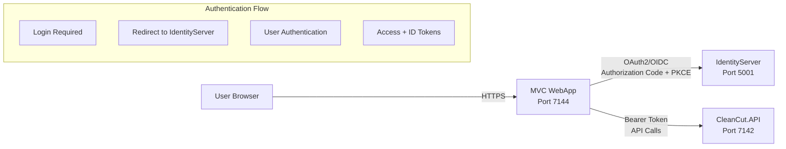

# CleanCut MVC WebApp - OAuth2/OIDC Startup Guide

## ?? **Overview**

The **CleanCut.WebApp** is a complete **ASP.NET Core MVC/Razor Pages** application that demonstrates **OAuth2/OpenID Connect** user authentication with secure API integration. This application serves as a **confidential client** in the authentication ecosystem, providing traditional web application patterns with modern security.

## ?? **Authentication Architecture**


```mermaid
graph LR
  USER[User Browser] -->|HTTPS| WEBAPP[MVC WebApp<br/>Port 7144]
    WEBAPP -->|OAuth2/OIDC<br/>Authorization Code + PKCE| IDENTITY[IdentityServer<br/>Port 5001]
    WEBAPP -->|Bearer Token<br/>API Calls| API[CleanCut.API<br/>Port 7142]
    
    subgraph "Authentication Flow"
   LOGIN[Login Required]
  REDIRECT[Redirect to IdentityServer]
        AUTH[User Authentication]
        TOKENS[Access + ID Tokens]
    end
```

### ?? **Client Configuration**
- **Client Type**: Confidential Client (server-side secret)
- **Grant Type**: Authorization Code + PKCE
- **Client ID**: `CleanCutWebApp`
- **Client Secret**: `WebAppSecret2024!` (development)
- **Scopes**: `openid`, `profile`, `CleanCutAPI`
- **Authentication**: User-driven (not service-to-service)

## ??? **Required Startup Sequence**

> **?? Important**: All three services must be running for full functionality

### **Step 1: Start IdentityServer** (Port 5001)
```bash
cd "D:\.NET STUDY\CleanCut"
dotnet run --project src/Infrastructure/CleanCut.Infrastructure.Identity
```
**Verify**: Navigate to `https://localhost:5001` - should show IdentityServer welcome page

### **Step 2: Start API** (Port 7142)  
```bash
# In a new terminal
cd "D:\.NET STUDY\CleanCut"
dotnet run --project src/Presentation/CleanCut.API
```
**Verify**: Navigate to `https://localhost:7142/swagger` - should show API documentation

### **Step 3: Start MVC WebApp** (Port 7144)
```bash
# In a new terminal  
cd "D:\.NET STUDY\CleanCut"
dotnet run --project src/Presentation/CleanCut.WebApp
```
**Verify**: Navigate to `https://localhost:7144` - should show MVC application

## ?? **Authentication Flow Testing**

### **User Authentication Process**
1. **Navigate to WebApp**: `https://localhost:7144`
2. **Click "Login"**: Redirects to IdentityServer login page
3. **Enter Credentials**: Use test accounts (see below)
4. **Automatic Redirect**: Returns to WebApp with authenticated session
5. **Access Protected Pages**: Navigate to Products, Customers, etc.

### **?? Test Accounts**
| Role | Email | Password | Access Level |
|------|-------|----------|--------------|
| **Admin** | `admin@cleancut.com` | `TempPassword123!` | Full CRUD access (including delete) |
| **User** | `user@cleancut.com` | `TempPassword123!` | Create, Read, Update (no delete) |

## ?? **Available Features**

### **?? Home Dashboard**
- **Authentication Status**: Shows logged-in user information
- **User Claims**: Displays roles and permissions
- **API Connectivity**: Tests connection to protected API
- **Quick Links**: Navigation to main features

### **?? Customer Management** (`/Customers`)
- ? **View All Customers**: List all customers with pagination
- ? **Customer Details**: View detailed customer information
- ? **Create Customer**: Add new customers with validation
- ? **Edit Customer**: Update customer information
- ? **Delete Customer**: Remove customers (Admin only)
- ? **Search & Filter**: Find customers by name or email

### **?? Product Management** (`/Products`)
- ? **View All Products**: List products with customer assignment
- ? **Product Details**: View detailed product information  
- ? **Create Product**: Add new products linked to customers
- ? **Edit Product**: Update product details and pricing
- ? **Delete Product**: Remove products (Admin only)
- ? **Customer Filter**: View products by specific customer
- ? **Search Functionality**: Find products by name or description

### **?? Role-Based Access Control**
```razor
<!-- Admin-only features -->
@if (User.IsInRole("Admin"))
{
    <button class="btn btn-danger" onclick="deleteCustomer()">
        Delete Customer
    </button>
}
else
{
    <span class="text-muted">Admin access required</span>
}
```

## ??? **Technical Implementation**

### **?? Authentication Configuration** (`Program.cs`)
```csharp
// OAuth2/OIDC Authentication
builder.Services.AddAuthentication(options =>
{
    options.DefaultScheme = "Cookies";
    options.DefaultChallengeScheme = "oidc";
})
.AddCookie("Cookies", options =>
{
    options.LoginPath = "/Account/Login";
    options.AccessDeniedPath = "/Account/AccessDenied";
})
.AddOpenIdConnect("oidc", options =>
{
    options.Authority = "https://localhost:5001";
    options.ClientId = "CleanCutWebApp";
    options.ClientSecret = "WebAppSecret2024!";
    options.UsePkce = true; // Enhanced security
    options.SaveTokens = true; // Store tokens for API calls
    options.GetClaimsFromUserInfoEndpoint = true;
});
```

### **?? API Integration**
```csharp
// Automatic Bearer token injection
public class AuthenticatedHttpMessageHandler : DelegatingHandler
{
    protected override async Task<HttpResponseMessage> SendAsync(
        HttpRequestMessage request, CancellationToken cancellationToken)
    {
        var accessToken = await _httpContextAccessor.HttpContext
         .GetTokenAsync("access_token");
    
        if (!string.IsNullOrEmpty(accessToken))
{
            request.Headers.Authorization = 
        new AuthenticationHeaderValue("Bearer", accessToken);
  }
  
     return await base.SendAsync(request, cancellationToken);
  }
}
```

### **?? Service Registration**
```csharp
// HTTP clients with authentication
builder.Services.AddHttpClient<IApiService, ApiService>(client =>
{
    client.BaseAddress = new Uri("https://localhost:7142");
})
.AddHttpMessageHandler<AuthenticatedHttpMessageHandler>();
```

## ?? **Testing Scenarios**

### **?? Authentication Testing**
1. **Login Flow**:
   - Visit any protected page
   - Should redirect to IdentityServer
   - Login with test credentials
   - Should return to original page authenticated

2. **Role-Based Access**:
   - Login as User ? Cannot see delete buttons
   - Login as Admin ? Can access all features
   - Attempt unauthorized action ? Shows access denied

3. **Token Management**:
   - Tokens automatically refreshed
   - Logout clears tokens and session
   - API calls include proper Bearer tokens

### **?? API Integration Testing**
1. **Customer Operations**:
   - Create ? Should save via API
   - Read ? Should fetch from API
   - Update ? Should modify via API
   - Delete ? Should remove via API (Admin only)

2. **Product Operations**:
   - All CRUD operations through authenticated API
   - Customer assignment validation
   - Price validation and formatting

3. **Error Scenarios**:
   - API unavailable ? Graceful error messages
   - Authentication expired ? Automatic re-authentication
   - Insufficient permissions ? Access denied page

## ? **Troubleshooting Guide**

### **?? Authentication Issues**

#### **"Unable to obtain configuration" Error**
```bash
# Check IdentityServer is running
curl -k https://localhost:5001/.well-known/openid_configuration

# Should return JSON configuration
```

#### **"Unauthorized" on API Calls**
1. Check access token in browser developer tools
2. Verify API is running and accessible
3. Check CORS configuration in API
4. Validate token in JWT.io

#### **Login Redirect Loop**
1. Check client configuration in IdentityServer
2. Verify redirect URIs match exactly
3. Check cookie domain settings
4. Clear browser cache and cookies

### **?? API Integration Issues**

#### **No Data Displayed**
```bash
# Check API directly
curl -H "Authorization: Bearer YOUR_TOKEN" \
  https://localhost:7142/api/customers

# Should return customer data
```

#### **404 Not Found Errors**
1. Verify API routes in Swagger UI
2. Check base URL configuration
3. Ensure API controllers are properly registered

### **?? Common Configuration Issues**

#### **CORS Errors**
```json
// API appsettings.json
{
  "AllowedOrigins": [
    "https://localhost:7144"  // MVC WebApp URL
  ]
}
```

#### **Connection String Issues**
```json
// WebApp appsettings.json
{
  "IdentityServer": {
 "Authority": "https://localhost:5001",
    "ClientId": "CleanCutWebApp",
    "ClientSecret": "WebAppSecret2024!"
  },
  "ApiSettings": {
    "BaseUrl": "https://localhost:7142"
  }
}
```

## ?? **Diagnostic Commands**

### **Health Checks**
```bash
# IdentityServer health
curl -k https://localhost:5001/health

# API health  
curl -k https://localhost:7142/health

# WebApp health
curl -k https://localhost:7144/health
```

### **Token Validation**
```bash
# Get token manually (for testing)
curl -X POST "https://localhost:5001/connect/token" \
  -H "Content-Type: application/x-www-form-urlencoded" \
-d "grant_type=client_credentials&client_id=m2m.client&client_secret=511536EF-F270-4058-80CA-1C89C192F69A&scope=CleanCutAPI"
```

## ?? **Success Indicators**

### **? Fully Working System**
- [ ] IdentityServer responds on port 5001
- [ ] API returns data on port 7142 (with authentication)
- [ ] WebApp loads on port 7144
- [ ] Login redirects to IdentityServer and back
- [ ] Protected pages require authentication
- [ ] Role-based features work correctly
- [ ] API integration shows live data
- [ ] Create/Edit operations save successfully
- [ ] Admin-only features hidden for regular users

### **?? Performance Metrics**
- **Login Flow**: < 3 seconds total
- **Page Load**: < 2 seconds with authenticated API calls
- **API Response**: < 500ms for typical operations
- **Token Refresh**: Transparent to user

## ?? **Production Considerations**

### **?? Security Hardening**
- Use proper SSL certificates
- Store client secrets in Azure Key Vault
- Configure proper CORS origins
- Implement rate limiting
- Add comprehensive logging

### **?? Monitoring**
- Authentication success/failure rates
- API response times
- Token usage patterns
- Error rates and types

---

**The MVC WebApp now provides a complete, secure, and production-ready example of OAuth2/OIDC authentication with API integration, demonstrating modern web application security patterns!** ??