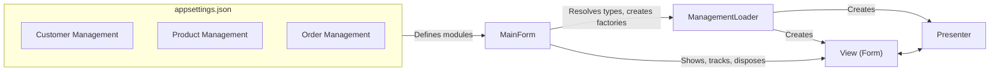
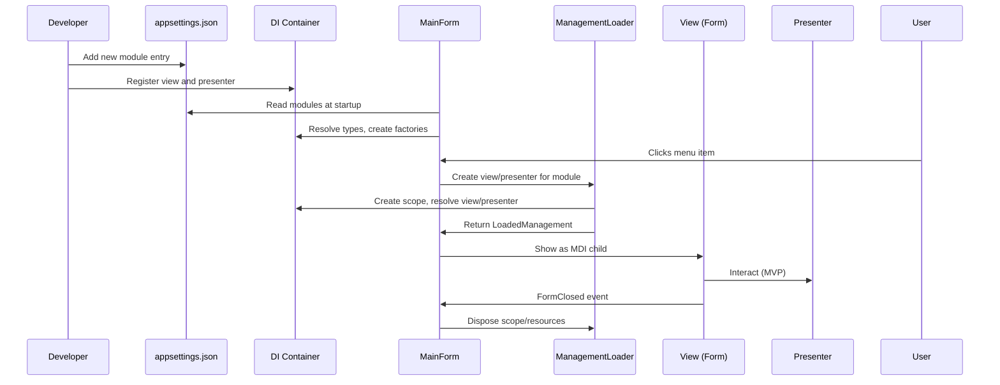
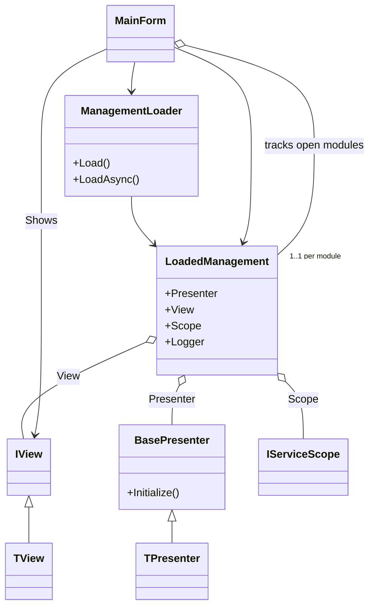

# Detailed Guide: ManagementLoader, LoadedManagement, and MainForm Integration


# Introduction: Why Dynamic Module Loading?

In traditional WinForms applications, forms and their logic are often hard-coded and tightly coupled to the main application. This makes it difficult to add, remove, or update modules (such as management screens for Customers, Products, or Orders) without modifying and recompiling the main codebase. As applications grow, this approach leads to maintenance headaches, code duplication, and a brittle navigation structure.

**The Problem:**
- How can we design a WinForms application that allows new management modules to be added or removed simply by changing configuration, without code changes in the main form?
- How do we ensure each module is isolated, testable, and properly cleaned up?
- How do we avoid resource leaks and ensure only one instance of each module is open at a time?

---


# Solution Overview: Configuration-Driven, DI-Based, and Maintainable

To solve these challenges, we use a combination of:

- **Configuration-driven module discovery:** All available management modules are defined in `appsettings.json`, specifying their types and enabled state.
- **Dependency Injection (DI):** All forms (views) and presenters are registered with the DI container, allowing for flexible, testable construction.
- **MVP (Model-View-Presenter) pattern:** Separates UI (view) from logic (presenter), making modules easier to test and maintain.
- **Dynamic type resolution:** At runtime, the application reads the configuration, resolves types using reflection, and creates factories for each module.
- **Single-instance-per-module navigation:** Only one instance of each management form is open at a time, tracked by module id.
- **Resource management:** Each module runs in its own DI scope, and all resources are disposed when the form is closed.

This approach allows you to:

- Add, remove, or update modules by editing configuration and registering new types—no code changes in the main navigation or form loader.
- Ensure each module is isolated, testable, and properly cleaned up.
- Keep the application maintainable and extensible as it grows.


**Conceptual Diagram:**



---

# Solution Steps at a Glance

Here are the main logical steps to build and use this solution:

1. **Define modules in configuration:**
   - Add entries to `ManagementModules` in `appsettings.json`, specifying the id, title, view type, presenter type, and enabled flag for each module.
2. **Register views and presenters in DI:**
   - In your DI setup (e.g., `ServiceConfiguration.ConfigureServices()`), register all view interfaces, form implementations, and presenters.
3. **Startup: Read configuration and build factories:**
   - On startup, `MainForm` reads the configuration, resolves types using reflection, and creates factories for each enabled module.
4. **Navigation: Show modules dynamically:**
   - When a user selects a module from the menu, `MainForm` checks if it is already open. If not, it uses the factory to create and show the form and presenter.
5. **Resource management:**
   - Each module runs in its own DI scope. When the form is closed, all resources (presenter, view, scope) are disposed, and the module is removed from tracking.
6. **Extending the app:**
   - To add a new module, implement the view and presenter, register them in DI, and add a new entry to the configuration. The app will pick it up automatically.


## Sequence Diagram

Below is a detailed sequence diagram (Mermaid) showing the interaction between the developer, configuration, DI, MainForm, ManagementLoader, and the loaded management module:



---

# 1. Class Overview and Roles

## 1.1 ManagementLoader

- **Namespace:** `CleanCut.WinApp.Services.Management`
- **Implements:** `IManagementLoader`

**Why a Loader? Why a Factory?**
- **Factory Pattern:** Encapsulates the logic for creating objects, especially when their types are not known until runtime.
- **Generics:** The loader is generic (`Load<TView, TPresenter>`) so it can create any type of view and presenter, as long as they satisfy the required interfaces and base classes. This provides type safety and flexibility.
- **Reflection:** Types of views and presenters are specified as strings in configuration. Reflection is used to resolve these strings to actual types at runtime, enabling dynamic module loading.
- **DI:** Uses the DI container to resolve dependencies for views and presenters, ensuring all dependencies are injected and each module gets its own isolated scope.

**Key Members**
- **Fields:**
  - `_scopeFactory` (readonly): Used to create a new DI scope for each management module.
  - `_logger` (readonly): For logging loader operations.
- **Methods:**
  - `Load<TView, TPresenter>()`: Synchronously creates and initializes a view and presenter.
  - `LoadAsync<TView, TPresenter>()`: Asynchronously (simulated) creates and initializes a view and presenter.

**Why readonly?**
- Fields like `_scopeFactory` and `_logger` are marked readonly because they are set once in the constructor and never change. This is a best practice for thread safety and clarity.

**Why async?**
- `LoadAsync` is provided for future-proofing and UI responsiveness. While DI is synchronous, some presenters or views may require async initialization (e.g., loading data from a database or API). Using `await Task.Yield()` simulates asynchrony and allows the UI to remain responsive.

**Concurrency and DI Scope**
- Each call to `Load` or `LoadAsync` creates a new DI scope. This ensures that dependencies are not shared between modules, preventing concurrency issues and resource leaks.

**Factory Pattern and Reflection**
- The loader uses `ActivatorUtilities.CreateInstance<TPresenter>(provider, view)` to create presenters, allowing constructor injection and runtime view assignment.
- Reflection is used to resolve types from configuration strings, enabling dynamic module loading.

**Example Usage**
```csharp
var loaded = await managementLoader.LoadAsync<ICustomerListView, CustomerListPresenter>();
```
## 1.2 LoadedManagement<TView, TPresenter>

- **Namespace:** `CleanCut.WinApp.Services.Management`

**Why a Resource Holder?**
- When a module is loaded, it consists of:
  - The presenter (logic)
  - The view (form)
  - The DI scope (for resource management)
  - A logger
- We need a way to keep these together and ensure they are all disposed when the module is closed. This is the role of the `LoadedManagement` class.

**Key Members**
- **Properties:**
  - `Presenter`: The presenter instance (business/UI logic).
  - `View`: The view instance (typically a Form or UserControl).
  - `Scope`: The DI scope for resource management.
  - `Logger`: Logger for this management context.

**Why implement IDisposable?**
- The class holds resources (presenter, view, DI scope) that must be disposed to prevent memory leaks. Implementing `IDisposable` ensures that cleanup happens reliably.

**Cleanup Logic**
- When disposed, the class:
  - Calls `Cleanup()` on the presenter (if implemented).
  - Disposes the presenter (if it implements `IDisposable`).
  - Disposes the DI scope.
- All exceptions during cleanup are caught and logged, to avoid crashing the app.

**Logger Lifetime**
- A logger is resolved for each loaded management module, scoped to the module's lifetime.

**Example Usage**
```csharp
form.FormClosed += (s, e) => loaded.Dispose();
```

## 1.3 IView and BasePresenter<TView>

- **Namespace:** `CleanCut.WinApp.MVP`

**Why Use Interfaces and Abstract Classes?**
- **Interfaces** (e.g., `IView`, `ILoadedManagement`) define contracts for views and loaded modules, enabling loose coupling and testability.
- **Abstract classes** (e.g., `BasePresenter<TView>`) provide shared logic and enforce structure for presenters.

**Key Members**
- `IView`: Defines the contract for view operations.
- `BasePresenter<TView>`: Provides base logic and a reference to the view.

**How They Fit**
- Enforce the MVP pattern, ensuring separation of concerns between UI and logic.
- Used as generic constraints in `ManagementLoader` to guarantee type safety.

---


## 1.4 MainForm (Updated for Single-Instance-Per-Module)

- **Namespace:** (Typically your main WinForms namespace)

**Why a Dictionary for Open Modules?**
- The main form tracks open modules using a `Dictionary<string, ILoadedManagement>`, mapping module ids to their loaded management handles.
- This ensures only one instance of each module is open at a time, and allows for efficient lookup and cleanup.

**Why Use Events and MDI?**
- The form subscribes to the `FormClosed` event of each module, so it can dispose resources and remove the module from tracking.
- MDI (Multiple Document Interface) allows multiple forms to be open within the main window, providing a familiar user experience.

**Concurrency and Thread Safety**
- All UI operations are performed on the UI thread, avoiding concurrency issues.
- The dictionary of open modules is only accessed from the UI thread.

**Example Usage**
```csharp
if (_openManagements.TryGetValue(id, out var existing) && existing.View is Form existingForm && !existingForm.IsDisposed)
{
    existingForm.BringToFront();
    existingForm.WindowState = FormWindowState.Normal;
    existingForm.Activate();
    return;
}
var loaded = await factory();
_openManagements[id] = loaded;
var form = loaded.View as Form;
form.MdiParent = this;
form.FormClosed += (s, e) =>
{
    loaded.Dispose();
    _openManagements.Remove(id);
};
form.Show();
```

---


## 2. Resource Management and Lifetime (Expanded)

### Scope Management
- Each call to `Load` or `LoadAsync` creates a new DI scope, isolating dependencies for the loaded module.
- The DI scope is stored in the `LoadedManagement` object and must be disposed when the form is closed to prevent memory leaks.
- **Only one DI scope per module is open at a time.**

### Presenter and View Lifetime
- The presenter and view are resolved and constructed within the DI scope.
- When the form (view) is closed, the presenter and all scoped dependencies are disposed with the scope.
- **MainForm ensures only one presenter/view/scope per module is alive at a time.**

### Logger Lifetime
- A logger is resolved for each loaded management module, scoped to the module's lifetime.

### Best Practices
- Always dispose the `Scope` property of `LoadedManagement` when the form is closed.
- Do not keep references to presenters/views after the form is closed.
- Register all views and presenters with the DI container.
- Use async loading for better UI responsiveness.
- **Track open forms by module id and prevent multiple instances of the same module.**

---


## 3. Example Usage in MainForm (Expanded)

```csharp
// Asynchronously load a management module (single-instance-per-module pattern)
if (_openManagements.TryGetValue(moduleId, out var existing) && existing.View is Form existingForm && !existingForm.IsDisposed)
{
    existingForm.BringToFront();
    existingForm.WindowState = FormWindowState.Normal;
    existingForm.Activate();
    return;
}
var loaded = await _managementLoader.LoadAsync<CustomerView, CustomerPresenter>();
_openManagements[moduleId] = loaded;
var form = loaded.View as Form;
form.MdiParent = this;
form.FormClosed += (s, e) =>
{
    loaded.Dispose();
    _openManagements.Remove(moduleId);
};
form.Show();
```

- **Step 1:** MainForm checks if a management module is already open for the requested id.
- **Step 2:** If open, brings the form to front and activates it. If not, requests a new management module.
- **Step 3:** ManagementLoader creates a new DI scope, resolves the view and presenter, initializes the presenter, and returns a LoadedManagement object.
- **Step 4:** MainForm sets up the form, subscribes to its FormClosed event, and shows it. Tracks the handle by module id.
- **Step 5:** When the form is closed, the DI scope is disposed, cleaning up all resources, and the handle is removed from tracking.

---

## 4. Extensibility and Testability

- **Adding New Modules:** Implement a new view (inherits `IView`) and presenter (inherits `BasePresenter<TView>`), register them in DI, and use `ManagementLoader` to instantiate.
- **Testing:** Because the loader does not show forms directly, you can test presenter/view creation and initialization without UI side effects.
- **Isolation:** Each module runs in its own scope, so dependencies and state are not shared between modules. Only one instance per module is allowed at a time.

---


## 5. Summary Table

| Component        | Role                                 | Lifetime        | Notes                                  |
|------------------|--------------------------------------|-----------------|----------------------------------------|
| ManagementLoader | Creates and initializes modules      | Singleton       | Used by MainForm                       |
| LoadedManagement | Holds presenter, view, scope, logger | Per module load | Must be disposed after use             |
| View (Form)      | UI shown to user                     | Per module load | Implements IView                       |
| Presenter        | Handles logic for the view           | Per module load | Inherits BasePresenter<TView>          |
| DI Scope         | Manages dependencies for the module  | Per module load | Disposed when form is closed           |
| MainForm         | Tracks open modules by id            | App lifetime    | Only one instance per module at a time |

---

## 6. Resource Management Checklist

- [x] Always dispose `LoadedManagement.Scope` when the form is closed.
- [x] Do not keep references to presenters/views after the form is closed.
- [x] Register all views and presenters with the DI container.
- [x] Use async loading for better UI responsiveness.
- [x] Track open forms by module id and prevent multiple instances of the same module.

---


## 2. Resource Management and Lifetime

### **Scope Management**

-   Each call to `Load` or `LoadAsync` creates a new DI scope.
-   All dependencies for the view and presenter are resolved within this scope.
-   The scope is held in the `LoadedManagement` object and must be disposed when the form is closed to prevent memory leaks.
-   **With the new pattern, only one DI scope per module is open at a time.**

### **Presenter and View Lifetime**

-   The presenter and view are tied to the DI scope.
-   When the form (view) is closed, the presenter and all scoped dependencies are disposed.
-   **MainForm ensures that only one presenter/view/scope per module is alive at a time.**

### **Best Practices**

-   **Always** dispose the `Scope` property of `LoadedManagement` when the form is closed.
-   Do **not** show the form inside the loader; let MainForm handle UI logic.
-   Use async loading for UI responsiveness, even if DI is synchronous.
-   **Track open forms by module id and prevent multiple instances of the same module.**

---

## 3. Sequence Diagram

Below is a detailed sequence diagram (Mermaid) showing the interaction between the user, MainForm, ManagementLoader, and the loaded management module, including resource management and disposal:

```mermaid
sequenceDiagram
    actor User
    participant MF as MainForm
    participant ML as ManagementLoader
    participant LMG as LoadedManagement
    participant VF as "View (Form)"
    participant P as Presenter
    participant Scope as "DI Scope"

    User->>MF: Triggers action (e.g., menu click)
    MF->>MF: Check if module is already open
    alt Module already open
        MF->>VF: BringToFront/Activate existing form
        return
    else Not open
        MF->>ML: LoadAsync<TView, TPresenter>()
        ML->>Scope: CreateScope()
        ML->>Scope: GetRequiredService<TView>()
        ML->>VF: (resolved)
        ML->>Scope: CreateInstance<TPresenter>(VF)
        ML->>P: Initialize()
        ML->>LMG: new LoadedManagement(P, VF, Scope, Logger)
        ML-->>MF: Return LoadedManagement
        MF->>VF: Set MdiParent
        MF->>VF: Show()
        MF->>VF: Subscribe to FormClosed
        note over VF,MF: User interacts with form
        VF->>MF: FormClosed event
        MF->>LMG: Dispose Scope
        LMG->>Scope: Dispose()
    end
```

---

## 4. Class Relationship Diagram

Below is a Mermaid class diagram showing the relationships between the key classes:



---

## 5. Resource Management and Lifetime (Expanded)

### Scope Management

-   Each call to `Load` or `LoadAsync` creates a new DI scope, isolating dependencies for the loaded module.
-   The DI scope is stored in the `LoadedManagement` object and must be disposed when the form is closed to prevent memory leaks.
-   **Only one DI scope per module is open at a time.**

### Presenter and View Lifetime

-   The presenter and view are resolved and constructed within the DI scope.
-   When the form (view) is closed, the presenter and all scoped dependencies are disposed with the scope.
-   **MainForm ensures only one presenter/view/scope per module is alive at a time.**

### Logger Lifetime

-   A logger is resolved for each loaded management module, scoped to the module's lifetime.

### Best Practices

-   Always dispose the `Scope` property of `LoadedManagement` when the form is closed.
-   Do not keep references to presenters/views after the form is closed.
-   Register all views and presenters with the DI container.
-   Use async loading for better UI responsiveness.
-   **Track open forms by module id and prevent multiple instances of the same module.**

---

## 6. Example Usage in MainForm (Expanded)

```csharp

// Asynchronously load a management module (single-instance-per-module pattern)
if (_openManagements.TryGetValue(moduleId, out var existing) && existing.View is Form existingForm && !existingForm.IsDisposed)
{
    existingForm.BringToFront();
    existingForm.WindowState = FormWindowState.Normal;
    existingForm.Activate();
    return;
}
var loaded = await _managementLoader.LoadAsync<CustomerView, CustomerPresenter>();
_openManagements[moduleId] = loaded;
var form = loaded.View as Form;
form.MdiParent = this;
form.FormClosed += (s, e) =>
{
    loaded.Dispose();
    _openManagements.Remove(moduleId);
};
form.Show();
```

-   **Step 1:** MainForm checks if a management module is already open for the requested id.
-   **Step 2:** If open, brings the form to front and activates it. If not, requests a new management module.
-   **Step 3:** ManagementLoader creates a new DI scope, resolves the view and presenter, initializes the presenter, and returns a LoadedManagement object.
-   **Step 4:** MainForm sets up the form, subscribes to its `FormClosed` event, and shows it. Tracks the handle by module id.
-   **Step 5:** When the form is closed, the DI scope is disposed, cleaning up all resources, and the handle is removed from tracking.

---

## 7. Extensibility and Testability

-   **Adding New Modules:** Implement a new view (inherits `IView`) and presenter (inherits `BasePresenter<TView>`), register them in DI, and use `ManagementLoader` to instantiate.
-   **Testing:** Because the loader does not show forms directly, you can test presenter/view creation and initialization without UI side effects.
-   **Isolation:** Each module runs in its own scope, so dependencies and state are not shared between modules. Only one instance per module is allowed at a time.

---

## 8. Summary Table

| Component        | Role                                 | Lifetime        | Notes                                  |
| ---------------- | ------------------------------------ | --------------- | -------------------------------------- |
| ManagementLoader | Creates and initializes modules      | Singleton       | Used by MainForm                       |
| LoadedManagement | Holds presenter, view, scope, logger | Per module load | Must be disposed after use             |
| View (Form)      | UI shown to user                     | Per module load | Implements IView                       |
| Presenter        | Handles logic for the view           | Per module load | Inherits BasePresenter<TView>          |
| DI Scope         | Manages dependencies for the module  | Per module load | Disposed when form is closed           |
| MainForm         | Tracks open modules by id            | App lifetime    | Only one instance per module at a time |

---

## 9. Resource Management Checklist

-   [x] Always dispose `LoadedManagement.Scope` when the form is closed.
-   [x] Do not keep references to presenters/views after the form is closed.
-   [x] Register all views and presenters with the DI container.
-   [x] Use async loading for better UI responsiveness.
-   [x] Track open forms by module id and prevent multiple instances of the same module.

---

This detailed guide should help you and your team understand, extend, and maintain the management module loading pattern in your application with confidence.

---
# Detailed Guide: ManagementLoader, LoadedManagement, and MainForm Integration

This document provides an in-depth explanation of the classes, types, and patterns used for dynamic form and presenter management in your WinForms application, focusing on the `ManagementLoader`, `LoadedManagement`, and their orchestration from `MainForm`. It is updated for the new architecture, where only one instance of each management form/module is allowed at a time. It includes class descriptions, resource management notes, and diagrams to clarify relationships and lifecycles.

---

## 1. Class Overview and Roles

### 1.1 `ManagementLoader`

**Namespace:** `CleanCut.WinApp.Services.Management`  
**Implements:** `IManagementLoader`

#### **Purpose**
- Acts as a factory and orchestrator for creating, initializing, and managing the lifetime of view-presenter pairs (MVP pattern) within a dedicated dependency injection (DI) scope.
- Ensures each management module (form + presenter) is isolated and properly managed.

#### **Key Members**
- **Fields:**
  - `_scopeFactory`: Used to create a new DI scope for each management module.
  - `_logger`: For logging loader operations.
- **Methods:**
  - `Load<TView, TPresenter>()`: Synchronously creates and initializes a view and presenter.
  - `LoadAsync<TView, TPresenter>()`: Asynchronously (simulated) creates and initializes a view and presenter.

#### **How It Fits**
- Central entry point for MainForm (or other consumers) to instantiate management modules.
- Handles all DI, initialization, and logging concerns, returning a `LoadedManagement` object for further use.

---

### 1.2 `LoadedManagement<TView, TPresenter>`

**Namespace:** `CleanCut.WinApp.Services.Management`

#### **Purpose**
- Encapsulates all resources and references needed for a loaded management module.
- Provides access to the presenter, view, DI scope, and logger.

#### **Key Members**
- **Properties:**
  - `Presenter`: The presenter instance (business/UI logic).
  - `View`: The view instance (typically a Form or UserControl).
  - `Scope`: The DI scope for resource management.
  - `Logger`: Logger for this management context.

#### **How It Fits**
- Returned by `ManagementLoader` methods.
- Used by MainForm to display the view, manage the presenter, and ensure proper disposal of resources.

---

### 1.3 `IView` and `BasePresenter<TView>`

**Namespace:** `CleanCut.WinApp.MVP`

#### **Purpose**
- **`IView`**: Interface that all views (forms/user controls) must implement.
- **`BasePresenter<TView>`**: Abstract base class for presenters, parameterized by the view type.

#### **Key Members**
- **IView**: Defines the contract for view operations.
- **BasePresenter<TView>**: Provides base logic and a reference to the view.

#### **How They Fit**
- Enforce the MVP pattern, ensuring separation of concerns between UI and logic.
- Used as generic constraints in `ManagementLoader` to guarantee type safety.

---


### 1.4 `MainForm` (Updated for Single-Instance-Per-Module)

**Namespace:** (Typically your main WinForms namespace)

#### **Purpose**
- Acts as the MDI parent and main UI shell.
- Initiates the loading of management modules via `ManagementLoader`.
- Responsible for showing forms and managing their lifetimes.
- **Ensures only one instance of each management module (form) is open at a time.**

#### **Key Interactions (Updated)**
- Maintains a dictionary mapping module ids to their open `LoadedManagement` handles.
- When a user requests a module (via menu click), checks if a form for that module is already open:
  - If open, brings the existing form to the front and activates it.
  - If not open, loads a new instance using `ManagementLoader`, shows it, and tracks it by module id.
- When a form is closed, disposes its resources and removes it from the tracking dictionary.

---

## 2. Resource Management and Lifetime


### **Scope Management**
- Each call to `Load` or `LoadAsync` creates a new DI scope.
- All dependencies for the view and presenter are resolved within this scope.
- The scope is held in the `LoadedManagement` object and must be disposed when the form is closed to prevent memory leaks.
- **With the new pattern, only one DI scope per module is open at a time.**


### **Presenter and View Lifetime**
- The presenter and view are tied to the DI scope.
- When the form (view) is closed, the presenter and all scoped dependencies are disposed.
- **MainForm ensures that only one presenter/view/scope per module is alive at a time.**


### **Best Practices**
- **Always** dispose the `Scope` property of `LoadedManagement` when the form is closed.
- Do **not** show the form inside the loader; let MainForm handle UI logic.
- Use async loading for UI responsiveness, even if DI is synchronous.
- **Track open forms by module id and prevent multiple instances of the same module.**

---


## 3. Sequence Diagram

Below is a detailed sequence diagram (Mermaid) showing the interaction between the user, MainForm, ManagementLoader, and the loaded management module, including resource management and disposal:

```mermaid
sequenceDiagram
    actor User
    participant MF as MainForm
    participant ML as ManagementLoader
    participant LMG as LoadedManagement
    participant VF as "View (Form)"
    participant P as Presenter
    participant Scope as "DI Scope"

    User->>MF: Triggers action (e.g., menu click)
    MF->>MF: Check if module is already open
    alt Module already open
        MF->>VF: BringToFront/Activate existing form
        return
    else Not open
        MF->>ML: LoadAsync<TView, TPresenter>()
        ML->>Scope: CreateScope()
        ML->>Scope: GetRequiredService<TView>()
        ML->>VF: (resolved)
        ML->>Scope: CreateInstance<TPresenter>(VF)
        ML->>P: Initialize()
        ML->>LMG: new LoadedManagement(P, VF, Scope, Logger)
        ML-->>MF: Return LoadedManagement
        MF->>VF: Set MdiParent
        MF->>VF: Show()
        MF->>VF: Subscribe to FormClosed
        note over VF,MF: User interacts with form
        VF->>MF: FormClosed event
        MF->>LMG: Dispose Scope
        LMG->>Scope: Dispose()
    end
```

---

## 4. Class Relationship Diagram

Below is a Mermaid class diagram showing the relationships between the key classes:


---

## 5. Resource Management and Lifetime (Expanded)


### Scope Management
- Each call to `Load` or `LoadAsync` creates a new DI scope, isolating dependencies for the loaded module.
- The DI scope is stored in the `LoadedManagement` object and must be disposed when the form is closed to prevent memory leaks.
- **Only one DI scope per module is open at a time.**


### Presenter and View Lifetime
- The presenter and view are resolved and constructed within the DI scope.
- When the form (view) is closed, the presenter and all scoped dependencies are disposed with the scope.
- **MainForm ensures only one presenter/view/scope per module is alive at a time.**


### Logger Lifetime
- A logger is resolved for each loaded management module, scoped to the module's lifetime.


### Best Practices
- Always dispose the `Scope` property of `LoadedManagement` when the form is closed.
- Do not keep references to presenters/views after the form is closed.
- Register all views and presenters with the DI container.
- Use async loading for better UI responsiveness.
- **Track open forms by module id and prevent multiple instances of the same module.**

---

## 6. Example Usage in MainForm (Expanded)

```csharp

// Asynchronously load a management module (single-instance-per-module pattern)
if (_openManagements.TryGetValue(moduleId, out var existing) && existing.View is Form existingForm && !existingForm.IsDisposed)
{
    existingForm.BringToFront();
    existingForm.WindowState = FormWindowState.Normal;
    existingForm.Activate();
    return;
}
var loaded = await _managementLoader.LoadAsync<CustomerView, CustomerPresenter>();
_openManagements[moduleId] = loaded;
var form = loaded.View as Form;
form.MdiParent = this;
form.FormClosed += (s, e) =>
{
    loaded.Dispose();
    _openManagements.Remove(moduleId);
};
form.Show();
```


- **Step 1:** MainForm checks if a management module is already open for the requested id.
- **Step 2:** If open, brings the form to front and activates it. If not, requests a new management module.
- **Step 3:** ManagementLoader creates a new DI scope, resolves the view and presenter, initializes the presenter, and returns a LoadedManagement object.
- **Step 4:** MainForm sets up the form, subscribes to its `FormClosed` event, and shows it. Tracks the handle by module id.
- **Step 5:** When the form is closed, the DI scope is disposed, cleaning up all resources, and the handle is removed from tracking.

---

## 7. Extensibility and Testability

- **Adding New Modules:** Implement a new view (inherits `IView`) and presenter (inherits `BasePresenter<TView>`), register them in DI, and use `ManagementLoader` to instantiate.
- **Testing:** Because the loader does not show forms directly, you can test presenter/view creation and initialization without UI side effects.
- **Isolation:** Each module runs in its own scope, so dependencies and state are not shared between modules. Only one instance per module is allowed at a time.

---

## 8. Summary Table

| Component         | Role                                      | Lifetime         | Notes                                  |
|-------------------|-------------------------------------------|------------------|----------------------------------------|
| ManagementLoader  | Creates and initializes modules           | Singleton        | Used by MainForm                       |
| LoadedManagement  | Holds presenter, view, scope, logger      | Per module load  | Must be disposed after use             |
| View (Form)       | UI shown to user                          | Per module load  | Implements IView                       |
| Presenter         | Handles logic for the view                | Per module load  | Inherits BasePresenter<TView>          |
| DI Scope          | Manages dependencies for the module       | Per module load  | Disposed when form is closed           |
| MainForm          | Tracks open modules by id                 | App lifetime     | Only one instance per module at a time |

---

## 9. Resource Management Checklist

- [x] Always dispose `LoadedManagement.Scope` when the form is closed.
- [x] Do not keep references to presenters/views after the form is closed.
- [x] Register all views and presenters with the DI container.
- [x] Use async loading for better UI responsiveness.
- [x] Track open forms by module id and prevent multiple instances of the same module.

---

This detailed guide should help you and your team understand, extend, and maintain the management module loading pattern in your application with confidence.

---

