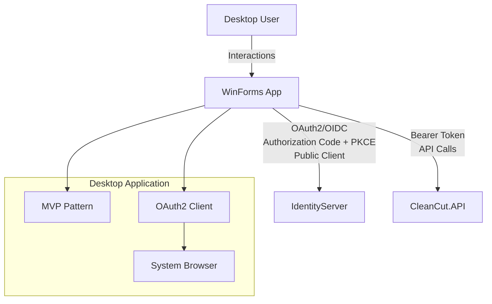

# CleanCut.WinApp - Desktop Application with OAuth2 Authentication

## Overview

The **CleanCut.WinApp** is a **Windows Forms desktop application** that serves as a **public client** in the OAuth2/OpenID Connect ecosystem. It demonstrates secure desktop application development with modern authentication, implementing the **MVP (Model-View-Presenter)** pattern with comprehensive **User and Product Management** features.

## Role in Authentication Architecture



## Authentication Flow

### **OAuth2/OpenID Connect for Desktop Apps**
1. **User clicks login** in desktop application
2. **System browser launches** for authentication
3. **User authenticates** with IdentityServer
4. **Authorization Code + PKCE** flow completes
5. **Browser redirects** back to desktop app
6. **Tokens received** and stored securely
7. **API calls** include Bearer tokens

### **Client Configuration**
```csharp
Client Type: Public Client (No Client Secret)
Grant Type: Authorization Code + PKCE
Client ID: CleanCutWinApp
Client Secret: None (Public Client)
Scopes: openid, profile, CleanCutAPI
Redirect URIs: http://localhost:8080/, cleancut://callback
```

## Key Features

### **?? OAuth2 Desktop Authentication**
- ? **Public Client Implementation** following RFC 8252
- ? **PKCE (Proof Key for Code Exchange)** for enhanced security
- ? **System Browser Integration** for secure authentication
- ? **Custom URI Scheme** handling (cleancut://)
- ? **Secure Token Storage** with Windows Data Protection API
- ? **Automatic Token Refresh** with refresh tokens

### **??? Enterprise Desktop Architecture**
- ? **MVP Pattern** with clean separation of concerns
- ? **Dependency Injection** throughout the application
- ? **CQRS Implementation** using MediatR
- ? **Domain Events** for business logic decoupling
- ? **Caching Strategy** with Redis and in-memory fallback
- ? **Comprehensive Error Handling** and logging

### **?? Business Functionality**
- ? **Complete User Management** with CRUD operations
- ? **Product Management** with user assignment
- ? **Real-time Validation** and error handling
- ? **Role-based UI Features** based on user claims
- ? **Search and Filtering** capabilities

## Authentication Implementation

### **OAuth2 Client Configuration**
```csharp
// OAuth2 configuration for desktop app
public class DesktopAuthenticationService : IAuthenticationService
{
    private readonly OidcClient _oidcClient;
    
    public DesktopAuthenticationService()
    {
        var options = new OidcClientOptions
   {
    Authority = "https://localhost:5001",
     ClientId = "CleanCutWinApp",
    RedirectUri = "http://localhost:8080/",
     Scope = "openid profile CleanCutAPI",
         ResponseMode = OidcClientOptions.AuthorizeResponseMode.Redirect,
            Flow = OidcClientOptions.AuthenticationFlow.AuthorizationCode,
        UsePkce = true // Required for public clients
        };
        
   _oidcClient = new OidcClient(options);
    }
}
```

### **System Browser Integration**
```csharp
public async Task<LoginResult> LoginAsync()
{
    try
    {
        // Launch system browser for authentication
    var loginRequest = new LoginRequest();
        var result = await _oidcClient.LoginAsync(loginRequest);
     
        if (result.IsError)
        {
            return new LoginResult 
{ 
          IsSuccess = false, 
   Error = result.Error 
    };
        }

        // Store tokens securely
        await _tokenStorage.StoreTokensAsync(result.AccessToken, result.RefreshToken);
        
        return new LoginResult 
        { 
            IsSuccess = true, 
  UserClaims = result.User.Claims 
     };
    }
    catch (Exception ex)
    {
      _logger.LogError(ex, "Authentication failed");
      return new LoginResult { IsSuccess = false, Error = ex.Message };
    }
}
```

### **Secure Token Storage**
```csharp
public class SecureTokenStorage : ITokenStorage
{
    // Uses Windows Data Protection API for secure storage
    public async Task StoreTokensAsync(string accessToken, string refreshToken)
    {
        var data = JsonSerializer.Serialize(new 
   { 
            AccessToken = accessToken, 
       RefreshToken = refreshToken,
            Timestamp = DateTime.UtcNow
        });
     
        var protectedData = ProtectedData.Protect(
  Encoding.UTF8.GetBytes(data), 
            null, 
            DataProtectionScope.CurrentUser);
  
        await File.WriteAllBytesAsync(TokenFilePath, protectedData);
    }
}
```

## Architecture Implementation

### **MVP Pattern with Authentication**

```
???????????????????????????????????????????????????????
?    Views (UI)    ?
?• LoginForm, MainForm, UserListForm   ?
?  • ProductListForm, UserEditForm     ?
???????????????????????????????????????????????????????
      ?
???????????????????????????????????????????????????????
?      Presenters (Logic)  ?
?  • LoginPresenter, MainPresenter        ?
?  • UserListPresenter, ProductListPresenter         ?
???????????????????????????????????????????????????????
             ?
???????????????????????????????????????????????????????
?          Application Layer (CQRS)         ?
?  • Commands, Queries, Handlers via MediatR         ?
?  • Authentication Services, API Services    ?
???????????????????????????????????????????????????????
               ?
???????????????????????????????????????????????????????
?      Domain Layer        ?
?  • Entities, Value Objects, Business Rules     ?
???????????????????????????????????????????????????????
  ?
???????????????????????????????????????????????????????
?         Infrastructure Layer           ?
?  • HTTP Clients, Token Storage, Caching   ?
???????????????????????????????????????????????????????
```

### **Main Application Components**

#### **LoginForm with OAuth2**
```csharp
public partial class LoginForm : BaseForm, ILoginView
{
    private readonly LoginPresenter _presenter;
    
 private async void LoginButton_Click(object sender, EventArgs e)
    {
        await _presenter.LoginAsync();
    }
    
    public void ShowLoginSuccess(UserInfo userInfo)
    {
      MessageBox.Show($"Welcome, {userInfo.Name}!");
        this.DialogResult = DialogResult.OK;
      this.Close();
    }
    
    public void ShowLoginError(string error)
    {
   MessageBox.Show($"Login failed: {error}", "Authentication Error", 
           MessageBoxButtons.OK, MessageBoxIcon.Error);
    }
}
```

#### **Authenticated API Service**
```csharp
public class AuthenticatedApiService : IApiService
{
    private readonly HttpClient _httpClient;
    private readonly ITokenStorage _tokenStorage;
    
    public AuthenticatedApiService(HttpClient httpClient, ITokenStorage tokenStorage)
    {
        _httpClient = httpClient;
        _tokenStorage = tokenStorage;
        _httpClient.BaseAddress = new Uri("https://localhost:7142");
    }
    
    private async Task EnsureAuthenticatedAsync()
    {
    var accessToken = await _tokenStorage.GetAccessTokenAsync();
        
if (string.IsNullOrEmpty(accessToken) || await IsTokenExpiredAsync(accessToken))
        {
     accessToken = await RefreshTokenAsync();
        }
 
        _httpClient.DefaultRequestHeaders.Authorization = 
          new AuthenticationHeaderValue("Bearer", accessToken);
    }
    
    public async Task<List<ProductInfo>> GetProductsAsync()
    {
        await EnsureAuthenticatedAsync();
        
  var response = await _httpClient.GetAsync("/api/v1/products");
      response.EnsureSuccessStatusCode();
        
   var json = await response.Content.ReadAsStringAsync();
        return JsonSerializer.Deserialize<List<ProductInfo>>(json, _jsonOptions);
    }
}
```

## User Interface Features

### **?? Authentication UI**
```
??? Login Dialog ??????????????????????????????
?       ?
?  ?? CleanCut Desktop Authentication        ?
?       ?
?  Click "Login" to authenticate with        ?
?  IdentityServer via your browser        ?
?          ?
?  [?? Login with Browser]    [Cancel]       ?
?                ?
?  Status: Ready to authenticate...        ?
??????????????????????????????????????????????
```

### **?? Main Application with User Info**
```
??? CleanCut Desktop Application ??????????????????????????????????
? File  Edit  View  Help             ?? John Doe (Admin) ?
???????????????????????????????????????????????????????????????????
?         ?
?  ?? Dashboard ?
?  ???????????????????  ???????????????????  ??????????????????  ?
?  ? ?? Users: 125   ?  ? ?? Products: 89 ?  ? ?? Last Sync  ?  ?
?  ? Active: 98      ?  ? Available: 76   ?  ? 2 min ago     ?  ?
?  ???????????????????  ???????????????????  ??????????????????  ?
?       ?
?  [?? Manage Users]  [?? Manage Products]  [?? Settings]        ?
?           ?
???????????????????????????????????????????????????????????????????
```

### **?? User Management Interface**
```
??? User Management ???????????????????????????????????????????????
? [? Add User] [?? Edit] [??? Delete] [?? Refresh] [?? Search...] ?
???????????????????????????????????????????????????????????????????
? First Name ? Last Name ? Email  ? Role  ? Status ? Created ?
???????????????????????????????????????????????????????????????????
? John       ? Doe       ? john@example.com ? Admin ? Active ? 2024-01 ?
? Jane       ? Smith     ? jane@example.com ? User  ? Active ? 2024-01 ?
? Bob        ? Wilson    ? bob@example.com  ? User  ? Inactive? 2024-02 ?
???????????????????????????????????????????????????????????????????
```

### **?? Product Management with Authorization**
```
??? Product Management ????????????????????????????????????????????
? Filter by User: [All Users ?] [Apply Filter]         ?
? [? Add Product] [?? Edit] [??? Delete*] [?? Refresh]            ?
? (*Admin only)    ?
???????????????????????????????????????????????????????????????????
? Name     ? Description ? Price  ? Owner      ? Available ? Created ?
???????????????????????????????????????????????????????????????????
? Widget A ? Premium...  ? $29.99 ? John Doe   ? ? Yes    ? 2024-01 ?
? Gadget B ? Advanced... ? $49.99 ? Jane Smith ? ? No     ? 2024-01 ?
? Tool C   ? Professional? $79.99 ? Bob Wilson ? ? Yes    ? 2024-02 ?
???????????????????????????????????????????????????????????????????
```

## Security Features

### **?? OAuth2 Security Implementation**
- ? **PKCE (Proof Key for Code Exchange)** mandatory for public clients
- ? **No Client Secrets** stored in application (public client)
- ? **System Browser** for secure authentication flow
- ? **Custom URI Scheme** for secure callback handling
- ? **Token Encryption** using Windows Data Protection API

### **??? Application Security**
- ? **Secure Token Storage** with DPAPI encryption
- ? **Automatic Token Refresh** with refresh token rotation
- ? **Role-based UI** showing/hiding features based on claims
- ? **Input Validation** on all forms
- ? **Error Handling** without sensitive data exposure

### **?? Desktop-Specific Security**
- ? **Process Isolation** from web browsers
- ? **Local Token Storage** encrypted per user
- ? **No Network Token Exposure** in application memory
- ? **Secure Communication** over HTTPS only

## Development Setup

### **Prerequisites**
1. **.NET 9 SDK**
2. **IdentityServer** running on `https://localhost:5001`
3. **CleanCut.API** running on `https://localhost:7142`
4. **Windows OS** with Data Protection API support

### **Starting the Application**
```bash
# Terminal 1: Start IdentityServer
dotnet run --project src/Infrastructure/CleanCut.Infrastructure.Identity

# Terminal 2: Start API
dotnet run --project src/Presentation/CleanCut.API

# Terminal 3: Start Desktop App
dotnet run --project src/Presentation/CleanCut.WinApp

# The application will prompt for login on first run
```

### **First Run Setup**
1. **Application starts** with login prompt
2. **Click "Login with Browser"** to open system browser
3. **Authenticate** with test credentials:
   - **Admin**: admin@cleancut.com / TempPassword123!
   - **User**: user@cleancut.com / TempPassword123!
4. **Browser redirects** back to desktop application
5. **Main application opens** with authenticated session

## Configuration

### **Authentication Settings** (`appsettings.json`)
```json
{
  "Authentication": {
 "Authority": "https://localhost:5001",
    "ClientId": "CleanCutWinApp",
    "RedirectUri": "http://localhost:8080/",
 "PostLogoutRedirectUri": "cleancut://logged-out",
    "Scope": "openid profile CleanCutAPI"
  },
  "ApiSettings": {
    "BaseUrl": "https://localhost:7142"
  }
}
```

### **Dependency Injection Setup**
```csharp
public static class ServiceConfiguration
{
 public static IServiceCollection ConfigureServices(this IServiceCollection services)
    {
        // Authentication
        services.AddSingleton<IAuthenticationService, DesktopAuthenticationService>();
        services.AddSingleton<ITokenStorage, SecureTokenStorage>();
   
        // HTTP Client with authentication
 services.AddHttpClient<IApiService, AuthenticatedApiService>();
      
        // MVP Components
        services.AddTransient<ILoginView, LoginForm>();
        services.AddTransient<LoginPresenter>();
        services.AddTransient<IMainView, MainForm>();
  services.AddTransient<MainPresenter>();
      
      // Application Layer
 services.AddMediatR(cfg => cfg.RegisterServicesFromAssembly(typeof(GetProductsQuery).Assembly));
        
  return services;
    }
}
```

## Error Handling and User Experience

### **Authentication Error Handling**
```csharp
public class AuthenticationErrorHandler
{
public static void HandleAuthenticationError(Exception ex, Form parentForm)
    {
        string message = ex switch
      {
            HttpRequestException => "Unable to connect to authentication server. Please check your internet connection.",
TimeoutException => "Authentication timed out. Please try again.",
            OperationCanceledException => "Authentication was cancelled.",
            _ => "An unexpected error occurred during authentication."
        };
     
        MessageBox.Show(parentForm, message, "Authentication Error", 
     MessageBoxButtons.OK, MessageBoxIcon.Warning);
    }
}
```

### **Offline Mode Support**
```csharp
public class OfflineService : IOfflineService
{
    public async Task<bool> IsOnlineAsync()
    {
  try
    {
        using var client = new HttpClient();
            client.Timeout = TimeSpan.FromSeconds(5);
            var response = await client.GetAsync("https://localhost:7142/health");
      return response.IsSuccessStatusCode;
        }
        catch
   {
    return false;
        }
    }
    
    public void ShowOfflineMessage(Form parentForm)
    {
  MessageBox.Show(parentForm, 
            "The application is currently offline. Some features may be limited.", 
            "Offline Mode", MessageBoxButtons.OK, MessageBoxIcon.Information);
    }
}
```

## Testing Strategy

### **Authentication Testing**
1. **OAuth2 Flow Testing** with mock IdentityServer
2. **Token Refresh Logic** testing
3. **Offline/Online Scenarios** testing
4. **Error Handling** validation

### **Integration Testing**
1. **API Integration** with authenticated requests
2. **MVP Pattern** component testing
3. **UI Automation** testing with White framework
4. **Cross-platform** compatibility testing

## Production Deployment

### **Security Considerations**
- ?? **Code Signing Certificate** for application trust
- ?? **Antivirus Exclusions** for application directory
- ?? **Network Firewall** configuration for HTTPS endpoints
- ?? **User Access Control** and permission requirements

### **Distribution Methods**
- ?? **ClickOnce Deployment** for automatic updates
- ?? **MSI Installer** for enterprise deployment
- ?? **Portable Executable** for standalone deployment
- ?? **Windows Store** packaging for modern deployment

---

**This desktop application demonstrates secure OAuth2 implementation for public clients, showcasing modern authentication patterns while maintaining the benefits of native desktop application development with comprehensive business functionality.**