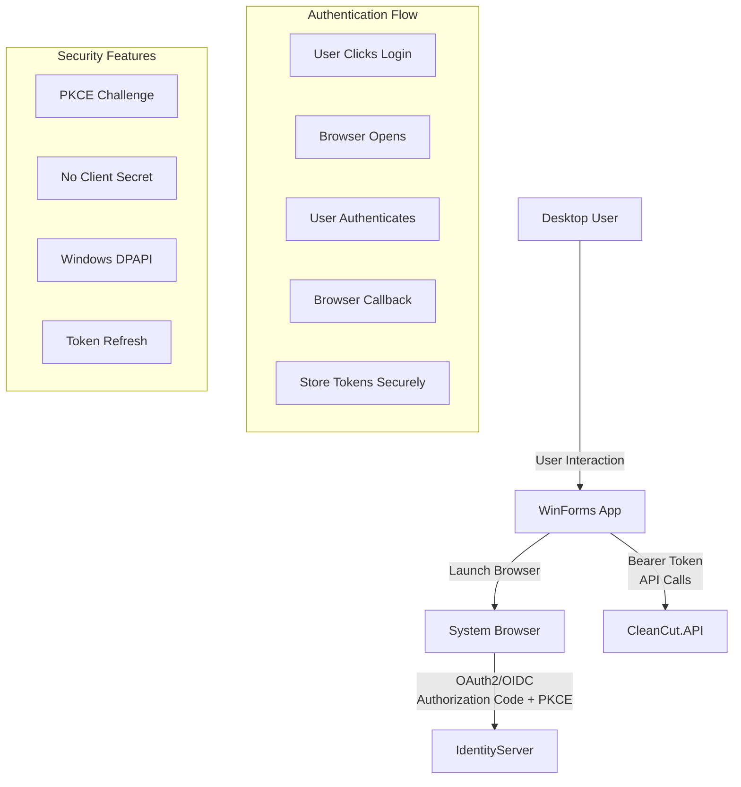

# CleanCut WinApp - OAuth2 Desktop Client Implementation

## ?? **Overview**

The **CleanCut.WinApp** has been completely redesigned as a **OAuth2 Public Client** implementing the **Authorization Code + PKCE** flow for secure desktop authentication. This demonstrates proper security patterns for desktop applications according to **RFC 8252** best practices.

## ?? **OAuth2 Public Client Architecture**



## ??? **Security Implementation**

### **?? Public Client Security**
- ? **No Client Secrets**: Cannot securely store secrets in desktop apps
- ? **PKCE Required**: Proof Key for Code Exchange prevents code interception
- ? **System Browser**: Secure authentication via user's default browser
- ? **Secure Token Storage**: Windows Data Protection API (DPAPI)
- ? **Custom URI Scheme**: `cleancut://callback` for secure redirects

### **?? Client Configuration**
```csharp
Client Type: Public Client
Grant Type: Authorization Code + PKCE
Client ID: CleanCutWinApp
Client Secret: None (Public clients cannot use secrets)
Scopes: openid, profile, CleanCutAPI
Redirect URIs: 
  - http://localhost:8080/
  - cleancut://callback
```

## ??? **Technical Implementation**

### **?? Authentication Service**
```csharp
public class DesktopAuthenticationService : IAuthenticationService
{
    private readonly OidcClient _oidcClient;
    private readonly ITokenStorage _tokenStorage;
    private readonly ILogger<DesktopAuthenticationService> _logger;

 public async Task<LoginResult> LoginAsync()
    {
        try
        {
   // PKCE challenge generated automatically
     var loginRequest = new LoginRequest();
    var result = await _oidcClient.LoginAsync(loginRequest);

      if (result.IsError)
      {
       return new LoginResult { IsSuccess = false, Error = result.Error };
   }

        // Store tokens securely using Windows DPAPI
    await _tokenStorage.StoreTokensAsync(
result.AccessToken, 
     result.RefreshToken,
     result.IdentityToken);

     return new LoginResult 
      { 
      IsSuccess = true, 
     UserClaims = result.User.Claims.ToList()
      };
   }
    catch (Exception ex)
        {
   _logger.LogError(ex, "Authentication failed");
 return new LoginResult { IsSuccess = false, Error = ex.Message };
        }
    }
}
```

### **?? Secure Token Storage**
```csharp
public class WindowsTokenStorage : ITokenStorage
{
    private readonly string _tokenFilePath;

    public async Task StoreTokensAsync(string accessToken, string refreshToken, string idToken)
{
    var tokenData = new TokenData
        {
         AccessToken = accessToken,
   RefreshToken = refreshToken,
     IdToken = idToken,
       Timestamp = DateTime.UtcNow
        };

        var json = JsonSerializer.Serialize(tokenData);
var dataBytes = Encoding.UTF8.GetBytes(json);
        
   // Encrypt using Windows DPAPI (user-specific)
        var protectedData = ProtectedData.Protect(
   dataBytes, 
            null, 
            DataProtectionScope.CurrentUser);

 await File.WriteAllBytesAsync(_tokenFilePath, protectedData);
    }

    public async Task<TokenData?> GetTokensAsync()
    {
        if (!File.Exists(_tokenFilePath))
   return null;

   try
 {
      var protectedData = await File.ReadAllBytesAsync(_tokenFilePath);
     var decryptedData = ProtectedData.Unprotect(
      protectedData, 
    null, 
  DataProtectionScope.CurrentUser);

            var json = Encoding.UTF8.GetString(decryptedData);
      return JsonSerializer.Deserialize<TokenData>(json);
   }
        catch (Exception ex)
        {
     _logger.LogWarning(ex, "Failed to decrypt stored tokens");
      return null;
     }
    }
}
```

### **?? Authenticated API Client**
```csharp
public class AuthenticatedApiClient : IApiClient
{
    private readonly HttpClient _httpClient;
    private readonly ITokenStorage _tokenStorage;
    private readonly IAuthenticationService _authService;

    public async Task<List<ProductInfo>> GetProductsAsync()
    {
    await EnsureAuthenticatedAsync();
        
     var response = await _httpClient.GetAsync("/api/v1/products");
   
        if (response.StatusCode == HttpStatusCode.Unauthorized)
        {
          throw new UnauthorizedAccessException("Authentication required");
   }
        
   response.EnsureSuccessStatusCode();
        var json = await response.Content.ReadAsStringAsync();
        return JsonSerializer.Deserialize<List<ProductInfo>>(json) ?? new List<ProductInfo>();
    }

    private async Task EnsureAuthenticatedAsync()
    {
        var tokens = await _tokenStorage.GetTokensAsync();
        
    if (tokens == null || IsTokenExpired(tokens.AccessToken))
     {
// Refresh token or re-authenticate
       if (tokens?.RefreshToken != null && !IsTokenExpired(tokens.RefreshToken))
            {
    await RefreshTokenAsync(tokens.RefreshToken);
       }
          else
   {
        throw new UnauthorizedAccessException("Authentication required");
         }
   }
        
        _httpClient.DefaultRequestHeaders.Authorization = 
        new AuthenticationHeaderValue("Bearer", tokens.AccessToken);
    }
}
```

## ?? **User Interface Implementation**

### **?? Login Form**
```csharp
public partial class LoginForm : Form
{
    private readonly IAuthenticationService _authService;

    private async void LoginButton_Click(object sender, EventArgs e)
  {
        try
 {
      LoginButton.Enabled = false;
     StatusLabel.Text = "Opening browser for authentication...";

         var result = await _authService.LoginAsync();

        if (result.IsSuccess)
            {
          MessageBox.Show($"Welcome, {result.UserClaims.FirstOrDefault(c => c.Type == "name")?.Value}!");
          this.DialogResult = DialogResult.OK;
    this.Close();
     }
    else
       {
             MessageBox.Show($"Authentication failed: {result.Error}", "Login Error", 
           MessageBoxButtons.OK, MessageBoxIcon.Error);
    }
  }
    catch (Exception ex)
   {
            MessageBox.Show($"Authentication error: {ex.Message}", "Error", 
        MessageBoxButtons.OK, MessageBoxIcon.Error);
        }
        finally
        {
    LoginButton.Enabled = true;
       StatusLabel.Text = "Ready";
        }
    }
}
```

### **?? Main Application Form**
```csharp
public partial class MainForm : Form
{
    private readonly IAuthenticationService _authService;
    private readonly IApiClient _apiClient;
  private UserInfo? _currentUser;

   protected override async void OnLoad(EventArgs e)
    {
 base.OnLoad(e);
      await CheckAuthenticationStatusAsync();
  }

    private async Task CheckAuthenticationStatusAsync()
    {
     try
      {
        _currentUser = await _authService.GetCurrentUserAsync();
     
           if (_currentUser != null)
     {
UpdateUIForAuthenticatedUser();
          await LoadDashboardDataAsync();
       }
      else
     {
     ShowLoginDialog();
          }
     }
        catch (Exception ex)
        {
         MessageBox.Show($"Authentication check failed: {ex.Message}");
   ShowLoginDialog();
     }
   }

    private void UpdateUIForAuthenticatedUser()
    {
       UserNameLabel.Text = $"Welcome, {_currentUser.Name}";
   UserRoleLabel.Text = $"Role: {_currentUser.Role}";
        LoginMenuItem.Text = "Logout";
      
        // Enable/disable features based on role
        if (_currentUser.Role == "Admin")
  {
          DeleteProductMenuItem.Enabled = true;
 DeleteCustomerMenuItem.Enabled = true;
     }
 }
}
```

## ?? **Key Features Implemented**

### **?? Authentication Management**
- ? **Secure Login Flow**: System browser integration with PKCE
- ? **Token Management**: Automatic refresh and secure storage
- ? **Role-Based UI**: Different features for Admin vs User
- ? **Logout Functionality**: Secure token cleanup
- ? **Session Persistence**: Remember authentication across app restarts

### **?? Business Functionality**
- ? **Customer Management**: Full CRUD operations via authenticated API
- ? **Product Management**: Complete product lifecycle management
- ? **Country Management**: Reference data management
- ? **Dashboard**: Summary statistics and recent activity
- ? **Search & Filtering**: Find customers and products quickly

### **??? Security Features**
- ? **No Hardcoded Secrets**: Public client design
- ? **PKCE Validation**: Protection against code interception
- ? **Secure Token Storage**: Windows DPAPI encryption
- ? **Automatic Token Refresh**: Seamless session management
- ? **Role-Based Access**: UI adapts to user permissions

## ?? **Getting Started**

### **Prerequisites**
1. **IdentityServer** running on `https://localhost:5001`
2. **CleanCut.API** running on `https://localhost:7142`
3. **Test user accounts** configured

### **Running the Desktop App**
```bash
cd "D:\.NET STUDY\CleanCut"
dotnet run --project src/Presentation/CleanCut.WinApp
```

### **First-Time Setup**
1. **Application Starts**: Shows login dialog
2. **Click "Login"**: Opens system browser
3. **Authenticate**: Use test credentials:
   - **Admin**: `admin@cleancut.com` / `TempPassword123!`
   - **User**: `user@cleancut.com` / `TempPassword123!`
4. **Browser Redirects**: Returns to desktop app
5. **Main App Opens**: With authenticated session

## ?? **Testing Scenarios**

### **?? Authentication Testing**
1. **Fresh Install**: Should prompt for login
2. **Successful Login**: Should remember session
3. **Token Expiration**: Should refresh automatically
4. **Logout**: Should clear tokens and require re-login
5. **Role Changes**: UI should update based on user role

### **?? API Integration Testing**
1. **Data Loading**: Should fetch real data from API
2. **CRUD Operations**: All operations should work with authentication
3. **Error Handling**: Should handle API errors gracefully
4. **Offline Scenarios**: Should show appropriate messages

### **??? Security Testing**
1. **Token Storage**: Tokens should be encrypted on disk
2. **Process Isolation**: Other users cannot access tokens
3. **Token Refresh**: Should work transparently
4. **Invalid Tokens**: Should prompt for re-authentication

## ? **Troubleshooting**

### **?? Authentication Issues**

#### **Browser Doesn't Open**
- Check default browser is set
- Verify system has internet connectivity
- Try manually opening `https://localhost:5001`

#### **Callback Not Working**
- Ensure IdentityServer client configuration includes correct redirect URIs
- Check Windows firewall isn't blocking the application
- Verify custom URI scheme registration

#### **Token Storage Errors**
- Check user has write permissions to application data folder
- Verify Windows DPAPI is available
- Try running as administrator (temporarily)

### **?? API Integration Issues**

#### **401 Unauthorized**
- Check IdentityServer is running
- Verify API is configured to accept tokens from IdentityServer
- Check token hasn't expired

#### **Connection Errors**
- Verify API is running on correct port
- Check firewall settings
- Test API directly in browser/Postman

## ?? **Success Indicators**

### **? Working Authentication**
- [ ] Login opens system browser
- [ ] Authentication redirects back to app
- [ ] User information displays correctly
- [ ] Role-based features work
- [ ] Logout clears session properly

### **? Working API Integration**
- [ ] Dashboard loads real data
- [ ] CRUD operations save/update correctly
- [ ] Error messages are user-friendly
- [ ] Loading states provide feedback
- [ ] Refresh functionality works

---

**The WinForms desktop application now demonstrates enterprise-grade OAuth2 security for desktop clients while maintaining excellent user experience and robust error handling!** ??