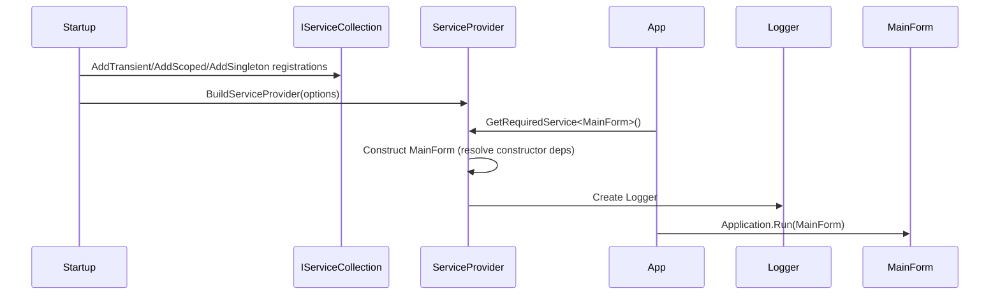
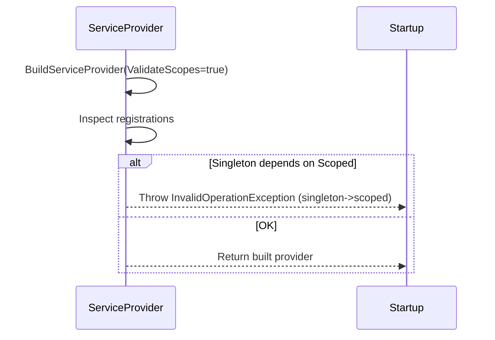
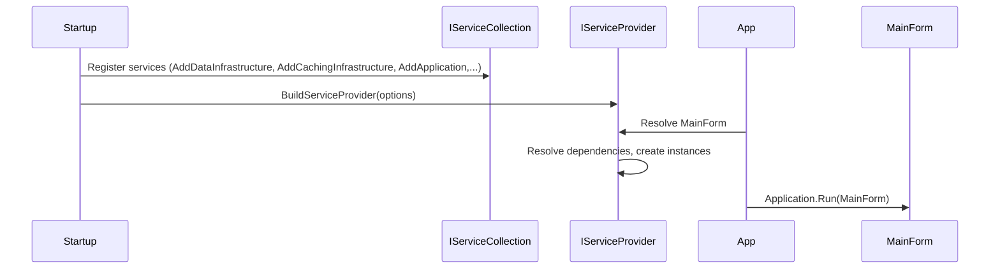
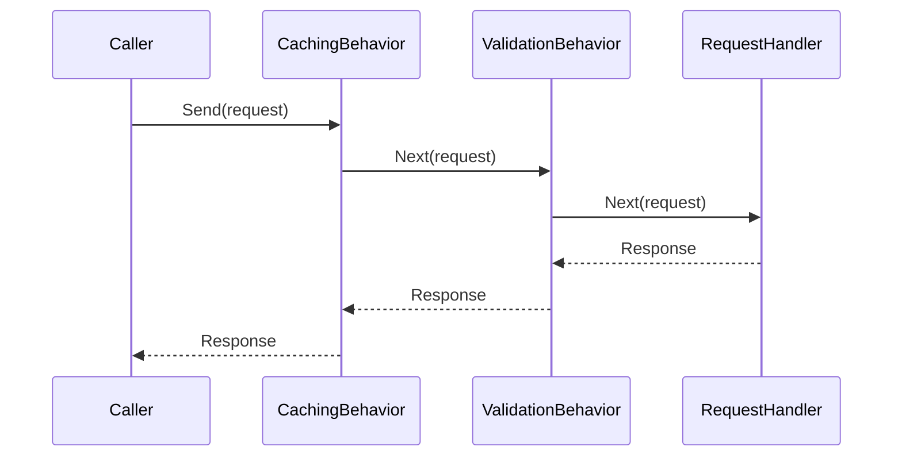

# Detailed Guide: ServiceConfiguration and Application Startup in CleanCut.WinApp

---

# Introduction and Purpose

This document explains the `ServiceConfiguration` responsibilities and the startup sequence used by CleanCut.WinApp. It follows the same detailed, numbered "book-style" approach used in `LoadedManagement.md` and then provides a technical deep-dive with code references, DI rationale, and diagrams matching the style used in the management documentation.

Goals:
- Centralize registration of infrastructure, application services and MVP components.
- Make lifetimes and scoping explicit and validated at startup.
- Provide clear rationale for design choices (Transient vs Scoped vs Singleton, generics, factories, logger wiring).

---

# ServiceConfiguration: Narrative guide (book-style, numbered)

Each numbered entry explains the intent, common pitfalls, and a small how-to for implementation.

1) The job of configuration: one authoritative source

- Why: Multiple sources of settings cause confusion. A single `IConfiguration` ensures every part of the app (data, caching, logging, UI) reads the same values, which makes behavior predictable and testable.
- What it does: merges `appsettings.json`, environment variables and any developer overrides into one object passed to all registration helpers.
- How to implement (conceptual):

```csharp
var config = new ConfigurationBuilder()
    .SetBasePath(AppContext.BaseDirectory ?? Directory.GetCurrentDirectory())
    .AddJsonFile("appsettings.json", optional: true, reloadOnChange: true)
    .AddEnvironmentVariables()
    .Build();
services.AddSingleton<IConfiguration>(config);
```

- Common pitfall: reading configuration directly in many places instead of injecting `IConfiguration` — this makes testing harder and leads to duplicated parsing logic.

2) Establish logging early so nothing is lost

- Why: Startup failures are the hardest to diagnose when there is no logging configured. Configuring Serilog early records critical events and makes it safe to call into other subsystems.
- What it does: creates `logs` folder (if needed) and configures console + rolling file sinks, then adds Serilog to the `ILoggingBuilder` so `ILogger<T>` can be injected.
- How to implement (conceptual):

```csharp
Directory.CreateDirectory(Path.Combine(AppContext.BaseDirectory ?? ".", "logs"));
Log.Logger = new LoggerConfiguration()
    .ReadFrom.Configuration(configuration)
    .Enrich.FromLogContext()
    .WriteTo.Console()
    .WriteTo.File(Path.Combine("logs", "cleanCut-.log"), rollingInterval: RollingInterval.Day)
    .CreateLogger();
services.AddLogging(b => b.AddSerilog());
```

- Note: registering the logger with DI means any presenter or service that requests `ILogger<T>` will get the configured Serilog adapter automatically.

3) Data infrastructure — centralize and respect lifetimes

- Why: Database contexts and repositories are foundational but easy to mis-register. `DbContext` should not be a singleton; it should be scoped to a unit-of-work. In WinForms we don't have an automatic HTTP scope, so scopes must be created explicitly for operations or per-module.
- What it does: registers `DbContext` via `AddDbContext` (scoped by default) and repository interfaces, centralizing connection strings and migration behavior.
- How to implement (conceptual):

```csharp
services.AddDbContext<ApplicationDbContext>((sp, opts) =>
    opts.UseSqlServer(configuration.GetConnectionString("DefaultConnection")));
services.AddScoped<ICustomerRepository, CustomerRepository>();
```

- Tip: When running a DB operation from a presenter, create a scope in the `ManagementLoader` or a background task and resolve `ApplicationDbContext` from that scope — do not resolve it as a singleton.

4) Caching infrastructure — design for tiers and fallback

- Why: Caching improves responsiveness. Use an in-memory cache for single-process speed and a distributed cache (Redis) when multiple processes or machines must share state.
- What it does: registers `IMemoryCache`, conditionally configures `IDistributedCache` (Redis) and exposes an `ICacheService` façade that hides composite behavior.
- How to implement (conceptual):

```csharp
services.AddMemoryCache();
if (!string.IsNullOrEmpty(configuration["Redis:Configuration"]))
{
    services.AddStackExchangeRedisCache(opts => opts.Configuration = configuration["Redis:Configuration"]);
    services.AddScoped<ICacheService, RedisCacheService>();
    services.AddScoped<CleanCut.Application.Common.Interfaces.ICacheService, CacheServiceAdapter>();
}
else
{
    services.AddMemoryCache();
    services.AddScoped<ICacheService, MemoryCacheService>();
    services.AddScoped<CleanCut.Application.Common.Interfaces.ICacheService, CacheServiceAdapter>();
}
```

- Note: the application layer consumes `ICacheService` and does not know whether the cache is distributed — that makes tests and local development easier.

> What AddCachingInfrastructure does (concrete):
> - Tests for Redis availability, configures Redis if present.
> - Registers the concrete caching implementation(s) (Redis or memory) and a small adapter so the Application layer consumes `CleanCut.Application.Common.Interfaces.ICacheService` only.
> - Registers helpers such as `CacheKeyBuilder`, `CacheInvalidationService` and any MediatR behaviors that depend on caching when the behavior is registered in the Application host.

5) Application wiring and `includeIntegrationBehaviors`

- Why: The same application code (CQRS handlers, MediatR, validators) is reused across hosts (API, background services, WinApp). Pipeline behaviors that publish integration events should be opt-in per host.
- What it does: `services.AddApplication(includeIntegrationBehaviors: false)` registers MediatR, validation and core pipeline behaviors; when `includeIntegrationBehaviors` is `true` the pipeline also registers behaviors that emit integration events.
- How to reason about it: In the WinApp we do not want the UI to publish domain integration events by default — the UI is a consumer and orchestrator, not a producer of integration messages for other services.


## Integration behaviors: what they are and what they actually do (expanded)

Integration behaviors are pipeline middleware that run around MediatR handlers (queries/commands). They perform cross-cutting integration work after application logic runs or as part of the same transaction boundary. "Integration behavior" is not an abstract file writer — it usually implements reliable message publication patterns.

Key responsibilities of integration behaviors:
- Capture domain events produced by handlers and convert them into integration messages.
- Persist messages to an outbox table within the same DB transaction as the data change (Outbox pattern).
- Orchestrate reliable delivery to a message bus (RabbitMQ, Azure Service Bus, Kafka) from the outbox, often via a background worker.
- Provide retry/poison-message handling and logging for external publish attempts.

Concrete example (pseudo-code) — what an integration behavior does inside a command pipeline:

```text
CommandHandler.Handle(command)
  -> updates database using DbContext
  -> collects DomainEvents from domain entities
IntegrationBehavior.Handle(command)
  -> invokes next() to run handler
  -> after next returns successfully, opens same DbContext transaction
  -> serializes DomainEvents to JSON and writes them to Outbox table (same transaction)
  -> commits transaction
  -> optionally signals an OutboxPublisher to pick up records for external publish
```

If the host sets `includeIntegrationBehaviors: true` the Application registration will register classes such as `OutboxBehavior` and `PublishIntegrationEventsBehavior`. Those behaviors are responsible for the outbox write and the eventual hand-off to the message bus.

Small, concrete analogy for clarity: an integration behavior is more like "save a message to the outbox table" and less like "write to a text file". Writing to a text file could be a side-effect but provides no delivery guarantees and is not the same responsibility.

Why WinApp disables them (`includeIntegrationBehaviors: false`):
- Desktop clients should not be the canonical producers of enterprise integration events. They are ephemeral, may be offline, and lack the operational controls of server hosts.
- Server-side hosts (API, background services) shoulder the responsibility of publishing integration events reliably and can run background workers to flush outbox to the bus.

Practical mapping:
- API host: `AddApplication(includeIntegrationBehaviors: true)` -> registers `OutboxBehavior`, `PublishIntegrationEventsBehavior`, `CacheInvalidationBehavior`, etc.
- WinApp: `AddApplication(includeIntegrationBehaviors: false)` -> registers only query caching behavior, validation behavior, logging behavior, and not the outbox/publish behaviors.

6) AutoMapper and mapping clarity

- Why: Presenters translate DTOs from the application layer into view models for the UI. Keeping mapping profiles centralized prevents accidental impure mapping code in presenters.
- What it does: `services.AddAutoMapper(...)` scans and registers mapping profiles (classes deriving from `Profile`). The DI container registers `IMapper` which can be injected into presenters.

Example of what `AddAutoMapper` does behind the scenes:
- Instantiate mapping configuration and register `IMapper` as a singleton with compiled maps.
- Discover `Profile` classes (e.g., `WinAppMappingProfile`) and add their mapping rules.

How presenters use it:

```csharp
public class CustomerPresenter
{
    private readonly IMapper _mapper;
    public CustomerPresenter(IMapper mapper) { _mapper = mapper; }
    public void Display(IEnumerable<CustomerDto> dtos)
    {
        var viewModels = _mapper.Map<List<CustomerViewModel>>(dtos);
        View.DisplayCustomers(viewModels);
    }
}
```

> What AddAutoMapper does (concrete): scans for mapping profiles and registers `IMapper` with configuration assembled from those profiles so you can inject `IMapper` in presenters and services.

7) MVP registrations and why `Transient` is the right default

- Why: UI components are ephemeral. A form instance represents a separate UI session; having a single shared presenter or view leads to subtle state bugs. `Transient` guarantees a fresh instance for each open window.
- What it does: registers forms, presenters and factories as transient. When the module loads inside a scope, those types are created and disposed together.

```csharp
services.AddTransient<MainForm>();
services.AddTransient<ICustomerListView, CustomerListForm>();
services.AddTransient<CustomerListPresenter>();
```

- What does Transient mean? A new instance is created every time the service is requested. Use `Transient` for UI elements to avoid shared mutable state between windows.

- Boundary: If you need a shared cache or a truly application-wide service, use `Singleton`. For services that should be shared only within the life of a module, register them as `Scoped` and create/ dispose a scope via the loader.

8) `MainForm` creation and the startup factory

- Why register `MainForm` in DI? So its constructor receives configured dependencies (`IManagementLoader`, `ILogger<MainForm>`, `IConfiguration`) and so the same DI rules/validation apply.
- What it does: `MainForm` is registered transient and `Program.cs` requests it from the built provider before calling `Application.Run(mainForm)`.

9) `IManagementLoader` as a `Singleton` coordinator and `IServiceScope`

- Why: the loader orchestrates creating per-module scopes and does not hold per-module state. Making it a singleton centralizes creation logic and lets it reuse any internal helpers.
- What it does: creates `IServiceScope` per module, resolves view and presenter, returns a `LoadedManagement` wrapper that holds the scope so cleanup happens when the form closes.

What is `IServiceScope` and why it matters:
- `IServiceScopeFactory.CreateScope()` produces an `IServiceScope` whose `ServiceProvider` resolves `Scoped` services. Disposing the `IServiceScope` disposes all scoped services it created (DbContext, repositories, etc.).

Typical `ManagementLoader` flow (simplified):

```csharp
public LoadedManagement Load<TView, TPresenter>()
{
    var scope = _scopeFactory.CreateScope();
    var view = scope.ServiceProvider.GetRequiredService<TView>();
    var presenter = ActivatorUtilities.CreateInstance<TPresenter>(scope.ServiceProvider, view);
    presenter.Initialize();
    return new LoadedManagement(presenter, view, scope);
}

// When form closes:
loadedManagement.Dispose(); // disposes presenter, view if needed, and scope
```

- Why scoping is important: in desktop apps you must control when `Scoped` services are created and disposed. Creating a scope per module (form) gives the expected semantics of a per-module unit-of-work.

10) ServiceCollection, ServiceProvider and DI validation options

- What is `IServiceCollection`?
  - `IServiceCollection` is a mutable collection used at startup to declare all service registrations (type mappings, lifetimes, factory delegates). Think of it as a recipe book: you list how to create each ingredient but nothing is created yet.
  - Example operations: `services.AddTransient<T>()`, `services.AddScoped<TInterface, TImpl>()`, `services.AddSingleton<T>(instance)`.

- What is `IServiceProvider`?
  - After registrations are complete, `services.BuildServiceProvider()` produces an `IServiceProvider` — the runtime container that actually constructs and holds service instances according to declared lifetimes.
  - The `IServiceProvider` answers requests: `provider.GetRequiredService<T>()` creates (or returns) instances per the configured lifetimes.

Sequence diagram: registration -> build -> resolve



- What do `ValidateScopes` and `ValidateOnBuild` actually do?
  - `ValidateScopes = true` enables runtime checks that detect common lifetime mistakes. Specifically, it throws an exception if a singleton service depends (directly or indirectly) on a scoped service. This prevents a singleton from capturing a scoped instance that should be transient per scope.
  - `ValidateOnBuild = true` causes the DI container to attempt to validate all registrations at `BuildServiceProvider()` time. It will enumerate constructors and try to detect missing registrations and some lifetime mismatch issues early, failing fast during startup instead of later at runtime.

Diagram: ValidateScopes failing case



Why enable these options in development?
- They catch configuration mistakes early and avoid subtle runtime bugs where a long-lived singleton holds on to a shorter-lived resource (e.g., DbContext) causing data corruption, memory leaks or incorrect behavior.

11) Build service provider and bootstrap logging

- Why: After all registrations the container must be built. `Program.cs` resolves `ILoggerFactory` for bootstrap logging and `MainForm` for the UI.
- What it does: builds the provider, resolves logger and main form, runs the application, and ensures Serilog is flushed on exit.

```csharp
using var provider = services.BuildServiceProvider(new ServiceProviderOptions { ValidateScopes = true });
var loggerFactory = provider.GetRequiredService<ILoggerFactory>();
var logger = loggerFactory.CreateLogger("CleanCut.WinApp.Program");
var main = provider.GetRequiredService<MainForm>();
Application.Run(main);
```

---

# What the three important registrations do in this solution

In `ServiceConfiguration.ConfigureServices()` you will see:

```csharp
services.AddDataInfrastructure(configuration);
services.AddCachingInfrastructure(configuration);
services.AddApplication(includeIntegrationBehaviors: false);
```

These are extension methods defined in other projects. Concretely:

- `AddDataInfrastructure(configuration)` (Infrastructure.Data project)
  - Registers EF Core `DbContext`(s) (via `AddDbContext`) with the configured connection string.
  - Registers repository implementations, unit-of-work helpers and any data-related services.
  - Configures migrations and any DB resilience policies (retry, timeouts).
  - Typically registers these services as `Scoped` so a scope yields a fresh `DbContext` instance.

- `AddCachingInfrastructure(configuration)` (Infrastructure.Caching project)
  - Tests and configures Redis if a connection string is present; otherwise configures in-memory cache.
  - Registers concrete cache service implementations (`RedisCacheService`, `MemoryCacheService`, or `HybridCacheService`) and adapters so the Application layer depends only on `CleanCut.Application.Common.Interfaces.ICacheService`.
  - Registers cache helpers: `CacheKeyBuilder`, `CacheInvalidationService`, and any DI registrations required by cache behaviors.

- `AddApplication(includeIntegrationBehaviors: false)` (Application project)
  - Registers MediatR and scans for request handlers (commands/queries) and notification handlers.
  - Registers pipeline behaviors: validation, logging, retry, caching behavior for queries, and (optionally) integration/outbox behaviors depending on `includeIntegrationBehaviors`.
  - Registers application services (interfaces implemented in Application layer) and any mapping/validation wiring.

These extension methods keep infrastructure-specific registrations inside their own assemblies so the WinApp project only calls into them and remains small and expressive.

---

# Technical deep dive (code references, rationale and examples)

This section expands the above steps with code references and detailed rationale. Copy these examples into `ServiceConfiguration` or `Program.cs` as appropriate.

(Examples omitted here; see earlier sections for examples of configuring Serilog, Data, Caching, Application and scoping.)

---

# Technical deep dive (developer reference)

This section is a developer-oriented reference that complements the book-style narrative above. It provides concrete code examples, wiring details, lifetime implications, and pointers to where things are implemented in the solution. Use this when you need to modify registrations, add behaviors, or debug startup problems.

1) Build configuration (concrete)

- Where: `ServiceConfiguration.BuildConfiguration()` in `CleanCut.WinApp.Infrastructure.ServiceConfiguration`.
- Purpose: create a single `IConfiguration` instance and register it in DI so all components read the same settings.

Code reference:

```csharp
var configuration = new ConfigurationBuilder()
    .SetBasePath(GetProjectBasePath())
    .AddJsonFile("appsettings.json", optional: false, reloadOnChange: true)
    .AddJsonFile($"appsettings.{environment}.json", optional: true, reloadOnChange: true)
    .AddEnvironmentVariables()
    .Build();

services.AddSingleton<IConfiguration>(configuration);
```

Notes:
- Use `IConfiguration` instead of reading files in many places to improve testability and consistency.
- Keep secrets out of source files in production (Key Vault, environment variables, user secrets).

2) Configure logging (concrete)

- Where: `ServiceConfiguration.ConfigureLogging()`.
- Purpose: configure Serilog as the application-wide logger and register the provider so `ILogger<T>` works.

Code reference:

```csharp
Log.Logger = new LoggerConfiguration()
    .ReadFrom.Configuration(configuration)
    .Enrich.FromLogContext()
    .WriteTo.Console()
    .WriteTo.File(logFilePath, rollingInterval: RollingInterval.Day)
    .CreateLogger();

services.AddLogging(b => b.AddSerilog());
```

Notes:
- `Log.CloseAndFlush()` should be called on application exit to flush file sinks.
- Register a non-generic `ILogger` if some components request the non-generic type.

3) Data infrastructure (concrete explanation)

- Where: `CleanCut.Infrastructure.Data.DependencyInjection` (project `CleanCut.Infrastructure.Data`).
- What it registers:
  - `AddDbContext<ApplicationDbContext>(...)` — registers `ApplicationDbContext` as `Scoped`.
  - Repository implementations: `ICustomerRepository -> CustomerRepository` (usually `Scoped`).
  - Migrations helpers and any EF configuration (CommandTimeouts, retry policies).

Why scoped:
- `DbContext` is not thread-safe and represents a unit-of-work. In WinForms create a scope per module/operation so each scope gets a fresh `DbContext` and disposing the scope disposes the context.

4) Caching infrastructure (concrete explanation)

- Where: `CleanCut.Infrastructure.Caching.DependencyInjection`.
- What it registers:
  - Tests for Redis connection string — if available registers `IConnectionMultiplexer` and `RedisCacheService`.
  - Otherwise registers `MemoryCacheService` and `IMemoryCache`.
  - Adapts infrastructure caching to application-level `CleanCut.Application.Common.Interfaces.ICacheService` via `CacheServiceAdapter`.
  - Registers supporting helpers: `CacheKeyBuilder`, `CacheInvalidationService`.

Example usage in presenters (already used in this solution):

```csharp
var users = await _cacheService.GetAsync<List<CustomerInfo>>("customers:all");
if (users == null)
{
    users = (await _mediator.Send(new GetAllCustomersQuery())).ToList();
    await _cacheService.SetAsync("customers:all", users, TimeSpan.FromMinutes(30));
}
```

Notes:
- Prefer application-level abstraction `ICacheService` so handlers/tests don't depend on Redis types.
- Use `RemoveByPatternAsync` on commands to invalidate related caches.

5) Application registration and MediatR wiring (concrete)

- Where: `CleanCut.Application.DependencyInjection` (or similar `AddApplication` extension in Application project).
- What it registers:
  - `services.AddMediatR(typeof(SomeHandler).Assembly)` — registers handlers automatically.
  - Pipeline behaviors: add `IPipelineBehavior<,>` implementations (ValidationBehavior, CachingBehavior, LoggingBehavior). When `includeIntegrationBehaviors` is true, it also registers Outbox/Publish behaviors.

Example registration pattern:

```csharp
public static IServiceCollection AddApplication(this IServiceCollection services, bool includeIntegrationBehaviors)
{
    services.AddMediatR(cfg => cfg.RegisterServicesFromAssembly(typeof(SomeHandler).Assembly));

    services.AddTransient(typeof(IPipelineBehavior<,>), typeof(ValidationBehavior<,>));
    services.AddTransient(typeof(IPipelineBehavior<,>), typeof(LoggingBehavior<,>));
    services.AddTransient(typeof(IPipelineBehavior<,>), typeof(CachingBehavior<,>));

    if (includeIntegrationBehaviors)
    {
        services.AddTransient(typeof(IPipelineBehavior<,>), typeof(OutboxBehavior<,>));
        services.AddTransient(typeof(IPipelineBehavior<,>), typeof(PublishIntegrationEventsBehavior<,>));
    }

    // Register application services (IService -> Impl)

    return services;
}
```

Notes:
- Pipeline order matters: behaviors execute in registration order (outer -> inner). Place caching before handler invocation if you want to short-circuit queries.
- Test behavior registration by disabling `includeIntegrationBehaviors` in WinApp and enabling in API.

6) Service lifetimes and `IServiceScope` (concrete)

- Lifetimes:
  - `Transient`: new instance every resolve.
  - `Scoped`: single instance per `IServiceScope`.
  - `Singleton`: single instance for the container lifetime.

- Creating scopes:
  - WinForms: use `IServiceScopeFactory.CreateScope()` to create a scope per module/form or per operation.
  - Dispose the `IServiceScope` when the module closes to dispose scoped services.

Example (ManagementLoader simplified):

```csharp
var scope = _scopeFactory.CreateScope();
var presenter = ActivatorUtilities.CreateInstance<TPresenter>(scope.ServiceProvider, viewInstance);
// store scope in LoadedManagement so Dispose will call scope.Dispose()
```

7) IServiceCollection vs IServiceProvider (concrete)

- `IServiceCollection`: a startup-time mutable registry of service descriptors. You add registrations here.
- `IServiceProvider`: built from the collection (`BuildServiceProvider`) — the runtime container used to resolve services.

Flow:
- Register services into `IServiceCollection`.
- Optionally call `services.BuildServiceProvider(new ServiceProviderOptions { ValidateScopes = true, ValidateOnBuild = ... })`.
- Use the resulting `IServiceProvider` to resolve the main form and start the app.

8) ValidateScopes and ValidateOnBuild (concrete)

- `ValidateScopes = true` ensures the container throws if a singleton depends on a scoped service. This is an important guardrail for lifetime safety.
- `ValidateOnBuild = true` performs some resolution/validation work at build time and will throw early for certain registration problems (missing registrations, some lifetime issues).

When to enable:
- Enable both in Development for fast feedback; consider disabling `ValidateOnBuild` in production to reduce startup overhead only if you have a deterministic, well-tested registration surface.

9) Diagrams (developer view)

Sequence: registration, build, resolve



Pipeline behaviors ordering (example)



10) Troubleshooting tips

- If `BuildServiceProvider` fails with a lifetime error, enable `ValidateOnBuild` and read the exception — it usually indicates a singleton depends on a scoped service.
- If a service is unexpectedly shared, verify its registration lifetime.
- To debug service resolution, create a temporary scope in a unit test and `GetRequiredService<T>()` to exercise constructor wiring.

---

# Reference locations in repository

- `CleanCut.WinApp.Infrastructure.ServiceConfiguration` — host registrations and logging setup (this project).
- `CleanCut.Infrastructure.Data.DependencyInjection` — data infra registrations (DbContext, repositories).
- `CleanCut.Infrastructure.Caching.DependencyInjection` — caching registrations and adapter wiring.
- `CleanCut.Application` (extension) — `AddApplication` that registers MediatR and pipeline behaviors.
- `CleanCut.Application.Behaviors` — pipeline behaviors such as `CachingBehavior`, `CacheInvalidationBehavior`, `OutboxBehavior`.

---

# End of developer reference

This section provides the concrete reference that complements the book-style narrative at the start of the file. Use it as the authoritative source when changing wiring, adding behaviors, or troubleshooting startup DI errors.
